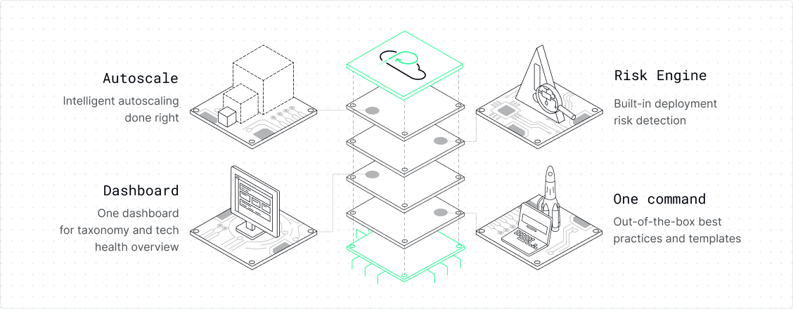

<div align="center">
<picture>
  <source media="(prefers-color-scheme: dark)" srcset="assets/banner-dark.png">
  <source media="(prefers-color-scheme: light)" srcset="assets/banner-light.png">
  
</picture>

</div>

<div align="center">

[](https://github.com/platformatic/platformatic/actions/workflows/ci.yml)
[](https://github.com/platformatic/platformatic/actions/workflows/update-docs.yml)
[](https://www.npmjs.com/package/platformatic)
[](https://discord.gg/platformatic)

</div>

<h1 align="center">
  <br/>
  Watt - The Node.js Application Server
  <br/>
</h1>

<div align="center"> 

  **Build and run multiple Node.js applications with unified logging, monitoring, and deployment.**  
  
  Transform Node.js development with a single server that handles databases, APIs, frontend frameworks, and microservices - all with built-in observability and zero-config deployment.
</div>
<br/>

## Quick Start (2 minutes)

Get your first Watt application running in under 2 minutes:

```bash
npm install -g wattpm
npx wattpm create my-first-app
cd my-first-app && npm start
```

Your application will be running at `http://localhost:3042` with auto-generated REST and GraphQL APIs.

## What Makes Watt Different?

**One Server, Multiple Services** - Watt runs your database APIs, custom services, frontend frameworks, and API gateways all within a single, unified application server.

- **🔋 Built-in Observability** - Logging, metrics, tracing, and health checks out of the box  
- **🧱 Composable Architecture** - HTTP services, API composers, frontend frameworks, and data services
- **⚡ Framework Integration** - Works with Next.js, Astro, Remix, Vite, NestJS, and plain Node.js
- **📦 Production Ready** - Docker deployment, environment configuration, and scaling built-in
- **🚀 TypeScript First** - Full type safety with auto-generated types and SDK

## Choose Your Learning Path

### 👋 New to Node.js?
**Start Here:** [What is Watt?](https://docs.platformatic.dev/docs/overview) → [Beginner Tutorial](https://docs.platformatic.dev/docs/learn/beginner/crud-application)  
Build a complete Todo API from scratch in 30 minutes with step-by-step guidance.

### ⚡ Experienced Developer?
**Jump In:** [Quick Start](https://docs.platformatic.dev/docs/getting-started/quick-start-watt) → [Architecture Overview](https://docs.platformatic.dev/docs/overview)  
Get running in 5 minutes, then dive into advanced patterns and integrations.

### 🔄 Migrating Existing Apps?
**Migrate:** [Port Your App](https://docs.platformatic.dev/docs/getting-started/port-your-app) → [Integration Guides](https://docs.platformatic.dev/docs/guides/frameworks)  
Add Watt to your existing Express, Fastify, or Next.js applications.

### 📚 Exploring Options?
**Compare:** [Watt vs Alternatives](https://docs.platformatic.dev/docs/overview) → [Examples Gallery](https://docs.platformatic.dev/docs/learn/overview)  
See how Watt compares to Express, Fastify, and other Node.js platforms.

---

## Core Capabilities

### HTTP Services  
Custom application logic built on Fastify with automatic API documentation, validation, and plugin integration.

### API Composition
Combine multiple services into unified APIs with request/response transformation and intelligent caching.

### Frontend Integration
Deploy Next.js, Astro, Remix, Vite, or NestJS applications alongside your APIs with optimized builds and routing.

### Client SDK
Auto-generated TypeScript/JavaScript clients for your APIs with full type safety and IDE integration.

### Data Services
Auto-generated REST and GraphQL APIs from your database schema with built-in authorization, migrations, and relationships.

## Documentation Structure

### 📖 [Overview](https://docs.platformatic.dev/docs/overview)
Understand what Watt is, why it exists, and how it fits your needs

### 🎓 [Learning](https://docs.platformatic.dev/docs/learn)  
Tutorials, examples, and guided paths from beginner to advanced

### 🛠️ [How-to Guides](https://docs.platformatic.dev/docs/guides)
Solve specific problems with framework integration, deployment, and production setup

### 📋 [Reference](https://docs.platformatic.dev/docs/reference)
Complete technical specifications for CLI, configuration, and APIs

### 🧠 [Concepts](https://docs.platformatic.dev/docs/concepts) 
Deep architectural understanding and design decisions

## Get Support

📖 **Documentation**: [docs.platformatic.dev](https://docs.platformatic.dev)  
💬 **Community**: [Discord](https://discord.gg/platformatic)  
🐛 **Issues**: [GitHub Issues](https://github.com/platformatic/platformatic/issues/new)  
🏢 **Enterprise**: [PlatformaticHQ](https://www.platformatichq.com)

---

## Enterprise Solutions

**Platformatic for Teams** provides enterprise-grade management, monitoring, and deployment tools for production Watt applications.

[Learn more about Enterprise Plans →](https://www.platformatichq.com)



