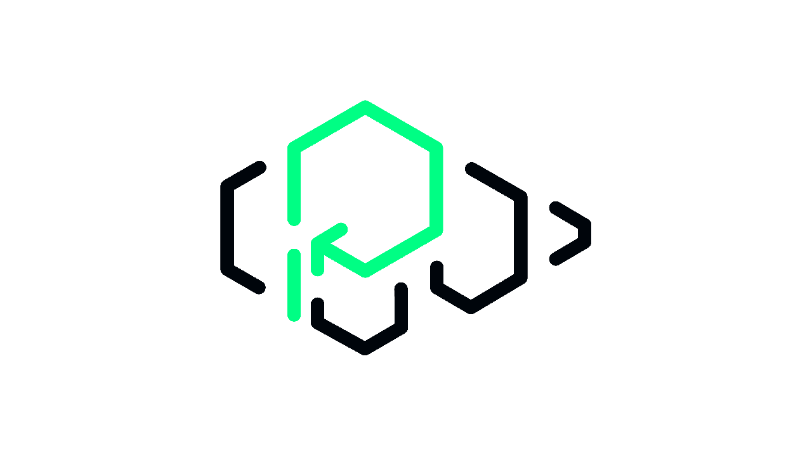

<picture>
  <source media="(prefers-color-scheme: dark)" srcset="assets/banner-dark.png">
  <source media="(prefers-color-scheme: light)" srcset="assets/banner-light.png">
  
</picture>

<div align="center">

[](https://github.com/platformatic/platformatic/actions/workflows/ci.yml)
[](https://github.com/platformatic/platformatic/actions/workflows/update-docs.yml)
[](https://standardjs.com/)
[](https://www.npmjs.com/package/platformatic)
[](https://discord.gg/platformatic)

</div>

<h1 align="center">
  <br/>
  The Open Source Toolkit for Node.js
  <br/>
</h1>

<div align="center"> 

  __Platformatic__'s Open Source toolkit helps you build modern Node.js  
  applications without the endless loop of setup and maintenance. 
</div>
<br/>

## How does it work?
Platformatic puts Node development on autopilot, with:

- 🧱 Opinionated structures and composable templates
- 🔋 Batteries-included API setup
- 📄 Out-of-the-box documentation, logs, and metrics
- ⚙️ Shareable and reusable configurations 

## Ready to get started?

### Install
<hr />

```bash
# Create a new application
npm create platformatic@latest

# Or install manually:
npm install platformatic
```

Follow our [Quick Start Guide](https://docs.platformatic.dev/docs/getting-started/quick-start-guide) to get up and running with Platformatic.

### Documentation
<hr />

- [Overview](https://docs.platformatic.dev/docs/Overview)
- [Getting Started](https://docs.platformatic.dev/docs/getting-started/quick-start-guide)
- [Guides](https://docs.platformatic.dev/docs/guides/movie-quotes-app-tutorial)

Check out our full documentation at [docs.platformatic.dev](https://docs.platformatic.dev).

### Support
<hr />

Join our community on [Discord](https://discord.gg/platformatic).
For a dedicated support, explore our [Enterprise Plans](https://www.platformatichq.com)

## Platformatic for Teams 
<hr />

Find out more about the enterprise command center that simplifies the development, management and operations of your Node.js apps at [platformaticHQ.com](https://www.platformatichq.com).


## Issues

If you run into a bug or have a suggestion for improvement, please raise an 
[issue on GitHub](https://github.com/platformatic/platformatic/issues/new) or join our [Discord feedback](https://discord.gg/platformatic) channel.

