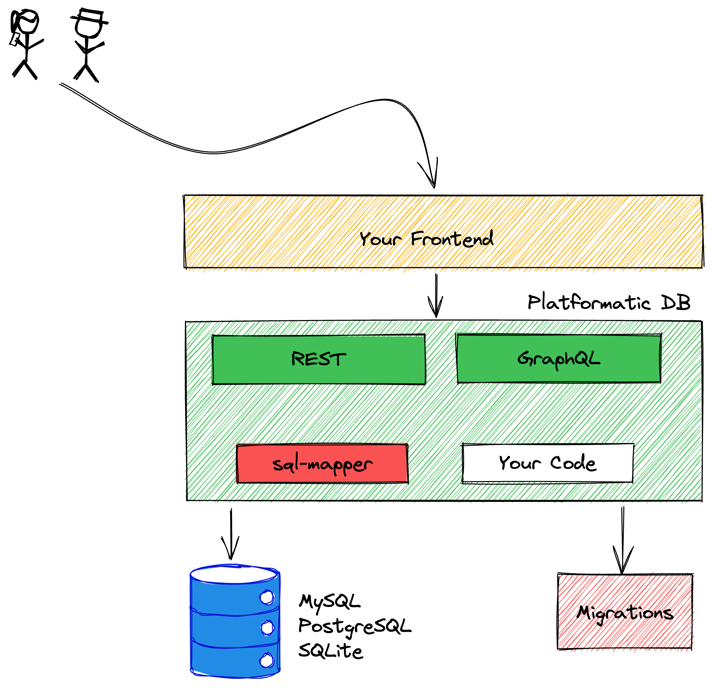

# Architecture

Platformatic is a collection of Open Source tools designed to eliminate friction
in backend development. The first of those tools is Platformatic DB, which is developed
as `@platformatic/db`.

## Platformatic DB

Platformatic DB can expose a SQL database by dynamically mapping it to REST/OpenAPI
and GraphQL endpoints. It supports a limited subset of the SQL query language, but
also allows developers to add their own custom routes and resolvers.

Platformatic DB is composed of a few key libraries:

1. `@platformatic/sql-mapper` - follows the [Data Mapper pattern](https://en.wikipedia.org/wiki/Data_mapper_pattern) to build an API on top of a SQL database.
   Internally it uses the [`@database` project](https://www.atdatabases.org/).
1. `@platformatic/sql-openapi` - uses `sql-mapper` to create a series of REST routes and matching OpenAPI definitions.
   Internally it uses [`@fastify/swagger`](https://github.com/fastify/fastify-swagger).
1. `@platformatic/sql-graphql` - uses `sql-mapper` to create a GraphQL endpoint and schema. `sql-graphql` also support Federation.
   Internally it uses [`mercurius`](https://github.com/mercuriusjs/mercurius).

Platformatic DB allows you to load a [Fastify plugin](https://www.fastify.io/docs/latest/Reference/Plugins/) during server startup that contains your own application-specific code.
The plugin can add more routes or resolvers — these will automatically be shown in the OpenAPI and GraphQL schemas.

SQL database migrations are also supported. They're implemented internally with the [`postgrator`](https://www.npmjs.com/package/postgrator) library.

