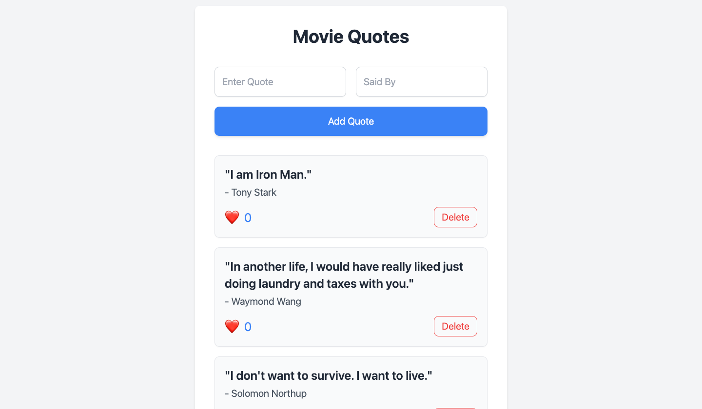

import Tabs from '@theme/Tabs';
import TabItem from '@theme/TabItem';

import NewApiProjectInstructions from './new-api-project-instructions.md';
import SetupWatt from './setup-watt.md';

# Fullstack Guide

Welcome to your next steps with Platformatic services such as [Platformatic Watt](../packages/watt/overview.md), [Platformatic DB](../packages/db/overview.md) with [SQLite](https://www.sqlite.org/), [Platformatic Client](../packages/client/overview.md) and the [Platformatic Composer](../packages/composer/overview.md). 

In this tutorial, you will build a movie quotes application, where users can add, like and delete quotes from popular movies. This guide will help you setup and run your first full-stack Platformatic application.

:::note

While this guide uses [SQLite](https://www.sqlite.org/), Platformatic DB also supports [PostgreSQL](https://www.postgresql.org/), [MySQL](https://www.mysql.com/), and [MariaDB](https://mariadb.org/). For more details on database compatibility, see the [Platformatic DB documentation](../packages/db/overview.md#supported-databases).

:::

## Prerequisites

Before starting, ensure you have the following installed:
- [Node.js](https://nodejs.org/) (v20.16.0+ or v22.3.0+)
- [npm](https://docs.npmjs.com/cli/) (v7 or higher)
- A code editor, (e.g., [Visual Studio Code](https://code.visualstudio.com/))

## Create a Platformatic Watt Application 

<SetupWatt />

## Add Platformatic DB service 

<NewApiProjectInstructions />

### Start Your API Server

Run the following command in your project directory to start your API server:

<Tabs groupId="package-manager">
<TabItem value="npm" label="npm">

```bash
npm run dev
```

</TabItem>
<TabItem value="yarn" label="yarn">

```bash
yarn run dev
```

</TabItem>

<TabItem value="pnpm" label="pnpm">

```bash
pnpm run dev
```

</TabItem>
</Tabs>


Your API server is now live! 🌟 It will automatically serve REST and GraphQL interfaces for your SQL database.

### Create a Database Schema

Navigate to the `migrations` directory within the `services` folder of your project directory. This folder contains your database migration files: 

- `001.do.sql`: contains the SQL statements for creating database objects.
- `001.undo.sql`: contains the SQL statements to remove database objects. 

For the movie quote application, you will need a schema configuration for the movie table and likes. Add the schema configuration below in the `001.do.sql` file to do this:

```sql
CREATE TABLE quotes (
  id INTEGER PRIMARY KEY,
  quote TEXT NOT NULL,
  said_by VARCHAR(255) NOT NULL,
  created_at DATETIME DEFAULT CURRENT_TIMESTAMP
);
```

This SQL query creates a database table called "quotes" that stores: a unique ID number, the quote's text, who said it, and when it was added to the database.

Create a new file `002.do.sql` in the same folder directory and add a schema below:

```sql
CREATE TABLE movies (
  id INTEGER PRIMARY KEY,
  name TEXT NOT NULL UNIQUE
);

ALTER TABLE quotes ADD COLUMN movie_id INTEGER DEFAULT 0 REFERENCES movies(id);
```

This schema stores the movie `IDs` and the movie `names`, adds a new column that links each movie quote to a specific `movie` in the movies table. 

Now create a `003.do.sql` and add the schema configuration below:

```sql
ALTER TABLE quotes ADD COLUMN likes INTEGER default 0;
```

### Create a Like Quotes Plugin 

You will add a Fastify plugin for adding likes to a quote. Create a new file `like-quote.js` in the plugins directory of your DB service. 

```js
'use strict'

const S = require("fluent-json-schema");

/** @param {import('fastify').FastifyInstance} app */
module.exports = async function plugin(app) {
  async function incrementQuoteLikes(id) {
    const { db, sql } = app.platformatic;
    const result = await db.query(sql`
      UPDATE quotes SET likes = likes + 1 WHERE id=${id} RETURNING *
    `);
    return result;
  }

  const schema = {
    params: S.object().prop("id", app.getSchema("Quote").properties.id),
  };

  // Check if the route already exists
  if (!app.hasRoute({ method: 'POST', url: '/quotes/:id/like' })) {
    app.post("/quotes/:id/like", { schema }, async function (request, reply) {
      return { likes: await incrementQuoteLikes(request.params.id) };
    });
  }
};
```

Here, you've created a API endpoint that lets users like a quote in the database. `incrementQuoteLikes` function updates the database by adding 1 to the `quote`'s `likes` count. The `fluent-json-schema` checks that the quote `ID` is valid. 

### Apply Schema Migrations 

Run the command below for database migrations

```sh
npx wattpm db:migrations:apply
```

## Add a Composer service 

[Platformatic Composer](../packages/composer/overview.md) integrates different microservices into a single API for more efficient management. For the movie quotes application, you will use the Platformatic composer to aggregate the DB service, and your frontend application. 

Inside `web` folder, let's create a new Platformatic Composer

```bash
npx wattpm create
```

This will output:

```
Hello Fortune Ikechi, welcome to Platformatic 2.64.0
Using existing configuration ...
? Which kind of service do you want to create? @platformatic/composer
? What is the name of the service? composer
? Do you want to create another service? no
? Which service should be exposed? composer
? Do you want to use TypeScript? no
[16:06:50] INFO: /Users/tmp/my-app/.env written!
[16:06:50] INFO: /Users/tmp/my-app/.env.sample written!
[16:06:50] INFO: /Users/tmp/my-app/web/composer/package.json written!
[16:06:50] INFO: /Users/tmp/my-app/web/composer/platformatic.json written!
[16:06:50] INFO: /Users/tmp/my-app/web/composer/.gitignore written!
[16:06:50] INFO: /Users/tmp/my-app/web/composer/plt-env.d.ts written!
[16:06:50] INFO: /Users/tmp/my-app/web/composer/README.md written!
[16:06:50] INFO: Installing dependencies for the application using npm ...
[16:06:50] INFO: Installing dependencies for the service composer using npm ...
[16:06:52] INFO: Project created successfully, executing post-install actions...
[16:06:52] INFO: You are all set! Run `npm start` to start your project.
```

### Add services to composer 

In your `web/composer` directory, select the `platformatic.json` file and add the DB service to your composer:

```json
{
  "$schema": "https://schemas.platformatic.dev/@platformatic/composer/2.5.5.json",
  "composer": {
    "services": [
      {
        "id": "db",
        "openapi": {
          "url": "/documentation/json"
        }
      }
    ],
    "refreshTimeout": 1000
  },
  

  "watch": true
}
```

## Add a React frontend for Movie Quotes App

Next steps is to add a React (vite) frontend for the movie quotes app. Run the command to create a React.js application:

```sh
npm create vite@latest frontend -- --template react
```

which will output:

```sh
> npx
> create-vite frontend --template react


Scaffolding project in /Users/fortuneikechi/Desktop/frontend...

Done. Now run:

  cd frontend
  npm install
  npm run dev
```

### Setting Up the Platformatic Frontend Client

To kickstart the project, in your `web/frontend/src` directory, run the command to create a [Platformatic frontend client](https://docs.platformatic.dev/docs/client/frontend) for your remote server:

```sh
npx --package @platformatic/client-cli plt-client --frontend http://0.0.0.0:3042 --name next-client web/frontend/src
```

This command will generate a [Platformatic frontend client](https://docs.platformatic.dev/docs/client/frontend) in the specified web/frontend/src folder, which allows a more efficient communication between your frontend and Platformatic DB and composer service.

### Installed Required Packages 

To style the application, install the following CSS packages:

```sh
npm install tailwindcss postcss autoprefixer
```

Set up **Tailwind CSS** by creating the necessary configuration files:

```sh
npx tailwindcss init -p
```

Ensure your `tailwind.config.js` points to the correct paths for your components:

```js
module.exports = {
  content: ['./src/**/*.{js,jsx,ts,tsx}', './public/index.html'],
  theme: {
    extend: {},
  },
  plugins: [],
};
```

### Building the `QuoteList` Component

The core of your frontend lies in the `src/components/QuoteList.jsx` file. Here's how it works:

- **Data Management**:
  - Fetches quotes from the API.
  - Handles creating new quotes, liking existing ones, and deleting quotes.
- **State Handling**:
  - Manages loading, error states, and real-time updates for user interactions.

Here’s the complete `QuoteList` component:

```js
import { useState, useEffect } from 'react';
import { setBaseUrl, dbGetQuotes, dbCreateQuote, dbDeleteQuotes, postQuotesIdLike } from '../frontend-client/frontend-client.mjs';

// Set the base URL for the API client
setBaseUrl(window.location.origin); // Or your specific API base URL

const QuoteList = () => {
  const [quotes, setQuotes] = useState([]);
  const [error, setError] = useState(null);
  const [newQuote, setNewQuote] = useState({ quote: '', saidBy: '' });
  const [isLoading, setIsLoading] = useState(true);

  useEffect(() => {
    getQuotes();
  }, []);

  const getQuotes = async () => {
    try {
      setIsLoading(true);
      const fetchedQuotes = await dbGetQuotes({});
      setQuotes(fetchedQuotes);
      setError(null);
    } catch (error) {
      console.error('Error fetching quotes:', error);
      setError('Failed to fetch quotes');
    } finally {
      setIsLoading(false);
    }
  };

  const handleLike = async (id) => {
    try {
      await postQuotesIdLike({ id });
      getQuotes();
    } catch (error) {
      console.error('Error liking quote:', error);
      setError('Failed to like quote');
    }
  };

  const handleCreate = async (e) => {
    e.preventDefault();
    if (!newQuote.quote || !newQuote.saidBy) {
      setError('Please fill in both quote and author');
      return;
    }
    try {
      await dbCreateQuote(newQuote);
      setNewQuote({ quote: '', saidBy: '' });
      setError(null);
      getQuotes();
    } catch (error) {
      console.error('Error creating quote:', error);
      setError('Failed to create quote');
    }
  };

  const handleDelete = async (id) => {
    try {
      await dbDeleteQuotes({ id });
      getQuotes();
    } catch (error) {
      console.error('Error deleting quote:', error);
      setError('Failed to delete quote');
    }
  };

  return (
    <div className="min-h-screen flex flex-col items-center justify-center bg-gray-100 py-8">
      <div className="bg-white shadow-md rounded-lg p-8 max-w-lg w-full">
        <h1 className="text-3xl font-bold mb-8 text-center text-gray-800">Movie Quotes</h1>
        
        {error && (
          <div className="mb-4 p-4 bg-red-100 border border-red-400 text-red-700 rounded-lg">
            {error}
          </div>
        )}

        <form onSubmit={handleCreate} className="mb-8">
          <div className="flex flex-col sm:flex-row gap-4 mb-4">
            <input
              type="text"
              placeholder="Enter Quote"
              value={newQuote.quote}
              onChange={(e) => setNewQuote({ ...newQuote, quote: e.target.value })}
              className="w-full p-3 border border-gray-300 rounded-lg shadow-sm focus:ring-2 focus:ring-blue-500 focus:border-transparent"
            />
            <input
              type="text"
              placeholder="Said By"
              value={newQuote.saidBy}
              onChange={(e) => setNewQuote({ ...newQuote, saidBy: e.target.value })}
              className="w-full p-3 border border-gray-300 rounded-lg shadow-sm focus:ring-2 focus:ring-blue-500 focus:border-transparent"
            />
          </div>
          <button
            type="submit"
            className="w-full bg-blue-500 text-white py-3 rounded-lg hover:bg-blue-600 transition duration-200 shadow-md"
          >
            Add Quote
          </button>
        </form>

        {isLoading ? (
          <p className="text-center text-gray-500 text-lg">Loading quotes...</p>
        ) : quotes.length === 0 ? (
          <p className="text-center text-gray-500 text-lg">No quotes available</p>
        ) : (
          <div className="space-y-4">
            {quotes.map((quote) => (
              <div
                key={quote.id}
                className="bg-gray-50 p-4 rounded-lg shadow-sm border border-gray-200"
              >
                <p className="text-xl font-semibold text-gray-800 mb-1">"{quote.quote}"</p>
                <p className="text-md text-gray-600 mb-3">- {quote.saidBy}</p>
                <div className="flex justify-between items-center">
                  <button
                    onClick={() => handleLike(quote.id)}
                    className="flex items-center space-x-2 text-blue-500 hover:text-blue-600"
                  >
                    <span className="text-2xl">❤️</span> 
                    <span className="text-xl">{quote.likes || 0}</span>
                  </button>
                  <button
                    onClick={() => handleDelete(quote.id)}
                    className="text-red-500 hover:text-red-600 px-3 py-1 border border-red-500 rounded-lg hover:bg-red-50 transition duration-200"
                  >
                    Delete
                  </button>
                </div>
              </div>
            ))}
          </div>
        )}
      </div>
    </div>
  );
};

export default QuoteList;
```

###  Integrating the `QuoteList` Component

Update your main app file `src/App.jsx` to include the QuoteList component:

```js 
import QuoteList from './components/QuoteList';

function App() {
  return (
    <div className="App">
      <QuoteList />
    </div>
  );
}

export default App;
```

#### Add frontend to Composer

In your `web/composer` directory, add the frontend `id` to your composer `platformatic.json` file, update it as shown below:

```json
{
  "$schema": "https://schemas.platformatic.dev/@platformatic/composer/2.5.5.json",
  "composer": {
    "services": [
      {
        "id": "db",
        "openapi": {
          "url": "/documentation/json"
        }
      },
      {
        "id": "frontend"
      }
    ],
    "refreshTimeout": 1000
  },
  

  "watch": true
}
```

### Start Your API Server

In your project directory, use the Platformatic CLI to start your API server:

```bash
npm run dev 
```


This will:
- Automatically map your SQL database and React frontend to REST using the composer 
- Start the Platformatic Watt server.

Your Platformatic application is now up and running! 🌟


