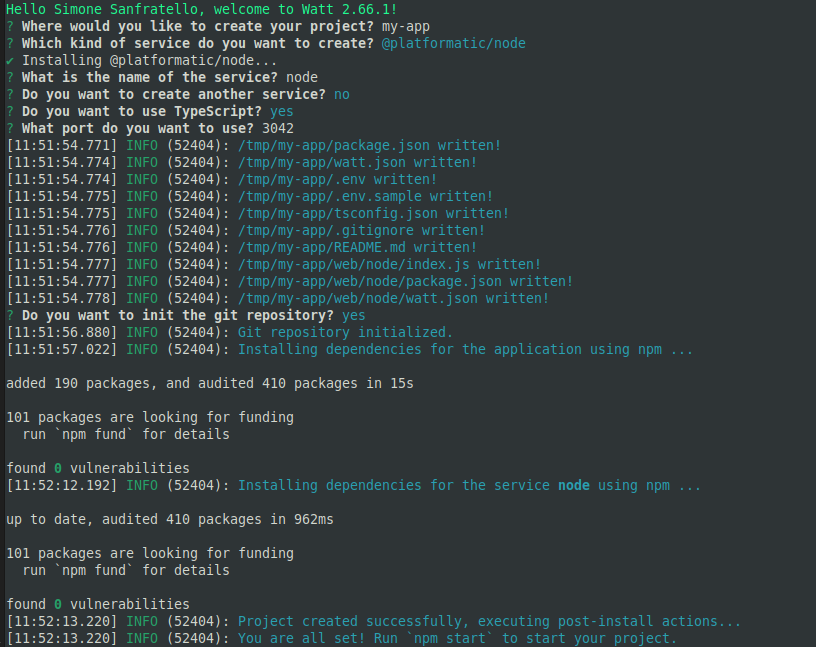
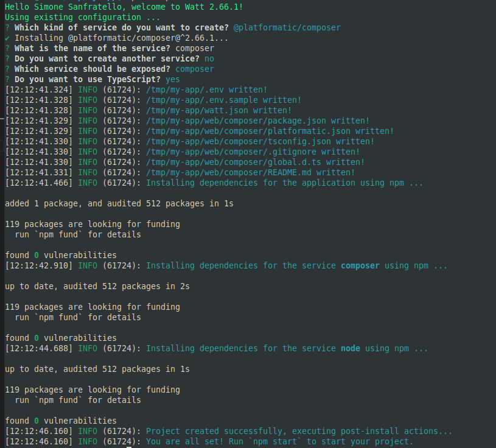

# Watt Quick Start

Welcome to your first steps with Platformatic Watt, the Node.js Application Server.
This guide will help you set up and run an application composed of the following stack:

- [Next.js](https://nextjs.org/) frontend, to render our frontend
- Generic `node:http` [`createServer`](https://nodejs.org/docs/latest/api/http.html#httpcreateserveroptions-requestlistener),
  to showcase how to add an existing Node.js app
- [Platformatic Composer](/docs/reference/composer/introduction), to coordinate/expose them all.

:::note

In this guide, we will use `Next.js` as our frontend framework, but you can also use [Astro](https://astro.build/), or [Remix](https://remix.run/).  
We plan to expand the list of supported frameworks in the future.

:::


## Prerequisites

Before starting, ensure you have the following installed:
- [Node.js](https://nodejs.org/) (v20.16.0+ or v22.3.0+)
- [npm](https://docs.npmjs.com/cli/) (v10 or higher)
- A code editor, (e.g., [Visual Studio Code](https://code.visualstudio.com/))

## Set up Watt

```bash
npx wattpm@latest init
```

Which will output and start the interactive setup:

```
Need to install the following packages:
wattpm@2.70.0
Ok to proceed? (y) y
```



It creates a new directory called `my-app` with the following structure:

```
my-app/
├── web/
│   └── node/
│       ├── package.json
│       ├── watt.json
│       └── index.js
├── .gitignore
├── .env
├── .env.sample
├── package.json
├── package-lock.json
├── README.md
├── tsconfig.json
└── watt.json
```

The dependencies are installed, so you can start working on your project right away.

In `web/node`, add a `package.json` like the following:

```json
{
  "name": "node",
  "main": "index.js",
  "type": "module",
  "scripts": {
    "start": "node index.js"
  },
  "dependencies": {
    "@platformatic/node": "^2.70.0"
  }
}
```

The `web/node/index.js` file has the following content:

```js
import { createServer } from 'node:http'

export function create() {
  return createServer((req, res) => {
    res.writeHead(200, { 'content-type': 'application/json', connection: 'close' })
    res.end(JSON.stringify({ hello: 'world' }))
  })
}
```

:::note

The default template uses the built-in `node:http` module to
create a simple HTTP server that responds with a JSON object containing a counter.
You can see that we are returning a `create` function that creates the server.
This server will be run by Watt when the application starts in its
own worker thread.

You can also use [Express](https://expressjs.com/), [Fastify](https://fastify.dev), [Koa](https://koajs.com/)
or any other Node.js framework.

:::

### Start your Watt server

Run the following command in the `my-app` directory to start your Watt server:

```bash
cd my-app
npm start
```

This will internally run `wattpm start` and start your Watt server.

If you want to have have a "watch mode" to automatically restart the server when you make changes, you can run:

```bash
npm run dev
```

Which will run `wattpm dev` and start your Watt server in watch mode.

Your first Watt server is now live! 🌟 You can test it with:

```bash
curl http://localhost:3042
```

## Add a Platformatic Composer to run multiple apps

Inside the `my-app` directory, let's create a new Platformatic Composer:

```bash
npx wattpm create
```

This will output:




Start your Watt server again:

```bash
npm start
```

Then, you can test it with:

```bash
curl http://localhost:3042/node
```

:::note

You can customize how the various services are expsed by changing `web/composer/platformatic.json`.
Here is the equivalent of the default configuration when exposing a **Node.js** application: 

```json
{
  "$schema": "https://schemas.platformatic.dev/@platformatic/composer/2.70.0.json",
  "composer": {
    "services": [{
      "id": "node",
      "proxy": {
        "prefix": "/node"
      }
    }],
    "refreshTimeout": 1000
  },
  "watch": true
}
```

:::


## Add a Next.js application to Watt

Inside the `my-app` directory, let's create a new Next.js app:

```bash
npx create-next-app@latest web/next
```

Which will output:

```
Need to install the following packages:
create-next-app@15.3.2
Ok to proceed? (y) 

✔ Would you like to use TypeScript? … Yes
✔ Would you like to use ESLint? … No
✔ Would you like to use Tailwind CSS? … No
✔ Would you like your code inside a `src/` directory? … Yes
✔ Would you like to use App Router? (recommended) … No
✔ Would you like to use Turbopack for `next dev`? … No
✔ Would you like to customize the import alias (`@/*` by default)? … No
reating a new Next.js app in /tmp/my-app/web/next.

Using npm.

Initializing project with template: default 


Installing dependencies:
- react
- react-dom
- next

Installing devDependencies:
- typescript
- @types/node
- @types/react
- @types/react-dom


added 6 packages, and audited 575 packages in 4s

Success! Created next at /tmp/my-app/web/next
```

Then, let's import it to our watt server:

```bash
npx wattpm import web/next
```

We should also install the additional dependencies with:

```bash
cd web/next
npm i @platformatic/next
```

Then, we need to tell Watt to expose our `next` server on `/next` by creating a `web/next/watt.json` file:

```json
{
  "$schema": "https://schemas.platformatic.dev/@platformatic/next/2.70.0.json",
  "application": {
    "basePath": "/next"
  }
}
```

Now you can run `npm run dev` from the `my-app` directory to start your Watt server in dev/watch mode, which in turn will start Next.js in development mode.

```
cd my-app
npm run dev
```

Then, you can test it by opening your browser at [`http://localhost:3042/next`](http://localhost:3042/next).

:::note

In this example, we are exposing the Next.js app at `/next` and the Node.js app at `/node`.
You can change the paths to suit your needs. Make sure to alter the `basePath` in `web/next/watt.json` and the `prefix` in `web/composer/platformatic.json` accordingly if you customize it.

:::


## `fetch` the data from the Node.js app in the Next.js app

To allow the Next.js app to fetch the data from the Node.js app, we need to enable CORS: let's update the `node` service to enable any origin (for demo purposes).

`web/node/index.js` should be updated to:

```js
import { createServer } from 'node:http'

const corsHeaders = {
  'Access-Control-Allow-Origin': '*',
  'Access-Control-Allow-Methods': 'GET, POST, PUT, DELETE, OPTIONS',
  'Access-Control-Allow-Headers': 'Content-Type, Authorization'
}

export function create() {
  return createServer((req, res) => {
    
    if (req.method === 'OPTIONS') {
      res.writeHead(204, corsHeaders)
      res.end()
      return
    }
    
    res.writeHead(200, { 
      'content-type': 'application/json', 
      'connection': 'close',
      ...corsHeaders
    })
    res.end(JSON.stringify({ hello: 'world' }))
  })
}
```

Let's update `web/next/src/pages/index.tsx`, with the following code:

```js
import { useState, useEffect } from "react";

export default function Home() {
  const [data, setData] = useState(null);

  useEffect(() => {
    const fetchData = async () => {
      const response = await fetch('http://127.0.0.1:3042/node');
      const result = await response.json();
      setData(result);
    };

    fetchData();
  }, []);

  return (
    <>
      <div>
        <main>
          <div>
            <pre>
              {JSON.stringify(data, null, 2)}
            </pre>
          </div>
        </main>
      </div>
    </>
  );
}
```

This will fetch the data from the Node.js app and display it in the Next.js app.
Note that it uses the `node.plt.local` hostname, which is the _internal_ hostname for the `node` service.
This domain name would not work outside of a Watt or Platformatic environment.

 *** WIP ***

:::note

By default Next.js caches all `fetch()` requests.
The `{ cache: 'no-store' }` option is used to disable caching, so that you can see the counter incrementing.

:::

Launch it with: `npm run dev`.

You can now test it by opening your browser at [`http://localhost:3042/next`](http://localhost:3042/next).

## Build and Production mode

To create a build for production, you can run `wattpm build`, which is exposed as npm script:

```bash
npm run build
```

Which will in turn create a build for Next.js and for the Node.js app (in case that is needed).

To run the server in production mode, you can run:

```bash
npm run start
```

which will call `wattpm start`.

## Debug individual services with Chrome DevTools

You can debug your Watt server with Chrome DevTools by running:

```bash
npm run start -- --inspect
```

This will start an inspector instance in each service, and you can connect to it with Chrome DevTools.
Open `chrome://inspect` in Chrome, and you will see the services listed there.


Then, you can click on `inspect` to open the DevTools for that service.

## Debug individual services with VS Code

You can debug the code of individual Watt services directly in VS Code.

To run the debugger in VS Code:
* add a breakpoint in your Watt service code
* open the `Command Palette` (`Ctrl+Shift+P` on Windows, `CMD+Shift+P` on Mac)
* search `Debug: Toggle Auto Attach`, then select `Always` from the list of options
* run watt with `npm run dev`
* you should now see in your shell a log that confirms that the debugger is listening
```shell
Debugger listening on ws://127.0.0.1:62807/6132054c-766e-4d86-a716-f634118275ed
For help, see: https://nodejs.org/en/docs/inspector
Debugger attached.
```
* do a request to your service, to trigger the breakpoint code, and use VS Code to debug it as by the following screenshot


