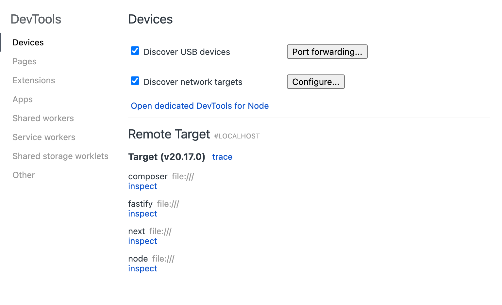
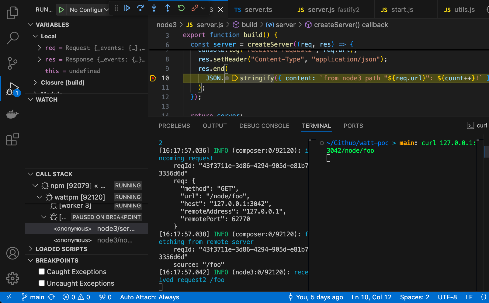

# Watt Quick Start

Welcome to your first steps with Platformatic Watt, the Node.js Application Server.
This guide will help you set up and run an application composed of the following stack:

- [Next.js](https://nextjs.org/) frontend, to render our frontend
- Generic `node:http` [`createServer`](https://nodejs.org/docs/latest/api/http.html#httpcreateserveroptions-requestlistener),
  to showcase how to add an existing Node.js app
- [Platformatic Composer](/docs/reference/composer/introduction), to coordinate/expose them all.

:::note
In this guide, we will use `Next.js` as our frontend framework, but you can also use [Astro](https://astro.build/),
or [Remix](https://remix.run/). We plan to expand the list of supported frameworks in the future.
:::


## Prerequisites

Before starting, ensure you have the following installed:
- [Node.js](https://nodejs.org/) (v20.16.0+ or v22.3.0+)
- [npm](https://docs.npmjs.com/cli/) (v10 or higher)
- A code editor, (e.g., [Visual Studio Code](https://code.visualstudio.com/))

## Set up Watt

```bash
npx wattpm@latest init
```

Which will output:
```
Need to install the following packages:
wattpm@2.0.0
Ok to proceed? (y) y
Where would you like to create your project? `my-app`
Which kind of service do you want to create? `@platformatic/node`
Do you want to create another service? `no`
Do you want to use TypeScript? `no`
What port do you want to use? `3042`
```

Dependencies are going to be installed. Your application is located in `web/my-app`.
The `watt.json` file is automatically created in the `my-app` folder and the `package.json` file includes `start` script and `@platformatic/node` as a dependency.

## Add Your first Node.js application to Watt

By choosing the `@platformatic/node` service, you have already created your nodejs app.

This file is created as your nodejs app:
```js
import { createServer } from 'node:http'

export function create() {
  return createServer((req, res) => {
    res.writeHead(200, { 'content-type': 'application/json', connection: 'close' })
    res.end(JSON.stringify({ hello: 'world' }))
  })
}
```

:::note

In this example, we are using the built-in `node:http` module to
create a simple HTTP server that responds with a JSON object containing a counter.
You can see that we are returning a `build` function that creates the server.
This server will be run by Watt when the application starts in its
own worker thread.

You can also use [Express](https://expressjs.com/), [Fastify](https://fastify.dev), [Koa](https://koajs.com/)
or any other Node.js framework.

### Start your Watt server

Run the following command in your project directory to start your Watt server:

```bash
npm start
```

This will internally run `wattpm start` and start your Watt server.

If you want to have a "watch mode" to automatically restart the server when you make changes, you can run:

```bash
wattpm dev
```

Your first Watt server is now live! 🌟 You can test it with:

```bash
curl http://localhost:3042
```

## Add a Platformatic Composer to run multiple apps

Inside `my-app`, let's create a new Platformatic Composer

```bash
npx wattpm create
```

This will output:

```
Hello Matteo Collina, welcome to Platformatic 2.64.0
Using existing configuration ...
? Which kind of service do you want to create? @platformatic/composer
? What is the name of the service? composer
? Do you want to create another service? no
? Which service should be exposed? composer
? Do you want to use TypeScript? no
[16:06:50] INFO: /Users/matteo/tmp/my-app/.env written!
[16:06:50] INFO: /Users/matteo/tmp/my-app/.env.sample written!
[16:06:50] INFO: /Users/matteo/tmp/my-app/web/composer/package.json written!
[16:06:50] INFO: /Users/matteo/tmp/my-app/web/composer/platformatic.json written!
[16:06:50] INFO: /Users/matteo/tmp/my-app/web/composer/.gitignore written!
[16:06:50] INFO: /Users/matteo/tmp/my-app/web/composer/global.d.ts written!
[16:06:50] INFO: /Users/matteo/tmp/my-app/web/composer/README.md written!
[16:06:50] INFO: Installing dependencies for the application using npm ...
[16:06:50] INFO: Installing dependencies for the service composer using npm ...
[16:06:52] INFO: Project created successfully, executing post-install actions...
[16:06:52] INFO: You are all set! Run `npm start` to start your project.
```

Start your Watt server again:

```bash
npm start
```

Then, you can test it with:

```bash
curl http://localhost:3042/node
```

:::note

You can customize how the various services are expsed by changing `web/composer/platformatic.json`.
Here is the equivalent of the default configuration when exposing a Node.js application: 

```json
{
  "$schema": "https://schemas.platformatic.dev/@platformatic/composer/2.0.0.json",
  "composer": {
    "services": [{
      "id": "node",
      "proxy": {
        "prefix": "/node"
      }
    }],
    "refreshTimeout": 1000
  },
  "watch": true
}
```

:::


## Add a Next.js application to Watt

Inside `my-app`, let's create a new Next.js app:

```bash
npx create-next-app@latest web/next
```

Which will output:

```
✔ Would you like to use TypeScript? … No
✔ Would you like to use ESLint? … No
✔ Would you like to use Tailwind CSS? … No
✔ Would you like to use `src/` directory? … Yes
✔ Would you like to use App Router? (recommended) … Yes
✔ Would you like to customize the default import alias (@/*)? … No
Creating a new Next.js app in /Users/matteo/tmp/my-app/web/next.

Using npm.

Initializing project with template: app


Installing dependencies:
- react
- react-dom
- next


added 18 packages in 4s

195 packages are looking for funding
  run `npm fund` for details
Success! Created next at /Users/matteo/tmp/my-app/web/next
```

Then, let's import it to our watt server:

```bash
wattpm import web/next
```

We should also install the additional dependencies with:

```bash
npm i
```

Then, we need to tell Watt to expose our `next` server on `/next` by modifying `web/next/watt.json`:

```json
{
  "$schema": "https://schemas.platformatic.dev/@platformatic/next/2.0.0.json",
  "application": {
    "basePath": "/next"
  }
}
```

You can run `npm run dev` to start your Watt server in dev/watch mode, which in turn will start Next.js
in development mode.

Then, you can test it by opening your browser at [`http://localhost:3042/next`](http://localhost:3042/next).

:::note

In this example, we are exposing the Next.js app at `/next` and the Node.js app at `/node`.
You can change the paths to suit your needs. Make sure to alter the `basePath` in `web/next/watt.json`
and the `prefix` in `web/composer/platformatic.json` accordingly if you customize it.

:::


## `fetch` the data from the Node.js app in the Next.js app

Replace `web/next/src/app/page.js`, with the following code:

```js
import styles from "./page.module.css";

export default async function Home() {
  const { content } = await (await fetch("http://node.plt.local", { cache: 'no-store' })).json();
  return (
    <div className={styles.page}>
      <main className={styles.main}>
        ${content}
      </main>
    </div>
  );
}
```

This will fetch the data from the Node.js app and display it in the Next.js app.
Note that it uses the `node.plt.local` hostname, which is the _internal_ hostname for the `node` service.
This domain name would not work outside of a Watt or Platformatic environment.

:::note

By default Next.js caches all `fetch()` requests.
The `{ cache: 'no-store' }` option is used to disable caching, so that you can see the counter incrementing.

:::

Launch it with: `npm run dev`.

You can now test it by opening your browser at [`http://localhost:3042/next`](http://localhost:3042/next).

## Build and Production mode

To create a build for production, you can run `wattpm build`, which is exposed as npm script:

```bash
npm run build
```

Which will in turn create a build for Next.js and for the Node.js app (in case that is needed).

To run the server in production mode, you can run:

```bash
npm run start
```

which will call `wattpm start`.

## Debug individual services with Chrome DevTools

You can debug your Watt server with Chrome DevTools by running:

```bash
npm run start -- --inspect
```

This will start an inspector instance in each service, and you can connect to it with Chrome DevTools.
Open `chrome://inspect` in Chrome, and you will see the services listed there.



Then, you can click on `inspect` to open the DevTools for that service.

## Debug individual services with VS Code

You can debug the code of individual Watt services directly in VS Code.

To run the debugger in VS Code:
* add a breakpoint in your Watt service code
* open the `Command Palette` (`Ctrl+Shift+P` on Windows, `CMD+Shift+P` on Mac)
* search `Debug: Toggle Auto Attach`, then select `Always` from the list of options
* run watt with `npm run dev`
* you should now see in your shell a log that confirms that the debugger is listening
```shell
Debugger listening on ws://127.0.0.1:62807/6132054c-766e-4d86-a716-f634118275ed
For help, see: https://nodejs.org/en/docs/inspector
Debugger attached.
```
* do a request to your service, to trigger the breakpoint code, and use VS Code to debug it as by the following screenshot


