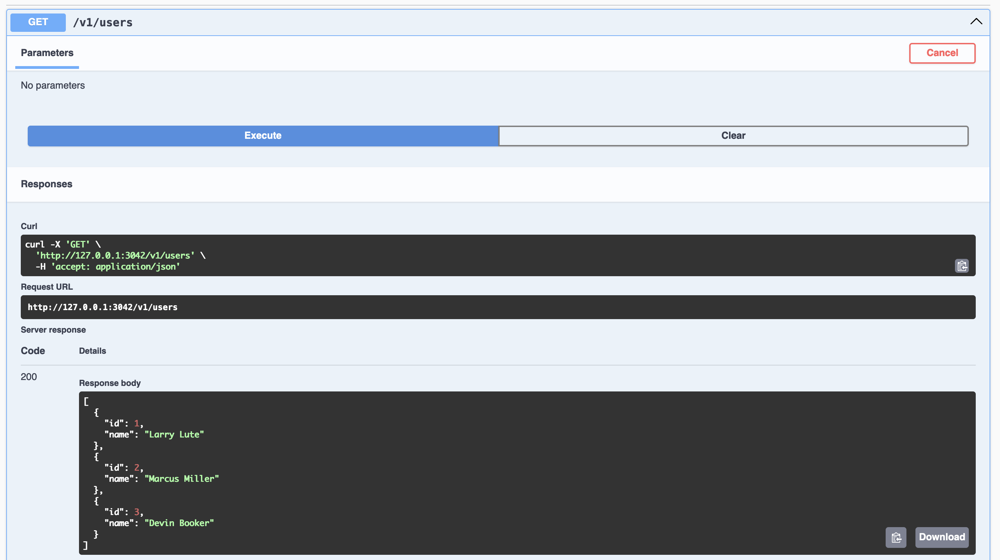
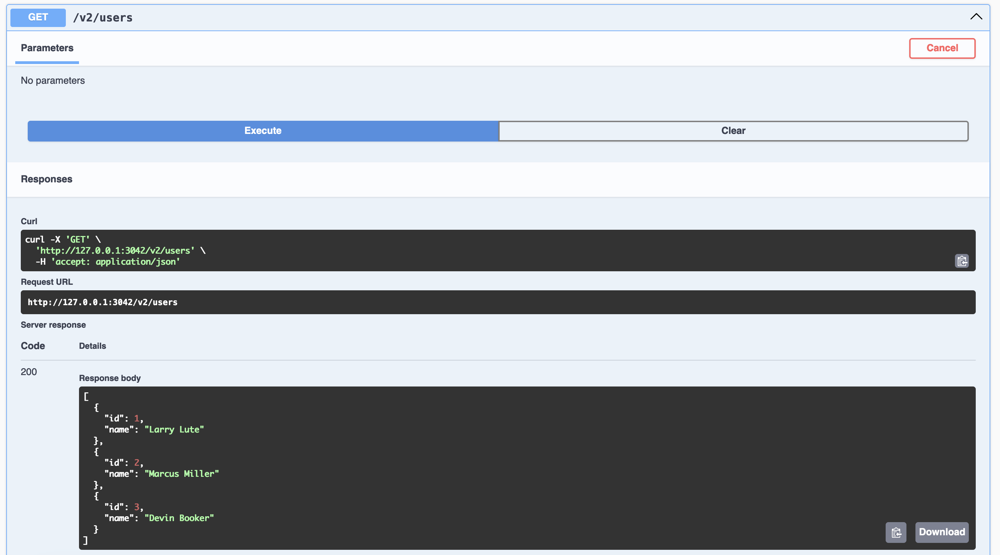
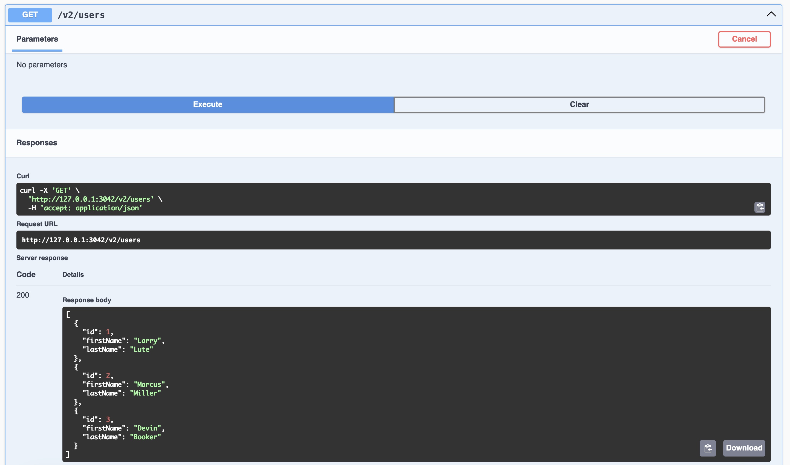

# Versionize a Platformatic application

## Introduction

Platformatic applications support versioning of the API without the need to deploy a new application for each version. Every time you bump a new API version of your application platformatic calculates the diff between the previous and current versions and maps API routes to the current one. In cases when it's not possible to automatically map the routes, platformatic generates a mapper plugin that can be used to map the routes manually or generated automatically by OpenAI. As a result, you have a single instance of the application that handles all the requests.

## Setup platformatic application versioning

### Setup the application

Lets start with a basic platformatic service application that can be generated by running `create-platformatic` command.

```bash
npx create-platformatic@latest
```

Lets add a new route to the application that will be used to test the versioning. Add the following code to the `routes/root.js` file.

```js
fastify.get('/users', {
  schema: {
    response: {
      200: {
        type: 'array',
        items: {
          type: 'object',
          properties: {
            id: { type: 'number' },
            name: { type: 'string' }
          }
        }
      }
    }
  }
}, async (request, reply) => {
  return [
    { id: 1, name: 'Larry Lute' },
    { id: 2, name: 'Marcus Miller' },
    { id: 3, name: 'Devin Booker' }
  ]
})
```

It's important to add the `schema` property to the route definition. Platformatic uses the OpenAPI schema to find the differences between the versions.

You can start the application and test that the route is working as expected.

```bash
npx platformatic@latest start
```

Testing `/users` route:

```bash
curl http://localhost:3042/users
```

Response:

```json
[
  {
    "id": 1,
    "name": "Larry Lute"
  },
  {
    "id": 2,
    "name": "Marcus Miller"
  },
  {
    "id": 3,
    "name": "Devin Booker"
  }
]
```

### Bump the first API version

Now when we have a basic application we can bump the first API version. To do that we need to run the following command:

```bash
npx platformatic@latest service versions bump
```

It will create a first version of the application `v1` and will map all the routes to the current version. If you start the application, you will see that now the route is available under the `/v1/users` path. If you want to create a different version name you can use the `--version` option.

Testing `/v1/users` route:

```bash
curl http://localhost:3042/v1/users
```
```
[
  {
    "id": 1,
    "name": "Larry Lute"
  },
  {
    "id": 2,
    "name": "Marcus Miller"
  },
  {
    "id": 3,
    "name": "Devin Booker"
  }
]
```

**API "v1" swagger page**


### Bump the second API version

Now when we have the first version of the application we can bump the second version. To do that we need to run the same command as before:

```bash
npx platformatic@latest service versions bump
```

It will create a second version of the application `v2` and will map all the routes to the current version. If you start the application, you will see that now the same under `/v1/users` and `/v2/users` paths. These routes were mapped automatically because the OpenAPI schema was the same for both versions.


Testing `/v2/users` route:

```bash
curl http://localhost:3042/v2/users
```
```bash
[
  {
    "id": 1,
    "name": "Larry Lute"
  },
  {
    "id": 2,
    "name": "Marcus Miller"
  },
  {
    "id": 3,
    "name": "Devin Booker"
  }
]
```

**API "v2" swagger page**


### Update the second API version

Lets make some changes to the latest version of the application. Lets modify the `/users` route in a following way:


```js
fastify.get('/users', {
  schema: {
    response: {
      200: {
        type: 'array',
        items: {
          type: 'object',
          properties: {
            id: { type: 'number' },
            firstName: { type: 'string' },
            lastName: { type: 'string' }
          }
        }
      }
    }
  }
}, async (request, reply) => {
  return [
    { id: 1, firstName: 'Larry', lastName: 'Lute' },
    { id: 2, firstName: 'Marcus', lastName: 'Miller' },
    { id: 3, firstName: 'Devin', lastName: 'Booker' }
  ]
})
```

Now the route returns the `firstName` and `lastName` instead of the `name`. Lets update the second version of the application to reflect the changes. To do that we need to run the following command:

```bash
npx platformatic@latest service versions update
```

Having that now the second version of the route can't be mapped automatically, platformatic will generate a mapper plugin that can be used to map the routes manually or generated automatically by OpenAI. The mapper plugin will be generated in the `versions/v1/get-users.js` file.

In the mappers plugin you can find a lot of useful information about the changes and code that proxies the "v1" route to the "v2" route. All you need to do is to update the `mapOutputData200` function to map the response from the "v2" route to the "v1" route.

```js
function mapOutputData200 (outputData) {
  const mappedBody = outputData.responseBody.map((user) => {
    return {
      id: user.id,
      name: `${user.firstName} ${user.lastName}`
    }
  })
  
  return {
    headers: outputData.headers,
    responseBody: mappedBody
  }
}
```

Now when you start the application and see that the `/v1/users` route returns response with the `name` property when the `/v2/users` route returns response with the `firstName` and `lastName` properties.

Testing `/v1/users` route:

```bash
curl http://localhost:3042/v1/users
```
```bash
[
  {
    "id": 1,
    "name": "Larry Lute"
  },
  {
    "id": 2,
    "name": "Marcus Miller"
  },
  {
    "id": 3,
    "name": "Devin Booker"
  }
]
```


Testing `/v2/users` route:

```bash
curl http://localhost:3042/v2/users
```
```bash
[
  {
    "id": 1,
    "firstName": "Larry",
    "lastName": "Lute"
  },
  {
    "id": 2,
    "firstName": "Marcus",
    "lastName": "Miller"
  },
  {
    "id": 3,
    "firstName": "Devin",
    "lastName": "Booker"
  }
]
```

**API "v2" swagger page**


### Generating the mapper plugin with OpenAI

Platformatic supports generating the mapper plugin automatically using the OpenAI. Before doing so, make sure you have a platformatic user API key. If not, you can generate it by running the following command:

```bash
npx platformatic@latest login
```

Now when you have the API key you can generate the mapper plugin by running the following command:

```bash
npx platformatic@latest service versions update --openai
```

It will update the same mapper plugin as before but this time it will use OpenAI to generate the request and response mappers. You should always be careful and check the generated code. In my case OpenAI generated the following code for the same `mapOutputData200` function:

```js
// !!! This function was generated by OpenAI. Check before use !!!
function mapOutputData200 (output) {
  const mappedOutput = {
    headers: {},
    responseBody: output.responseBody.map(item => ({
      id: item.id,
      name: `${item.firstName} ${item.lastName}`
    }))
  }
  return mappedOutput
}
```

As you can see the code is a little bit different but the result is the same. You can use the code generated by OpenAI or write your own.

### Shared routes

Sometimes you may want to have a route that is shared between all the versions. For example, you may want to have a `/health` route that is available under all the versions. To do that you need to set the plugin with this route in the platformatic `plugins` config section rather than in the `versions` config section.
