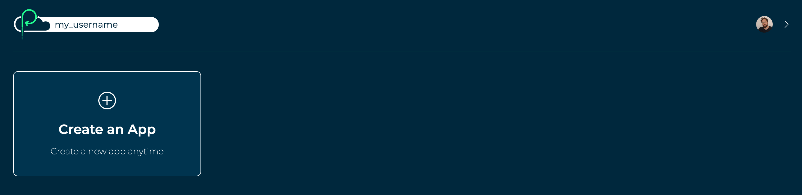

# Build and deploy a modular monolith

## Introduction

In this guide we'll create a "modular monolith" Library application. It will be a Platformatic Runtime app which contains multiple Platformatic DB and Composer services. We'll learn how to:

- Create and configure a [Platformatic Runtime](https://docs.platformatic.dev/docs/reference/runtime/introduction) app with multiple services
  - Three [Platformatic DB](https://docs.platformatic.dev/docs/reference/db/introduction) services, each with their own databases
  - A [Platformatic Composer](https://docs.platformatic.dev/docs/reference/composer/introduction) service which aggregates multiple service's REST APIs into a composed API
- Customise the composed API that's automatically generated in a Composer service
- Generate a client for a service's REST API and use it in a Platformatic service to make API requests
- Add custom functionality to a Composer service's composed API by modifying its routes and responses
- Deploy a Runtime app to Platformatic Cloud

The architecture for our Library application will look like this:

<!-- SCREENSHOT: architecture-diagram.png -->


The complete code for this tutorial is [available on GitHub](https://github.com/platformatic/examples/tree/main/applications/build-modular-monolith-with-platformatic).

### Prerequisites

To follow along with this tutorial, you'll need to have this software installed:

- [Node.js](https://nodejs.org/?utm_campaign=Build%20and%20deploy%20a%20modular%20monolith%20with%20Platformatic&utm_medium=blog&utm_source=Platformatic%20Blog) >= v18.8.0
- [npm](https://docs.npmjs.com/cli/?utm_campaign=Build%20and%20deploy%20a%20modular%20monolith%20with%20Platformatic&utm_medium=blog&utm_source=Platformatic%20Blog) v7 or later
- A code editor, for example [Visual Studio Code](https://code.visualstudio.com/?utm_campaign=Build%20and%20deploy%20a%20modular%20monolith%20with%20Platformatic&utm_medium=blog&utm_source=Platformatic%20Blog).

If you want to follow along with the [Deploy to Platformatic Cloud](#heading-deploy-to-platformatic-cloud) part of this tutorial, you'll need to create a free [Platformatic Cloud](https://platformatic.cloud), if you don't have one already.

## Create a Platformatic Runtime app: Library app

We're going to start by creating our Library app. This will be a Platformatic Runtime app that contains all of our services.

First, let's run the Platformatic creator wizard in our terminal:

```bash
npm create platformatic@latest
```

And then let's enter the following settings:

- **Which kind of project do you want to create?**
  - `Runtime`
- **Where would you like to create your project?**
  - `library-app`
- **Where would you like to load your services from?**
  - `services`
- **Do you want to run npm install?**
  - `yes`

After the dependencies have been installed, the creator will prompt us to create a service:

```
Let's create a first service!
```

We're now going to create a Platformatic DB service named `people-service`.

Let's enter the following settings for our new service:

- **What is the name of the service?**
  - `people-service`
- **Which kind of project do you want to create?**
  - `DB`
- **What database do you want to use?**
  - `SQLite`
- **Do you want to use the connection string "sqlite://./db.sqlite"?**
  - `y`
- **Do you want to create default migrations?**
  - `yes`
- **Do you want to create a plugin?**
  - `no`
- **Do you want to use TypeScript?**
  - `no`
- **What port do you want to use?**
  - `3042`

After answering these questions, the creator will create all of the files for the `people-service`. 

When the creator asks if we want to create another service, let's say `no`. Then let's say `yes` both times when it asks if we want to create GitHub Actions to deploy this application to Platformatic Cloud.

Once the creator has finished, our `library-app` directory should look like this:

```
library-app/
├── README.md
├── package.json
├── platformatic.runtime.json
└── services
    └── people-service
        ├── README.md
        ├── migrations
        │   ├── 001.do.sql
        │   └── 001.undo.sql
        ├── package.json
        └── platformatic.db.json
```

## Start the Library app

Let's change into the directory that contains our Library app:

```bash
cd library-app
```

And then we can start the app with:

```bash
npm start
```

We'll see a warning message displayed like this in our terminal:

```
[17:56:00.807] WARN (people-service/8615): No tables found in the database. Are you connected to the right database? Did you forget to run your migrations? This guide can help with debugging Platformatic DB: https://docs.platformatic.dev/docs/guides/debug-platformatic-db
```

<!-- SCREENSHOT: start-the-runtime-app-01.png -->


If we open up the API documentation for our People service at http://127.0.0.1:3042/documentation/, we'll also see that it says `"No operations defined in spec!"`.

We're seeing these messages because we haven't yet defined a schema for our People database. To fix this, let's go ahead and configure our People service.

## Configure the People service

To help us get our People service up and running, we're now going to do the following things:

- **Create the People database schema** — We'll create an SQL migration that adds the schema for our People database, and then apply it to our database using the Platformatic CLI. When we start our People service, Platformatic DB will automatically generate REST and GraphQL APIs based on our database schema (we'll only be working with the REST one in this tutorial).
- **Populate the People database** — We'll create a script that can add preset data into our database, and then use the Platformatic CLI to run it. This is commonly referred to as "seeding" the database.
- **Test the People service** — We'll explore the API documentation for our People service, and then make an HTTP request to one of the REST API routes. This will help us verify that our People database has the correct schema and contains the data that we seeded it with.

### Create the People database schema

First, let's open up `services/people-service/migrations/001.do.sql` and replace its contents with this SQL:

```sql
# services/people-service/migrations/001.do.sql

CREATE TABLE IF NOT EXISTS people (
  id INTEGER PRIMARY KEY,
  name VARCHAR(255) NOT NULL,
  created_at DATETIME DEFAULT CURRENT_TIMESTAMP,
  updated_at DATETIME DEFAULT CURRENT_TIMESTAMP
);
```

Then let's open up `services/people-service/migrations/001.undo.sql` and replace its contents with this SQL:

```sql
# services/people-service/migrations/001.undo.sql

DROP TABLE people;
```

Now in another terminal, let's change into the `people-service` directory:

```bash
cd services/people-service
```

And apply our migration:

```bash
npx platformatic db migrations apply
```

### Populate the People database

Let's create a new file, `services/people-service/seed.js`, and add this code to it:

```javascript
// services/people-service/seed.js

'use strict'

const people = [
  'Stephen King',
  'Miranda July',
  'Lewis Carroll',
  'Martha Schumacher',
  'Mick Garris',
  'Dede Gardner'
]

module.exports = async function ({ entities, logger }) {
  for (const name of people) {
    const newPerson = await entities.person.save({ input: { name } })

    logger.info({ newPerson }, 'Created person')
  }
}
```

Then let's add an npm run script which uses the Platformatic CLI to run the seed script to the `package.json` for our People service:

```bash
npm pkg set scripts.seed="platformatic db seed seed.js"
```

And then let's run it:

```bash
npm run seed
```

We should see output like this from our seed script:

```
[18:06:05] INFO: seeding from seed.js
Created person: {
  id: '1',
  name: 'Stephen King',
  createdAt: 1687827965773,
  updatedAt: 1687827965773
}
Created person: {
  id: '2',
  name: 'Miranda July',
  createdAt: 1687827965778,
  updatedAt: 1687827965778
}

...

[18:06:05] INFO: seeding complete
```

> You can learn more about seeding the database for a Platformatic DB app [in this guide](https://docs.platformatic.dev/docs/guides/seed-a-database?utm_campaign=Build%20and%20deploy%20a%20modular%20monolith%20with%20Platformatic&utm_medium=blog&utm_source=Platformatic%20Blog).

### Test the People service

Let's refresh the API documentation page for our People service (http://127.0.0.1:3042/documentation/). We should now see all of the `/people` API routes that Platformatic DB has automatically generated based on our database schema.

<!-- SCREENSHOT: test-the-people-service-01.png -->


Now we can test our People service API by making a request to it with cURL:

```bash
curl localhost:3042/people/
```

We should receive a response like this:

```json
[{"id":1,"name":"Stephen King","createdAt":"1687827965773","updatedAt":"1687827965773"},{"id":2,"name":"Miranda July","createdAt":"1687827965778","updatedAt":"1687827965778"},{"id":3,"name":"Lewis Carroll","createdAt":"1687827965780","updatedAt":"1687827965780"},{"id":4,"name":"Martha Schumacher","createdAt":"1687827965782","updatedAt":"1687827965782"},{"id":5,"name":"Mick Garris","createdAt":"1687827965784","updatedAt":"1687827965784"},{"id":6,"name":"Dede Gardner","createdAt":"1687827965786","updatedAt":"1687827965786"}]
```

## Create a Platformatic DB service: Books service

We're now going to create a Books service. We'll follow a similar process to the one that we just used to set up our People service.

In the root directory of our Runtime project (`library-app`), let's run this command to create the new service:

```bash
npx create-platformatic
```

Then let's enter the following settings:

- **What is the name of the service?**
  - `books-service`
- **Which kind of project do you want to create?**
  - `DB`
- **What database do you want to use?**
  - `SQLite`
- **Do you want to use the connection string "sqlite://./db.sqlite"?**
  - `y`
- **Do you want to create default migrations?**
  - `yes`
- **Do you want to create a plugin?**
  - `no`
- **Do you want to use TypeScript?**
  - `no`
- **What port do you want to use?**
  - `3043`
- **Do you want to apply migrations?**
  - `no`
- **Do you want to generate types?**
  - `yes`

Once the command has finished running, we should see that a Platformatic DB service has been created for us in the `services/books-service/` directory.

### Create the Books database schema

Now we're going to create a migration that adds the schema for our Books database.

First, let's open up `services/books-service/migrations/001.do.sql` and replace its contents with this SQL:

```sql
# services/books-service/migrations/001.do.sql

CREATE TABLE IF NOT EXISTS books (
  id INTEGER PRIMARY KEY,
  title VARCHAR(255) NOT NULL,
  author_id INTEGER NOT NULL,
  published_year INTEGER NOT NULL,
  created_at DATETIME DEFAULT CURRENT_TIMESTAMP,
  updated_at DATETIME DEFAULT CURRENT_TIMESTAMP
);
```

Then let's open up `services/books-service/migrations/001.undo.sql` and replace its contents with this SQL:

```sql
# services/books-service/migrations/001.undo.sql

DROP TABLE books;
```

Now we'll change into the `books-service` directory:

```bash
cd services/books-service
```

And apply our migration:

```bash
npx platformatic db migrations apply
```

### Populate the Books database

Let's create a new file, `services/books-service/seed.js`, and add this code to it:

```javascript
// services/books-service/seed.js

'use strict'

const books = [
  {
    title: 'Fairy Tale',
    authorId: 1, // Stephen King
    publishedYear: '2022'
  },
  {
    title: 'No One Belongs Here More Than You',
    authorId: 2, // Miranda July
    publishedYear: 2007
  },
  {
    title: 'Alice\'s Adventures in Wonderland',
    authorId: 3, // Lewis Carroll
    publishedYear: 1865
  }
]

module.exports = async function ({ entities, logger }) {
  for (const book of books) {
    const newBook = await entities.book.save({ input: book })

    logger.info({ newBook }, 'Created book')
  }
}
```

Then let's add an npm run script which uses the Platformatic CLI to run the seed script to the `package.json` for our Books service:

```bash
npm pkg set scripts.seed="platformatic db seed seed.js"
```

And then let's run it:

```bash
npm run seed
```

We should see output like this from our seed script:

```
[12:13:31] INFO: seeding from seed.js
Created book: {
  id: '1',
  title: 'Fairy Tale',
  authorId: 1,
  publishedYear: 2022,
  createdAt: 1687893211326,
  updatedAt: 1687893211326
}

...

[12:13:31] INFO: seeding complete
```

### Test the Books service API

To publicly expose the Books service so that we can test it, we need to change the `entrypoint` in `platformatic.runtime.json` to `books-service`:

```json
// platformatic.runtime.json

{
  "$schema": "https://platformatic.dev/schemas/v0.27.0/runtime",
  "entrypoint": "books-service",
  ...
}
```

In the terminal where we have our Library app running, let's stop it by pressing `CTRL+C`. Then let's start it again with:

```bash
npm start
```

Now we can test our Books service API by making a request to it:

```bash
curl localhost:3043/books/
```

The response should look like this:

```json
[{"id":1,"title":"Fairy Tale","authorId":1,"publishedYear":2022,"createdAt":"1687893211326","updatedAt":"1687893211326"},{"id":2,"title":"No One Belongs Here More Than You","authorId":2,"publishedYear":2007,"createdAt":"1687893211333","updatedAt":"1687893211333"},{"id":3,"title":"Alice's Adventures in Wonderland","authorId":3,"publishedYear":1865,"createdAt":"1687893211336","updatedAt":"1687893211336"}]
```

If we open up the API documentation for our Books service at http://127.0.0.1:3043/documentation/, we can see all of its routes:

<!-- SCREENSHOT: test-the-books-service-api-01.png -->


## Create a Platformatic DB service: Movies service

We're now going to create our third and final Platformatic DB service: the Movies service.

In the root directory of our Runtime project (`library-app`), let's create the new service:

```bash
npx create-platformatic
```

Then let's enter the following settings:

- **What is the name of the service?**
  - `movies-service`
- **Which kind of project do you want to create?**
  - `DB`
- **What database do you want to use?**
  - `SQLite`
- **Do you want to use the connection string "sqlite://./db.sqlite"?**
  - `y`
- **Do you want to create default migrations?**
  - `yes`
- **Do you want to create a plugin?**
  - `no`
- **Do you want to use TypeScript?**
  - `no`
- **What port do you want to use?**
  - `3044`
- **Do you want to apply migrations?**
  - `no`
- **Do you want to generate types?**
  - `yes`

Similarly to before, once the command has finished running, we should see that a Platformatic DB service has been created for us in the `services/movies-service/` directory.

### Create the Movies database schema

Lets create a migration to add the schema for our Movies database.

First, we'll open up `services/movies-service/migrations/001.do.sql` and replace its contents with this SQL:

```sql
# services/movies-service/migrations/001.do.sql

CREATE TABLE IF NOT EXISTS movies (
  id INTEGER PRIMARY KEY,
  title VARCHAR(255) NOT NULL,
  director_id INTEGER NOT NULL,
  producer_id INTEGER NOT NULL,
  released_year INTEGER NOT NULL,
  created_at DATETIME DEFAULT CURRENT_TIMESTAMP,
  updated_at DATETIME DEFAULT CURRENT_TIMESTAMP
);
```

Then let's open up `services/movies-service/migrations/001.undo.sql` and replace its contents with this SQL:

```sql
# services/movies-service/migrations/001.undo.sql

DROP TABLE movies;
```

Now we'll change into the `movies-service` directory:

```bash
cd services/movies-service
```

And apply our migration:

```bash
npx platformatic db migrations apply
```

### Populate the Movies database

Let's create a new file, `services/movies-service/seed.js`, and add this code to it:

```javascript
// services/movies-service/seed.js

'use strict'

const movies = [
  {
    title: 'Maximum Overdrive',
    directorId: 1, // Stephen King
    producerId: 4, // Martha Schumacher
    releasedYear: 1986
  },
  {
    title: 'The Shining',
    directorId: 5, // Mick Garris
    producerId: 1, // Stephen King
    releasedYear: 1980
  },
  {
    title: 'Kajillionaire',
    directorId: 2, // Miranda July
    producerId: 6, // Dede Gardner
    releasedYear: 2020
  }
]

module.exports = async function ({ entities, logger }) {
  for (const movie of movies) {
    const newmovie = await entities.movie.save({ input: movie })

    logger.info({ newmovie }, 'Created movie')
  }
}
```

Then let's add an npm run script which uses the Platformatic CLI to run the seed script to the `package.json` for our Movies service:

```bash
npm pkg set scripts.seed="platformatic db seed seed.js"
```

And then let's run it:

```bash
npm run seed
```

We should see output like this from our script:

```
[12:43:24] INFO: seeding from seed.js
Created movie: {
  id: '1',
  title: 'Maximum Overdrive',
  directorId: 1,
  producerId: 4,
  releasedYear: 1986,
  createdAt: 1687895004362,
  updatedAt: 1687895004362
}

...

[12:43:24] INFO: seeding complete
```

### Test the Movies service API

Let's change the `entrypoint` in `platformatic.runtime.json` to `movies-service`:

```json
// platformatic.runtime.json

{
  "$schema": "https://platformatic.dev/schemas/v0.27.0/runtime",
  "entrypoint": "movies-service",
  ...
}
```

And then let's stop our Library app running by pressing `CTRL+C`, and start it again with:

```bash
npm start
```

We can now test our Movies service API by making a request to it:

```bash
curl localhost:3044/movies/
```

And we should then receive a response like this:

```json
[{"id":1,"title":"Maximum Overdrive","directorId":1,"producerId":4,"releasedYear":1986,"createdAt":"1687895004362","updatedAt":"1687895004362"},{"id":2,"title":"The Shining","directorId":5,"producerId":1,"releasedYear":1980,"createdAt":"1687895004369","updatedAt":"1687895004369"},{"id":3,"title":"Kajillionaire","directorId":2,"producerId":6,"releasedYear":2020,"createdAt":"1687895004372","updatedAt":"1687895004372"}]
```

If we open up the Swagger UI documentation at http://127.0.0.1:3044/documentation/, we can see all of our Movie service's API routes:

<!-- SCREENSHOT: test-the-movies-service-api-01.png -->


## Create a Composer service: Media service

We're now going to use Platformatic Composer to create a Media service. This service will compose the `books-service` and `movies-service` APIs into a single REST API.

In the root directory of our Runtime project (`library-app`), let's create the Media service by running:

```bash
npx create-platformatic
```

Then let's enter the following settings:

- **What is the name of the service?**
  - `media-service`
- **Which kind of project do you want to create?**
  - `Composer`
- **What port do you want to use?**
  - `3045`

Once the command has finished, we'll see that our Platformatic Composer service has been created in the `services/media-service` directory.

### Configure the composed services

We're now going to replace the example `services` configuration for our Media service, and configure it to compose the APIs for our Books and Movies services.

Let's open up `services/media-service/platformatic.composer.json` and replace the `services` array so that it looks like this:

```json
// services/media-service/platformatic.composer.json

{
  "$schema": "https://platformatic.dev/schemas/v0.27.0/composer",
  ...,
  "composer": {
    "services": [
      {
        "id": "books-service",
        "openapi": {
          "url": "/documentation/json"
        }
      },
      {
        "id": "movies-service",
        "openapi": {
          "url": "/documentation/json"
        }
      }
    ],
    "refreshTimeout": 1000
  },
  ...
}
```

Let's take a look at the settings we've added here:

- `composer.services[].id` — The `id` values are the identifiers for our Books and Movies services. These are derived from the services' directory names.
- `composer.services[].openapi.url` — This is the URL that Composer will automatically call to retrieve the service's OpenAPI schema. It will use the OpenAPI schema to build the routes in our Media service's composed API.
- `composer.refreshTimeout` — This configures Composer to retrieve the OpenAPI schema for each service every 1 second (1000 milliseconds = 1 second). This is a good value during development, but should be longer in production. If Composer detects that the OpenAPI schema for a service has changed, it will rebuild the composed API.

### Test the composed Media service API

To expose our Media service, let's change the `entrypoint` in `platformatic.runtime.json` to `media-service`:

```json
// platformatic.runtime.json

{
  "$schema": "https://platformatic.dev/schemas/v0.27.0/runtime",
  "entrypoint": "media-service",
  ...
}
```

And then stop (`CTRL+C`) and start our Library app:

```bash
npm start
```

Now let's open up the Media service's API documentation at http://127.0.0.1:3045/documentation/. Here we can see that our Media service is composing all of our Books and Movie services' API routes into a single REST API:

<!-- SCREENSHOT: test-the-composed-media-service-api-01.png -->


Now let's test our composed Media service API by making a request to retrieve books:

```bash
curl localhost:3045/books/
```

We should receive a response like this:

```json
[{"id":1,"title":"Fairy Tale","authorId":1,"publishedYear":2022,"createdAt":"1687893211326","updatedAt":"1687893211326"},{"id":2,"title":"No One Belongs Here More Than You","authorId":2,"publishedYear":2007,"createdAt":"1687893211333","updatedAt":"1687893211333"},{"id":3,"title":"Alice's Adventures in Wonderland","authorId":3,"publishedYear":1865,"createdAt":"1687893211336","updatedAt":"1687893211336"}]
```

And then we can make a request to retrieve movies through the Media service API:

```bash
curl localhost:3045/movies/
```

We should receive a response like this:

```json
[{"id":1,"title":"Maximum Overdrive","directorId":1,"producerId":4,"releasedYear":1986,"createdAt":"1687895004362","updatedAt":"1687895004362"},{"id":2,"title":"The Shining","directorId":5,"producerId":1,"releasedYear":1980,"createdAt":"1687895004369","updatedAt":"1687895004369"},{"id":3,"title":"Kajillionaire","directorId":2,"producerId":6,"releasedYear":2020,"createdAt":"1687895004372","updatedAt":"1687895004372"}]
```

> If Composer has already generated a composed API, but later is unable to retrieve the OpenAPI schema for a service, it will remove the routes for that service from the composed API. Those routes will then return a 404 error response.

### Make the composed Media service API read-only

Platformatic Composer allows us to customise the composed API that it generates for us. We can do this by creating an OpenAPI configuration file for each service, and then configuring our Composer service to load it.

Our Books and Movies databases are already populated with data, and we don't want anyone to be able to add to, edit or delete that data. We're now going to configure the Media service to ignore `POST`, `PUT` and `DELETE` routes for the Books and Movies APIs. This will effectively make our Media service's composed API read-only.

First, let's create a new file, `services/media-service/books-service-openapi.config.json`, and add in this JSON:

```json
// services/media-service/books-service-openapi.config.json

{
  "paths": {
    "/books/": {
      "post": { "ignore": true },
      "put": { "ignore": true },
      "delete": { "ignore": true }
    },
    "/books/{id}": {
      "post": { "ignore": true },
      "put": { "ignore": true },
      "delete": { "ignore": true }
    }
  }
}
```

Then let's create another file, `services/media-service/movies-service-openapi.config.json`, and add in this JSON:

```json
// services/media-service/movies-service-openapi.config.json

{
  "paths": {
    "/movies/": {
      "post": { "ignore": true },
      "put": { "ignore": true },
      "delete": { "ignore": true }
    },
    "/movies/{id}": {
      "post": { "ignore": true },
      "put": { "ignore": true },
      "delete": { "ignore": true }
    }
  }
}
```

Now let's open up `services/media-service/platformatic.composer.json` and configure the Media service to apply these service configurations to our composed API:

```diff
// services/media-service/platformatic.composer.json

  {
    "$schema": "https://platformatic.dev/schemas/v0.27.0/composer",
    ...,
    "composer": {
      "services": [
        {
          "id": "books-service",
          "openapi": {
-           "url": "/documentation/json"
+           "url": "/documentation/json",
+           "config": "books-service-openapi.config.json"
          }
        },
        {
          "id": "movies-service",
          "openapi": {
-           "url": "/documentation/json"
+           "url": "/documentation/json",
+           "config": "movies-service-openapi.config.json"
          }
        }
      ],
      "refreshTimeout": 1000
    },
    ...
  }
```

If we open up the API documentation for our Media service at http://127.0.0.1:3045/documentation/, we should now see that only the composed `GET` routes are available:

<!-- SCREENSHOT: make-the-composed-media-service-api-read-only-01.png -->


> As well as allowing us to ignore specific routes, Platformatic Composer also supports aliasing for route paths and the renaming of route response fields. See the [Composer OpenAPI](https://docs.platformatic.dev/docs/reference/composer/configuration?utm_campaign=Build%20and%20deploy%20a%20modular%20monolith%20with%20Platformatic&utm_medium=blog&utm_source=Platformatic%20Blog#openapi-configuration) documentation to learn more.

### Add People data to Media service responses

Our Books and Media services currently send responses containing IDs that relate to people in the People database, but those responses don't contain the names of those people. We're now going to create a client for the People service, and then create a plugin for our Media service that uses it to enrich the Books and Movies service responses with people's names. The responses from the `/books/` and `/movies/` routes in our Media service's composed API will then contain IDs _and_ names for the people that each resource relates to.

First, let's change into the directory for our Media service:

```bash
cd services/media-service/
```

And then let's install [`@platformatic/client`](https://www.npmjs.com/package/@platformatic/client?utm_campaign=Build%20and%20deploy%20a%20modular%20monolith%20with%20Platformatic&utm_medium=blog&utm_source=Platformatic%20Blog) as a dependency:

```bash
npm install @platformatic/client
```

Now we can generate a client for the People service:

```bash
npx platformatic client --name people --runtime people-service --folder clients/people/
```

We'll see that this has generated a new directory, `clients/people/`, which contains a snapshot of the People service's OpenAPI schema and types that we can use when we integrate the client with our Media service. If we open up `platformatic.composer.json`, we'll also see that a `clients` block like this has been added:

```json
// services/media-service/platformatic.composer.json

{
  "$schema": "https://platformatic.dev/schemas/v0.28.1/composer",
  ...,
  "clients": [
    {
      "schema": "clients/people/people.openapi.json",
      "name": "people",
      "type": "openapi",
      "serviceId": "people-service"
    }
  ],
  ...
}
```

This configuration will make the People service client available as `app.people` inside any plugins that we create for our Media service.

To create the skeleton structure for our plugin, let's create a new file, `services/media-service/plugin.js`, and add the following code:

```javascript
// services/media-service/plugin.js

/// <reference path="./clients/people/people.d.ts" />

'use strict'

/** @param {import('fastify').FastifyInstance} app */
module.exports = async function peopleDataPlugin (app) {

}
```

The code we've just added is the skeleton structure for our plugin. The `<reference path="..." />` statement pulls in the types from the People client, providing us with type hinting and type checking (if it's supported by our code editor).

To be able to modify the responses that are sent from one of our Media service's composed API routes, we need to add a Composer `onRoute` hook for the route, and then set an `onComposerResponse` callback function inside of it, for example:

```javascript
app.platformatic.addComposerOnRouteHook('/books/', ['GET'], function (routeOptions) {
  routeOptions.config.onComposerResponse = function (request, reply, body) {
    // ...
  }
})
```

With the code above, when Composer registers the `GET` route for `/books/` in the composed API, it will call the `onRoute` hook function. Then when the Media service receives a response for that route from the downstream service, it will run our `onComposerResponse` callback function. We can add code inside the `onComposerResponse` which modifies the response that is returned back to the client that made the original request.

> To get a clearer picture of how this works, take a look at our [Composer API modification](https://docs.platformatic.dev/docs/reference/composer/api-modification/?utm_campaign=Build%20and%20deploy%20a%20modular%20monolith%20with%20Platformatic&utm_medium=blog&utm_source=Platformatic%20Blog) documentation.

Let's now apply what we've just learnt about Composer hooks and callbacks. First, let's add the following code inside of the `peopleDataPlugin` function in `services/media-service/plugin.js`:

```javascript
// services/media-service/plugin.js

function buildOnComposerResponseCallback (peopleProps) {
  return async function addPeopleToResponse (request, reply, body) {
    let entities = await body.json()

    const multipleEntities = Array.isArray(entities)
    if (!multipleEntities) {
      entities = [entities]
    }

    const peopleIds = []
    for (const entity of entities) {
      for (const { idProp } of peopleProps) {
        peopleIds.push(entity[idProp])
      }
    }

    const people = await app.people.getPeople({ "where.id.in": peopleIds.join(',') })

    const getPersonNameById = (id) => {
      const person = people.find(person => person.id === id)
      return (person) ? person.name : null
    }

    for (let entity of entities) {
      for (const { idProp, nameProp } of peopleProps) {
        entity[nameProp] = getPersonNameById(entity[idProp])
      }
    }

    reply.send(multipleEntities ? entities : entities[0])
  }
}
```

There are a few moving parts in the code above, so let's break down what's happening. The `buildOnComposerResponseCallback` function returns a function, which when called will:

- Parse the JSON response body
- Handle single or multiple entities
- Extract the person IDs from the properties in the entities that contain them
- Use the People client to retrieve people matching those IDs from the People service
- Loop through each entity and adds new properties with the names for any people referenced by that entity

Now, let's add this function after the `buildOnComposerResponseCallback` function:

```javascript
// services/media-service/plugin.js

function booksOnRouteHook (routeOptions) {
  const responseSchema = routeOptions.schema.response[200]
  const entitySchema = (responseSchema.items) ? responseSchema.items : responseSchema
  entitySchema.properties.authorName = { type: 'string' }
  entitySchema.required.push('authorName')

  routeOptions.config.onComposerResponse = buildOnComposerResponseCallback([
    { idProp: 'authorId', nameProp: 'authorName' }
  ])
}
```

In the code above we're modifying the response schema for the route which the `routeOptions` have been passed for. This ensures that the `authorName` will be correctly serialized in the response from our Media service's `/books/` routes.

Then, we're registering an `onComposerResponse` callback, which is the function that's returned by the `buildOnComposerResponseCallback` that we added a little earlier. The `peopleProps` array that we're passing to `buildOnComposerResponseCallback` tells it to look for a person ID in the `authorId` property for any book entity, and then to set the name that it retrieves for the person matching that ID to a property named `authorName`.

Finally, let's add this code after the `booksOnRouteHook` function to wire everything up:

```javascript
app.platformatic.addComposerOnRouteHook('/books/', ['GET'], booksOnRouteHook)
app.platformatic.addComposerOnRouteHook('/books/{id}', ['GET'], booksOnRouteHook)
```

Now we can configure the Media service to load our new plugin. Let's open up `platformatic.composer.json` and add a `plugins` object to the service configuration:

```json
{
  "$schema": "https://platformatic.dev/schemas/v0.28.1/composer",
  ...,
  "plugins": {
    "paths": [
      "./plugin.js"
    ]
  }
}
```

Now let's test our `/books/` routes to see if the people data is being added to the responses:

```bash
curl localhost:3045/books/ | grep 'authorName'
```

We should see that each book in the JSON response now contains an `authorName`.

If we make a request to retrieve the book with the ID `1`, we should see that response also now contains an `authorName`:

```bash
curl localhost:3045/books/1 | grep 'authorName'
```

We're now going to add `onRoute` hooks for our composed `/movies/` routes. These hooks will add the names for the director and producer of each movie.

First, let's add this function inside the `peopleDataPlugin`, after the other code that's already there:

```javascript
// services/media-service/plugin.js

function moviesOnRouteHook (routeOptions) {
  const responseSchema = routeOptions.schema.response[200]
  const entitySchema = (responseSchema.items) ? responseSchema.items : responseSchema
  entitySchema.properties.directorName = { type: 'string' }
  entitySchema.properties.producerName = { type: 'string' }
  entitySchema.required.push('directorName', 'producerName')

  routeOptions.config.onComposerResponse = buildOnComposerResponseCallback([
    { idProp: 'directorId', nameProp: 'directorName' },
    { idProp: 'producerId', nameProp: 'producerName' }
  ])
}
```

Similarly to the `booksOnRouteHook` function, the code above is modifying the response schema for the `/movies/` routes to allow for two new properties: `directorName` and `producerName`. It's then registering an `onComposerResponse` callback. That callback will pluck person IDs from the `directorId` and `producerId` properties in any movie entity, and then set the names for the corresponding people in the `directorName` and `producerName` properties.

Finally, let's wire up the `moviesOnRouteHook` to our `/movies/` routes:

```javascript
// services/media-service/plugin.js

app.platformatic.addComposerOnRouteHook('/movies/', ['GET'], moviesOnRouteHook)
app.platformatic.addComposerOnRouteHook('/movies/{id}', ['GET'], moviesOnRouteHook)
```

Now we can test our `/movies/` routes to confirm that the people data is being added to the responses:

```bash
curl localhost:3045/movies/ | grep 'Name'
```

Each movie in the JSON response should now contains a `directorName` and a `producerName`.

If we make a request to retrieve the movie with the ID `3`, we should see that response also now contains a `directorName` and a `producerName`:

```bash
curl localhost:3045/movies/3 | grep 'Name'
```

### Configure a service proxy to debug the People service API

Our Media service is composing the Books and Movies services into an API, and the Media service is then exposed by the Library app. But what if we want to test or debug the People service API during development? Fortunately, Platformatic Composer provides a service proxy feature ([`services[].proxy`](https://docs.platformatic.dev/docs/reference/composer/configuration#composer)) which we can use to help us do this.

Let's try this out by adding another service to the `services` in `platformatic.composer.json`:

```diff
// platformatic.composer.json

  {
    "$schema": "https://platformatic.dev/schemas/v0.28.1/composer",
    ...,
    "composer": {
      "services": [
        ...,
        {
          "id": "movies-service",
          "openapi": {
            "url": "/documentation/json",
            "config": "movies-service-openapi.config.json"
          }
-       }
+       },
+       {
+         "id": "people-service",
+         "proxy": {
+           "prefix": "people-service"
+         }
+       }
      ],
      "refreshTimeout": 1000
    },
    ...
  }
```

Now the People service API will be made available as part of the composed Media service API under the prefix `/people-service/`.

Let's test it now by making a request to one of the People service routes, via the composed Media service API:

```bash
curl localhost:3045/people-service/people/
```

We should receive a response like this from the People service's `/people` route:

```json
[{"id":1,"name":"Stephen King","createdAt":"1687891503369","updatedAt":"1687891503369"},{"id":2,"name":"Miranda July","createdAt":"1687891503375","updatedAt":"1687891503375"},{"id":3,"name":"Lewis Carroll","createdAt":"1687891503377","updatedAt":"1687891503377"},{"id":4,"name":"Martha Schumacher","createdAt":"1687891503379","updatedAt":"1687891503379"},{"id":5,"name":"Mick Garris","createdAt":"1687891503381","updatedAt":"1687891503381"},{"id":6,"name":"Dede Gardner","createdAt":"1687891503383","updatedAt":"1687891503383"}]
```

Although the Composer service proxy is a helpful feature, we don't want to use this in production, so let's remove the configuration that we just added to `platformatic.composer.json`:

```diff
// platformatic.composer.json

  {
    "$schema": "https://platformatic.dev/schemas/v0.28.1/composer",
    ...,
    "composer": {
      "services": [
        ...,
        {
          "id": "movies-service",
          "openapi": {
            "url": "/documentation/json",
            "config": "movies-service-openapi.config.json"
          }
+       }
-       },
-       {
-         "id": "people-service",
-         "proxy": {
-           "prefix": "people-service"
-         }
-       }
      ],
      "refreshTimeout": 1000
    },
    ...
  }
```

## Deploy to Platformatic Cloud

We've finished building our modular monolith application and we're ready to deploy it to Platformatic Cloud!

## Create an app on Platformatic Cloud

<!-- SCREENSHOT: create-an-app-on-platformati-cloud-01.png -->


Let's log in to our [Platformatic Cloud](https://platformatic.cloud) account, then we can click the **Create an app now** button on our Cloud Dashboard page.

We'll enter `library-app` as our application name. Then we can click the **Create Application** button to create our new app.

### Create a static app workspace

<!-- SCREENSHOT: create-a-static-app-workspace-01.png -->


Let's enter `production` as the name for our workspace, and then click on the **Create Workspace** button.

<!-- SCREENSHOT: create-a-static-app-workspace-02.png -->


On the next page we'll see the **Workspace ID** and **API key** for our app workspace.

At the bottom of the page, let's click on the link to download and then save an env file that contains those values. We'll use this file with the Platformatic CLI in just a moment to help us deploy our app.

Now we can click on the **Done** button to return to our Cloud dashboard.

### Deploy from the command-line

In our terminal, we can now run this command to deploy our app to Platformatic Cloud:

```bash
npx platformatic deploy --keys production.plt.txt
```

### Test the deployed Library app

After our app has been deployed by the Platformatic CLI, we should see a line like this in the logs in our terminal:

```
Starting application at https://<entrypoint-name>.deploy.space
```

Now, let's copy that full application URL, and use it to make a request to our app's `/books/` API endpoint:

```bash
curl <APP_URL>/books/

# Replace <APP_URL> with the URL for your app.
```

We should then see a response like this:

```json
[{"id":1,"title":"Fairy Tale","authorId":1,"publishedYear":2022,"createdAt":"1687996697283","updatedAt":"1687996697283","authorName":"Stephen King"},{"id":2,"title":"No One Belongs Here More Than You","authorId":2,"publishedYear":2007,"createdAt":"1687996697289","updatedAt":"1687996697289","authorName":"Miranda July"},{"id":3,"title":"Alice's Adventures in Wonderland","authorId":3,"publishedYear":1865,"createdAt":"1687996697290","updatedAt":"1687996697290","authorName":"Lewis Carroll"}]
```

Let's also test the `/movies/` API endpoint:

```bash
curl <APP_URL>/movies/

# Replace <APP_URL> with the URL for your app.
```

Which should give us a response like this:

```json
[{"id":1,"title":"Maximum Overdrive","directorId":1,"producerId":4,"releasedYear":1986,"createdAt":"1687996711612","updatedAt":"1687996711612","directorName":"Stephen King","producerName":"Martha Schumacher"},{"id":2,"title":"The Shining","directorId":5,"producerId":1,"releasedYear":1980,"createdAt":"1687996711619","updatedAt":"1687996711619","directorName":"Mick Garris","producerName":"Stephen King"},{"id":3,"title":"Kajillionaire","directorId":2,"producerId":6,"releasedYear":2020,"createdAt":"1687996711621","updatedAt":"1687996711621","directorName":"Miranda July","producerName":"Dede Gardner"}]
```

Our Library app is now successfully running in production! 🎉

### Automate deployment with GitHub Actions

If we want to automate pull request preview and production deployments of our app to Platformatic Cloud, we can do it with GitHub Actions by:

1. Creating a new repository on GitHub, then committing and push up the code for our Library app.
2. Following the [Cloud Quick Start Guide](https://docs.platformatic.cloud/docs/quick-start-guide/?utm_campaign=Build%20and%20deploy%20a%20modular%20monolith%20with%20Platformatic&utm_medium=blog&utm_source=Platformatic%20Blog) to configure the deployment for our app. We can skip the step for creating a GitHub repository.

## Next steps

### Deploying production databases

Because we configured all of our Platformatic DB services to use SQLite, when we deployed our Library app with `platformatic deploy` the SQLite database files were deployed too (`db.sqlite`). For a real production application we recommend storing your data separately from your application in a hosted database service such as [Neon](https://neon.tech/?utm_campaign=Build%20and%20deploy%20a%20modular%20monolith%20with%20Platformatic&utm_medium=blog&utm_source=Platformatic%20Blog) (Postgres) or [PlanetScale](https://planetscale.com/?utm_campaign=Build%20and%20deploy%20a%20modular%20monolith%20with%20Platformatic&utm_medium=blog&utm_source=Platformatic%20Blog) (MySQL).

### Integrating existing services into a Runtime application

If you have existing services that aren't built with Platformatic or Fastify, there are two ways you can integrate them with the services in a Platformatic Runtime application:

1. If the existing service provides an OpenAPI schema (via a URL or a file), you can create a Platformatic Composer service inside the Runtime application and configure it to add the API for the existing service into a composed API.
2. If the existing service provides an OpenAPI or GraphQL schema, you can generate a Platformatic Client for the existing service. The generated client can then be integrated with one of the Runtime services.

### Building Platformatic Runtime services in a monorepo

Here at Platformatic we use a [pnpm](https://pnpm.io/?utm_campaign=Build%20and%20deploy%20a%20modular%20monolith%20with%20Platformatic&utm_medium=blog&utm_source=Platformatic%20Blog) workspace to manage our [platformatic](https://github.com/platformatic/platformatic/?utm_campaign=Build%20and%20deploy%20a%20modular%20monolith%20with%20Platformatic&utm_medium=blog&utm_source=Platformatic%20Blog) monorepo. If you want to build Platformatic Runtime services in a monorepo, you might want to take a look at [pnpm workspaces](https://pnpm.io/workspaces?utm_campaign=Build%20and%20deploy%20a%20modular%20monolith%20with%20Platformatic&utm_medium=blog&utm_source=Platformatic%20Blog) for managing your repository.

You can configure your Runtime services as pnpm workspaces by adding a `pnpm-workspace.yaml` file to your project like this:

```yaml
packages:
  - 'services/*'
```

This allows you to then run scripts for all services, for example `pnpm run -r migrate`. See the [example application README](https://github.com/platformatic/examples/tree/main/applications/build-modular-monolith-with-platformatic?utm_campaign=Build%20and%20deploy%20a%20modular%20monolith%20with%20Platformatic&utm_medium=blog&utm_source=Platformatic%20Blog#readme) for more details.

## Wrapping up

If you've followed this tutorial step-by-step, you should now have a Platformatic Runtime app with four separate services that work together to provide a unified API. You can find the full application code [on GitHub](https://github.com/platformatic/examples/tree/main/applications/build-modular-monolith-with-platformatic?utm_campaign=Build%20and%20deploy%20a%20modular%20monolith%20with%20Platformatic&utm_medium=blog&utm_source=Platformatic%20Blog).

You can watch Platformatic Runtime and Composer in action in the deep dive videos that our Co-founder and CTO [Matteo Collina](https://twitter.com/matteocollina?utm_campaign=Build%20and%20deploy%20a%20modular%20monolith%20with%20Platformatic&utm_medium=blog&utm_source=Platformatic%20Blog) created for our [Papilio Launch](https://papilio.platformatic.dev/?utm_campaign=Build%20and%20deploy%20a%20modular%20monolith%20with%20Platformatic&utm_medium=blog&utm_source=Platformatic%20Blog):

- [Introducing: Platformatic Runtime](https://www.youtube.com/watch?v=KGzAURD8mcc&list=PL_x4nRdxj60K1zx4pCOEXUTQKkDg8WpCR&index=2?utm_campaign=Build%20and%20deploy%20a%20modular%20monolith%20with%20Platformatic&utm_medium=blog&utm_source=Platformatic%20Blog) and [Deploying Runtime to Cloud](https://www.youtube.com/watch?v=DWPDx19UrFU&list=PL_x4nRdxj60K1zx4pCOEXUTQKkDg8WpCR&index=5?utm_campaign=Build%20and%20deploy%20a%20modular%20monolith%20with%20Platformatic&utm_medium=blog&utm_source=Platformatic%20Blog)
- [Introducing: Platformatic Composer](https://www.youtube.com/watch?v=0DeNIeSnH0E&list=PL_x4nRdxj60K1zx4pCOEXUTQKkDg8WpCR&index=3?utm_campaign=Build%20and%20deploy%20a%20modular%20monolith%20with%20Platformatic&utm_medium=blog&utm_source=Platformatic%20Blog)
- [Introducing: Client & Taxonomy](https://www.youtube.com/watch?v=W_bXefh-j4A&list=PL_x4nRdxj60K1zx4pCOEXUTQKkDg8WpCR&index=4?utm_campaign=Build%20and%20deploy%20a%20modular%20monolith%20with%20Platformatic&utm_medium=blog&utm_source=Platformatic%20Blog)

### Get started with Platformatic

- Build robust Node.js apps with [our open-source tools](https://docs.platformatic.dev/?utm_campaign=Blog%20post%20-%20Building%20REST%20APIs%20with%20Platformatic%20DB&utm_medium=blog&utm_source=Platformatic%20Blog?utm_campaign=Build%20and%20deploy%20a%20modular%20monolith%20with%20Platformatic&utm_medium=blog&utm_source=Platformatic%20Blog)
- Deploy your apps with [Platformatic Cloud Free](https://docs.platformatic.cloud/docs/quick-start-guide/?utm_campaign=Blog%20post%20-%20Building%20REST%20APIs%20with%20Platformatic%20DB&utm_medium=blog&utm_source=Platformatic%20Blog?utm_campaign=Build%20and%20deploy%20a%20modular%20monolith%20with%20Platformatic&utm_medium=blog&utm_source=Platformatic%20Blog)
- Join [our community](https://discord.gg/platformatic?utm_campaign=Blog%20post%20-%20Building%20REST%20APIs%20with%20Platformatic%20DB&utm_medium=blog&utm_source=Platformatic%20Blog?utm_campaign=Build%20and%20deploy%20a%20modular%20monolith%20with%20Platformatic&utm_medium=blog&utm_source=Platformatic%20Blog) on Discord
