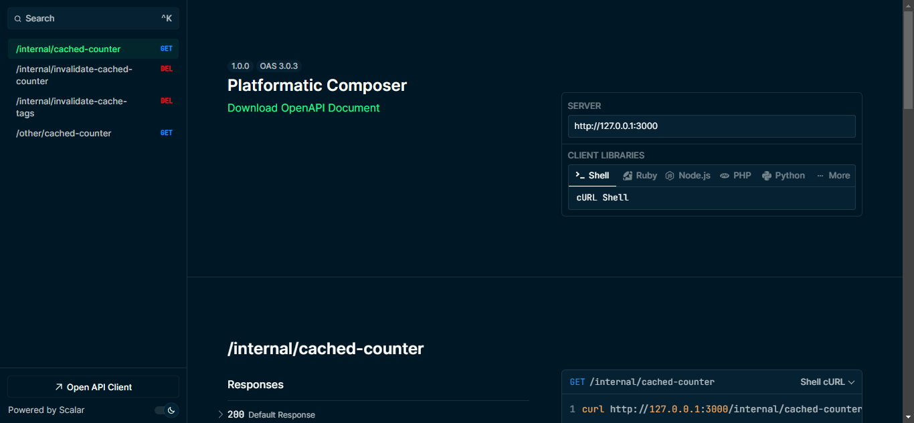
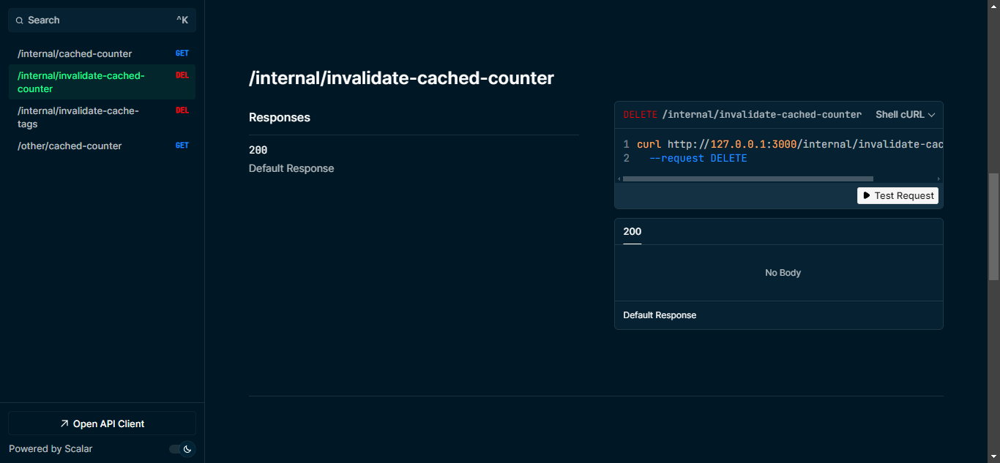

# How to setup caching with Platformatic Watt

This guide will help you set up caching in your Node.js application using Platformatic Watt, the Node.js Application Server.

## Prerequisites 

Before starting, ensure you have the following installed:

- [Node.js](https://nodejs.org/) (v20.16.0+ or v22.3.0+)
- [npm](https://docs.npmjs.com/cli/) (v10 or higher)
- A code editor (e.g., Visual Studio Code)

This guide demonstrates how to set up and run an application using the following stack:

- [Platformatic Watt](https://docs.platformatic.dev/watt) to enable and manage HTTP caching.
- [Platformatic service](https://docs.platformatic.dev/docs/service/overview) for building HTTP servers and APIs.

> [!NOTE]
> Learn how to setup a Platformatic Watt application [here](https://docs.platformatic.dev/docs/getting-started/quick-start-watt). 

## Enable Cache in Watt 

To enable caching, add the following configuration to the `root.json` file: 

```js
{
  "$schema": "https://schemas.platformatic.dev/@platformatic/runtime/2.17.0.json",
  ...
  "httpCache": {
    "cacheTagsHeader": "X-Cache-Tags"
  }
}
```

### Cache Tags

Cache tags are unique identifiers for resources, such as product-42, that can uniquely identify a product or entity. Using UUIDs is also a great approach for tagging.

Example:

```js
let counter = 0

fastify.get('/cached-counter, async (req, reply) => {
    reply.header('Cache-Control', 'public, s-maxage=600')
    reply.header('X-Cache-Tags', 'cached-counter-tag')
    return { ...data, "foo": "bar" }
})
```

### Invalidate Cache by Origin, Path, and Method

You can invalidate cached responses based on specific keys like the origin, path, and HTTP method:

```js
fastify.delete('/invalidate-cached-counter', async () => {
  await globalThis.platformatic.invalidateHttpCache({
    keys: [
      {
        origin: 'http://internal.plt.local',
        path: '/cached-counter',
        method: 'GET',
      }
    ]
  })
})
```

### Invalidate Cache by Tags

To invalidate cache entries by their tags, use the following approach:

```js
fastify.delete('/invalidate-cache-tags', {
  schema: {
    querystring: {
      type: 'object',
      properties: {
        tags: {
          type: 'string'
        }
      },
      required: ['tags']
    }
  }
}, async (req) => {
  const tags = req.query.tags.split(',');
  await globalThis.platformatic.invalidateHttpCache({ tags });
});
```

### Test the cache:

- Access the `GET /cached-counter` endpoint. You should receive a cached response with `X-Cache-Tags: cached-counter-tag`.
- After multiple calls, verify that the `counter` value does not change while the cache is active.
- Wait for 600 seconds or invalidate the cache to observe the `counter` value increment again.



### Test cache invalidation:

- Call `DELETE /invalidate-cached-counter` to invalidate the cache for `/cached-counter`.
- Alternatively, use `DELETE /invalidate-cache-tags?tags=cached-counter-tag` to invalidate the cache by tag.

