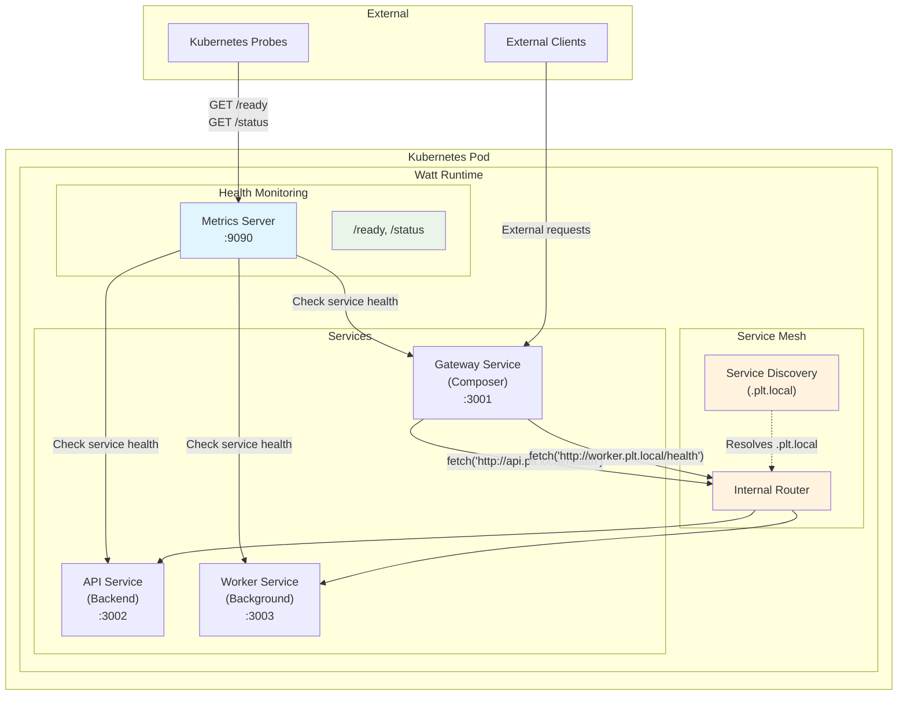

# How to Configure Kubernetes Health Checks with Watt

## Problem

You're deploying Watt applications to Kubernetes and need robust health checking that:
- Prevents traffic from reaching unhealthy pods
- Automatically restarts failed containers
- Handles complex health dependencies (databases, external services)
- Provides proper startup time for initialization
- Integrates with Kubernetes orchestration patterns

**When to use this solution:**
- Production Kubernetes deployments
- Applications with external dependencies that need health validation
- Services requiring zero-downtime deployments
- Complex multi-service applications where service health interdependencies matter

## Solution Overview

This guide shows you how to implement comprehensive Kubernetes health checks using Watt's built-in health endpoints. You'll learn to:
1. Configure readiness and liveness probes properly
2. Implement custom health checks for your application dependencies  
3. Set appropriate probe timing and thresholds
4. Handle startup scenarios and graceful shutdowns

## Understanding Kubernetes Health Probes

Kubernetes uses [probes](https://kubernetes.io/docs/concepts/workloads/pods/pod-lifecycle/#container-probes) to determine application health:

- **Readiness Probe**: Determines if the pod is ready to receive traffic. Failed readiness removes the pod from service endpoints.
- **Liveness Probe**: Determines if the container should be restarted. Failed liveness triggers container restart by Kubernetes.
- **Startup Probe**: Provides extra time for slow-starting containers. Disables readiness and liveness probes until startup succeeds.

## Prerequisites

Before implementing Kubernetes health checks, you need:

- **Node.js 22.17+** installed on your development machine (or later)
- **Docker** for containerization
- **Kubernetes cluster** access (local or cloud)
- **kubectl** configured to access your cluster

## Installation

**1. Create a new Watt application**, remeber to select a `@platformatic/node` called `api`:
```bash
npx wattpm@latest create my-health-app
cd my-health-app
```

```bash
cd web/api; npm install fastify;cd ..
```

Then replace the `web/api/index.js` file with:

```
import fastify from 'fastify'
import autoload from '@fastify/autoload'
import { join } from 'node:path'

export async function create () {
  const app = fastify({
    loggerIntance: globalThis.platformatic?.logger
  })

  app.get('/', () => 'hello world')

  return app
}
```

Finally, make sure that `web/api/package.json` includes `type: "module"`.

This created a Fastify app that will autoload the routes.


## Platformatic Health Check APIs

Platformatic Watt provides built-in health check endpoints through its metrics server. The metrics server exposes the following endpoints by default:

- **`/ready`** (Readiness endpoint): Indicates if all services are started and ready to accept traffic
- **`/status`** (Liveness endpoint): Indicates if all services are healthy and their custom health checks pass

### Endpoint Customization

You can customize the health check endpoints in your Watt configuration:

```json
{
  "metrics": {
    "hostname": "0.0.0.0",
    "port": 9090,
    "readiness": {
      "endpoint": "/health"
    },
    "liveness": {
      "endpoint": "/live"
    }
  }
}
```

### Service Discovery and Autoload

By default, Watt automatically loads all services in the `web` folder via the autoload configuration. You don't need to manually specify each service in the configuration. Watt will:

- Discover all valid Platformatic services in this directory
- Automatically register them in the runtime
- Include them in health check evaluations
- Expose their metrics through the metrics server

This autoload behavior simplifies deployment and ensures all your services are automatically included in the health monitoring system.

### Custom Health Check Functions

- **`setCustomHealthCheck`**: Sets a custom liveness check function that runs on the `/status` (or custom liveness) endpoint
- **`setCustomReadinessCheck`**: Sets a custom readiness check function that runs on the `/ready` (or custom readiness) endpoint

Both methods accept a function that returns:
- A `boolean` value (`true` = healthy, `false` = unhealthy)
- An object with:
  - `status`: boolean indicating success/failure
  - `statusCode`: optional HTTP status code (defaults to 200/500)
  - `body`: optional response body

## Implementation

### 1. Service Implementation with Custom Health Checks

Update your `web/api/index.js` to implements comprehensive health checks:

```javascript
import fastify from 'fastify'

export function create () {
  const app = fastify({ 
    loggerIntance: globalThis.platformatic?.logger
  })

  // Register custom liveness check (for /status endpoint)
  globalThis.platformatic.setCustomHealthCheck(async () => {
    try {
      // Example: Check database connectivity
      if (app.hasDecorator('db')) {
        await app.db.query('SELECT 1')
      }
      
      // Example: Check external service health
      const response = await fetch('https://api.external-service.com/health', {
        timeout: 5000
      })
      
      if (!response.ok) {
        return {
          status: false,
          statusCode: 503,
          body: 'External service unavailable'
        }
      }
      
      return { status: true }
    } catch (err) {
      app.log.error({ err }, 'Health check failed')
      return {
        status: false,
        statusCode: 503,
        body: `Health check failed: ${err.message}`
      }
    }
  })

  // Register custom readiness check (for /ready endpoint)
  globalThis.platformatic.setCustomReadinessCheck(async () => {
    try {
      // Basic service readiness checks
      // These should be fast and lightweight
      
      // Check if critical dependencies are initialized
      if (app.hasDecorator('db') && !app.db.pool) {
        return false
      }
      
      return true
    } catch (err) {
      app.log.error({ err }, 'Readiness check failed')
      return false
    }
  })

  // Add application routes
  app.get('/', async () => {
    return { message: 'hello world' }
  })

  return app
}
```

### 2. Watt Configuration

Configure the metrics server in your `watt.json` file:

```json
{
  "metrics": {
    "hostname": "0.0.0.0",
    "port": 9090,
    "readiness": {
      "success": {
        "statusCode": 200,
        "body": "Ready"
      },
      "fail": {
        "statusCode": 503,
        "body": "Not Ready"
      }
    },
    "liveness": {
      "success": {
        "statusCode": 200,
        "body": "Healthy"
      },
      "fail": {
        "statusCode": 503,
        "body": "Unhealthy"
      }
    }
  }
}
```

### 3. Kubernetes Configuration

Create a Kubernetes deployment configuration that defines the probes:

```yaml
apiVersion: apps/v1
kind: Deployment
metadata:
  name: watt-health-app
  labels:
    app: watt-health-app
spec:
  replicas: 2
  selector:
    matchLabels:
      app: watt-health-app
  template:
    metadata:
      labels:
        app: watt-health-app
    spec:
      containers:
      - name: watt-app
        image: watt-health-app:latest
        ports:
        - containerPort: 3042
          name: service
        - containerPort: 9090
          name: metrics
        env:
        - name: PLT_SERVER_HOSTNAME
          value: "0.0.0.0"
        readinessProbe:
          httpGet:
            path: /ready
            port: 9090
          initialDelaySeconds: 10
          periodSeconds: 10
          timeoutSeconds: 5
          successThreshold: 1
          failureThreshold: 3
        livenessProbe:
          httpGet:
            path: /status
            port: 9090
          initialDelaySeconds: 30
          periodSeconds: 30
          timeoutSeconds: 10
          failureThreshold: 3
        startupProbe:
          httpGet:
            path: /ready
            port: 9090
          initialDelaySeconds: 10
          periodSeconds: 5
          timeoutSeconds: 5
          failureThreshold: 20  # Allow up to 100 seconds for startup
        resources:
          requests:
            memory: "256Mi"
            cpu: "250m"
          limits:
            memory: "512Mi"
            cpu: "500m"
```

Key configuration points:

- **Startup Probe**: Allows up to 100 seconds for application initialization
- **Readiness Probe**: Checks `/ready` endpoint every 10 seconds after startup
- **Liveness Probe**: Checks `/status` endpoint every 30 seconds after startup
- **Environment Variables**: `PLT_SERVER_HOSTNAME=0.0.0.0` ensures the app binds to all interfaces

**Important Timing Considerations:**
- Startup probe runs first and disables other probes until successful
- Readiness probe has lower failure threshold for faster traffic removal
- Liveness probe has higher failure threshold to avoid unnecessary restarts
- Timeout values account for potential network latency

### 4. Docker Configuration

Create a `Dockerfile` for your Watt application:

```dockerfile
FROM node:22-alpine

WORKDIR /app

# Copy package files
COPY package*.json ./
RUN npm ci --only=production

# Copy application code
COPY . .

# Expose ports
EXPOSE 3042 9090

# Set environment variables
ENV PLT_SERVER_HOSTNAME=0.0.0.0
ENV NODE_ENV=production

# Health check for Docker
HEALTHCHECK --interval=30s --timeout=10s --start-period=60s --retries=3 \
  CMD curl -f http://localhost:9090/ready || exit 1

# Start the application
CMD ["npm", "start"]
```

## Watt Internal Service Communication

Watt provides a built-in service mesh that enables zero-configuration communication between services using the `.plt.local` domain. This is crucial for implementing proper health checks in multi-service applications.

### Architecture Overview

The following diagram illustrates how services communicate within a Watt application for health checks in Kubernetes:



### Key Communication Patterns:

1. **Kubernetes Health Probes** → Metrics server (`:9090/ready`, `:9090/status`)
2. **Metrics Server** → Individual services for health verification
3. **Inter-Service Health Checks** → Via `.plt.local` domain (e.g., `http://api.plt.local/health`)
4. **External Traffic** → Gateway service (composer) for API aggregation

### Internal Fetch with Automatic Service Discovery

Services within a Watt application can communicate with each other using the automatic service discovery:

```javascript
// Health check for internal services using Watt's service mesh
globalThis.platformatic.setCustomHealthCheck(async () => {
  try {
    const healthChecks = await Promise.allSettled([
      // Database service health check
      fetch('http://api.plt.local/health', { timeout: 2000 }),
      
      // Background worker service health check  
      fetch('http://worker.plt.local/health', { timeout: 2000 }),
      
      // Composer gateway health check
      fetch('http://gateway.plt.local/health', { timeout: 2000 })
    ])
    
    const allHealthy = healthChecks.every(result => 
      result.status === 'fulfilled' && result.value.ok
    )
    
    return {
      status: allHealthy,
      body: JSON.stringify({
        service: 'healthy',
        dependencies: healthChecks.map((check, index) => ({
          service: ['api', 'worker', 'gateway'][index],
          status: check.status === 'fulfilled' && check.value.ok ? 'healthy' : 'unhealthy'
        }))
      })
    }
  } catch (error) {
    return { 
      status: false, 
      statusCode: 503,
      body: `Health check failed: ${error.message}`
    }
  }
})
```

### Key Benefits of Watt's Internal Communication:

- **Zero Configuration**: Services are automatically discoverable via `{service-id}.plt.local`
- **No Network Latency**: Communication happens in-process via the service mesh
- **Automatic Load Balancing**: Requests are distributed across service workers
- **Built-in Service Discovery**: No need for external service registry

## Verification and Testing

### Test Health Endpoints Locally

**1. Start your Watt application:**
```bash
npm start
# or for development
npm run dev
```

**2. Test health endpoints:**
```bash
# Test readiness endpoint
curl -v http://localhost:9090/ready
# Expected: 200 OK "Ready" (or custom response)

# Test liveness endpoint  
curl -v http://localhost:9090/status
# Expected: 200 OK "Healthy" (or custom response)

# Check metrics endpoint
curl http://localhost:9090/metrics
# Expected: Prometheus metrics output
```

**3. Test with failing health checks:**
```bash
# If your app has test endpoints to simulate failures:
curl -X POST http://localhost:3042/api/test/fail-health
curl http://localhost:9090/status
# Expected: 503 Service Unavailable
```

### Test in Kubernetes

**1. Deploy to Kubernetes:**
```bash
kubectl apply -f k8s/deployment.yaml
kubectl apply -f k8s/service.yaml
```

**2. Monitor pod health:**
```bash
# Check pod status
kubectl get pods -l app=demo-readiness-liveness

# Watch pod events
kubectl describe pod <pod-name>

# Check probe results
kubectl get events --field-selector reason=Unhealthy
```

**3. Test probe behavior:**
```bash
# Test health endpoints from within the pod
kubectl exec <pod-name> -- curl -f http://localhost:9090/ready
kubectl exec <pod-name> -- curl -f http://localhost:9090/status

# Watch Kubernetes pod status in real-time
kubectl get pods -l app=watt-health-app -w

# Check pod events for probe failures
kubectl get events --field-selector involvedObject.name=<pod-name>
```

### Verify Probe Configuration

**Check probe timing is appropriate:**
```bash
# Get current probe configuration
kubectl get deployment demo-readiness-liveness -o yaml | grep -A 10 Probe
```

**Monitor probe metrics:**
```bash
# Check probe success/failure rates
kubectl top pods
kubectl describe pod <pod-name> | grep -A 5 "Liveness\|Readiness"
```

## Production Configuration Best Practices

### Probe Timing Guidelines

**Startup-dependent applications:**
```yaml
readinessProbe:
  httpGet:
    path: /ready
    port: 9090
  initialDelaySeconds: 10    # Short delay for quick apps
  periodSeconds: 5           # Frequent checks during startup
  timeoutSeconds: 5          # Allow time for health check
  successThreshold: 1        # Single success to mark ready
  failureThreshold: 3        # Allow some startup failures

livenessProbe:
  httpGet:
    path: /status
    port: 9090
  initialDelaySeconds: 30    # Longer delay after initial startup
  periodSeconds: 30          # Less frequent checks when running
  timeoutSeconds: 10         # More time for complex checks
  failureThreshold: 3        # Avoid restart on transient issues
```

**Database-dependent applications:**
```yaml
startupProbe:                # Use startup probe for slow initialization
  httpGet:
    path: /ready
    port: 9090
  initialDelaySeconds: 10
  periodSeconds: 10
  timeoutSeconds: 5
  failureThreshold: 30       # Up to 5 minutes for startup

readinessProbe:
  httpGet:
    path: /ready
    port: 9090
  periodSeconds: 10
  timeoutSeconds: 5
  failureThreshold: 1        # Quick removal from service if unhealthy

livenessProbe:
  httpGet:
    path: /status
    port: 9090
  initialDelaySeconds: 0     # Disabled until startup probe succeeds
  periodSeconds: 20
  timeoutSeconds: 10
  failureThreshold: 3
```

## Troubleshooting

### Pod Failing Readiness Checks

**Problem:** Pods remain in "Not Ready" state

**Solutions:**
```bash
# Check health endpoint directly
kubectl exec <pod-name> -- curl http://localhost:9090/ready

# Review application logs
kubectl logs <pod-name>

# Check probe configuration
kubectl describe pod <pod-name> | grep -A 10 Readiness

# Common fixes:
# - Increase initialDelaySeconds if app needs more startup time
# - Check that health dependencies are available
# - Verify metrics server is configured and running on correct port
```

### Pod Continuously Restarting

**Problem:** Liveness probes causing restart loops

**Solutions:**
```bash
# Check restart count and reason
kubectl get pods -l app=your-app

# Review pod events
kubectl describe pod <pod-name>

# Check liveness endpoint
kubectl exec <pod-name> -- curl http://localhost:9090/status

# Common fixes:
# - Increase timeoutSeconds for slow health checks
# - Increase failureThreshold to avoid restarts on transient issues
# - Review custom health check logic for potential failures
# - Check if app is properly handling SIGTERM for graceful shutdown
```

### Health Checks Always Failing

**Problem:** Health endpoints return 500/404 errors

**Solutions:**
```bash
# Verify metrics server is listening
kubectl exec <pod-name> -- netstat -tlnp | grep :9090

# Check Watt configuration
kubectl exec <pod-name> -- cat watt.json

# Test endpoints with verbose output
kubectl exec <pod-name> -- curl -v http://localhost:9090/ready
kubectl exec <pod-name> -- curl -v http://localhost:9090/status

# Check application logs for errors
kubectl logs <pod-name> --tail=100

# Verify container environment
kubectl exec <pod-name> -- env | grep PLT_
```

**Common fixes:**
- Ensure `metrics.hostname` is `"0.0.0.0"` (not `"127.0.0.1"` or `"localhost"`)
- Verify `metrics.port` matches probe port configuration  
- Check that `PLT_SERVER_HOSTNAME=0.0.0.0` environment variable is set
- Ensure custom health check functions handle errors gracefully
- Verify all Watt services are starting without errors

### Slow Startup Times

**Problem:** Pods take too long to become ready

**Solutions:**
```bash
# Analyze startup time with timestamps
kubectl logs <pod-name> --timestamps --since=5m

# Check resource usage and limits
kubectl describe pod <pod-name> | grep -A 10 -B 5 "Limits\|Requests"
kubectl top pod <pod-name>

# Profile health check performance
kubectl exec <pod-name> -- time curl -f http://localhost:9090/ready

# Check Node.js startup time
kubectl exec <pod-name> -- ps aux | grep node
```

**Common fixes:**
- **Use startup probes** for applications with slow initialization (database migrations, cache warming, etc.)
- **Optimize custom health checks** - keep them lightweight and fast
- **Increase resources** if CPU/memory constrained (check with `kubectl top`)
- **Remove expensive operations** from readiness checks (use async background tasks instead)
- **Pre-build dependencies** in Docker image rather than installing at runtime
- **Use Node.js production optimizations** (`NODE_ENV=production`, `--max-old-space-size`)

## Next Steps

Now that you have robust Kubernetes health checks:

- **[Configure monitoring](/docs/guides/monitoring)** - Track health check metrics with Prometheus
- **[Set up logging](/docs/guides/logging)** - Centralize health check logs for debugging
- **[Container deployment guide](/docs/guides/deployment/dockerize-a-watt-app)** - Optimize your Docker setup
- **[TypeScript compilation](/docs/guides/deployment/compiling-typescript)** - Production builds and optimization

## References

### Kubernetes Documentation
- [Kubernetes Pod Lifecycle](https://kubernetes.io/docs/concepts/workloads/pods/pod-lifecycle/)
- [Configure Liveness, Readiness and Startup Probes](https://kubernetes.io/docs/tasks/configure-pod-container/configure-liveness-readiness-startup-probes/)
- [Container Probes](https://kubernetes.io/docs/concepts/workloads/pods/pod-lifecycle/#container-probes)

### Platformatic Resources  
- [Watt Runtime Configuration](/docs/reference/runtime/configuration) - Complete metrics configuration reference
- [Node.js Stackable Reference](/docs/reference/node) - Custom health check API documentation
- [Example Application](https://github.com/platformatic/k8s-readiness-liveness) - Complete working example with Kubernetes manifests

### Best Practices
- [Kubernetes Health Check Best Practices](https://kubernetes.io/docs/concepts/workloads/pods/pod-lifecycle/#when-should-you-use-a-liveness-probe)
- [Production Readiness Checklist](https://kubernetes.io/docs/concepts/cluster-administration/production-environment/)
