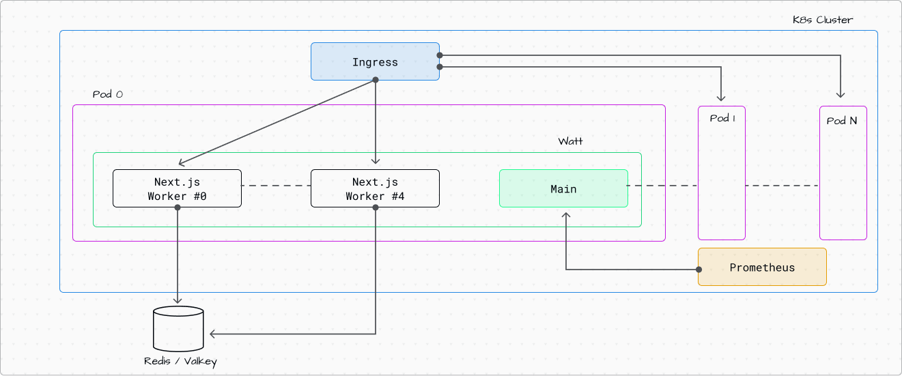
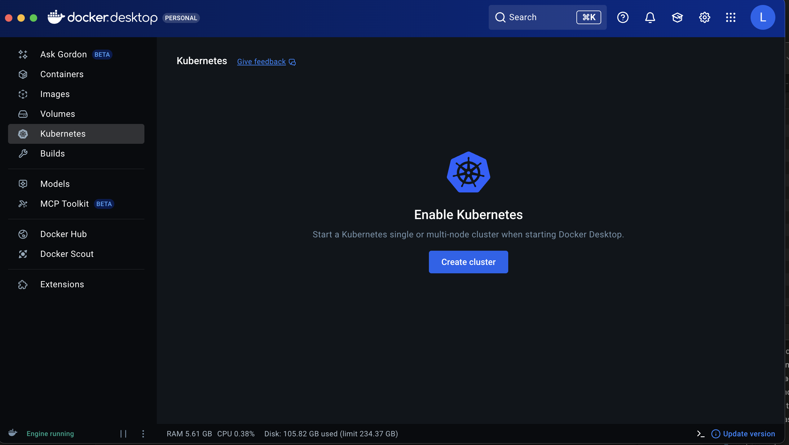
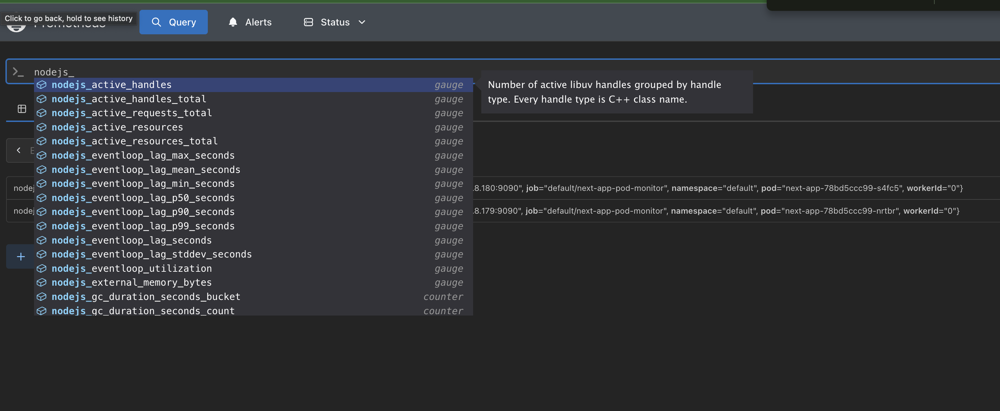

# Deploy Next.js in Kubernetes with Watt

In this guide, we are configuring and setting up a Next.js application in
very common enterprise environment: Kubernetes (K8s).

We will use Watt, the application server for Node.js, to set up:

1. metrics with Prometheus
2. multithreading server-side rendering
3. distributed caching with Redis/Valkey

Here is the highlight of the architecture:



**Complete Working Example**: The full code for this guide is available at [https://github.com/platformatic/k8s-watt-next-example](https://github.com/platformatic/k8s-watt-next-example). You can clone it and follow along, or use it as a reference while building your own application.

## Create a new Next.js application (or use your own)

To follow this guide, you can either create a new Next.js application or use an existing one. If you want to see a complete working example, check out our [k8s-watt-next-example repository](https://github.com/platformatic/k8s-watt-next-example).

### Create a New Next.js App

Create a new Next.js application using the official CLI:

```bash
npx create-next-app@15 my-next-app
cd my-next-app
```

When prompted, select your preferences. We recommend:
- TypeScript: Yes
- ESLint: Yes
- Tailwind CSS: Yes (optional)
- App Router: Yes (recommended)

### Add Incremental Static Regeneration or 'use cache'

To demonstrate the benefits of distributed caching with Watt and Valkey, you should add either Incremental Static Regeneration (ISR) or the new `use cache` directive to your application.

Let's modify the home page to show cached data that demonstrates how caching works across multiple pods:

```tsx
// src/app/page.tsx
import { hostname } from "os";

export const revalidate = 10; // Revalidate every 10 seconds

export default async function Home() {
  const name = hostname();
  const version = Date.now();

  return (
    <div>
      <h1>Welcome to Next.js + Platformatic!</h1>

      <h3>
        Last server date is <strong>{version}</strong>, served by{" "}
        <strong>{name}</strong>
      </h3>
    </div>
  );
}
```

In this example:
- `export const revalidate = 10` enables time-based revalidation every 10 seconds
- `hostname()` shows which pod is serving the request (useful when you have multiple replicas)
- `Date.now()` generates a timestamp that will be cached and shared across all pods

**What happens with caching:**

1. When the first request comes in, Next.js renders the page and stores the result in the cache (Valkey)
2. For the next 10 seconds, all requests to any pod will receive the same cached version with the same timestamp
3. After 10 seconds, the next request triggers a revalidation, updates the cache, and all pods get the new version
4. The hostname shows you which pod served the request, but the timestamp stays the same across all pods (proving the cache is shared)

#### Other Caching Options

**Option 2: On-demand Revalidation**

Use `revalidateTag` or `revalidatePath` to manually trigger cache revalidation:

```tsx
// src/app/actions.ts
'use server'
import { revalidatePath } from 'next/cache';

export async function updateData() {
  // Update your data...
  revalidatePath('/');
}
```

**Option 3: React Cache (Next.js 15+)**

With Next.js 15+, you can use the new `unstable_cache` for more granular caching:

```tsx
// src/app/page.tsx
import { unstable_cache } from 'next/cache';

const getCachedData = unstable_cache(
  async () => {
    return fetch('https://api.example.com/data').then(res => res.json());
  },
  ['data-key'],
  { revalidate: 10 }
);

export default async function Page() {
  const data = await getCachedData();
  // Your component logic
}
```

**Why is caching important?**

When you deploy multiple replicas of your Next.js application in Kubernetes, each pod maintains its own cache by default. With Watt's Valkey integration, all pods share a single distributed cache, which means:

- Faster response times across all pods
- Reduced load on your backend APIs and databases
- Consistent data across all replicas
- Better resource utilization

## Add `watt.json`

In order to run your existing Next.js application with Watt, you can use the import capability of `wattpm-utils`.

From the root of your application, run:

```
npx wattpm-utils import
```

The command will create a `watt.json` for you and also install `@platformatic/next` as part of your dependencies.

By default, Watt will run on random port. If you want to choose a specific port, add an entry in the `watt.json` file
with a `runtime` block. In the same block, we also need to add the configuration to support multithreading. Add it like
following:

```json
{
  ...
  "runtime": {
    "server": {
      "host": "0.0.0.0",
      "port": "{PORT}" 
    },
    "workers": {
      "static": "{PLT_NEXT_WORKERS}"
    }
  }
}
```

The `{MYENV}` syntax tells Watt to take that value from the process environment; `.env` loading is also fully supported.

You will also need to configure the Valkey connection string. Edit it and add:


```json
{
  ...
  "cache": {
    "adapter": "valkey"
    "url": "{PLT_VALKEY_HOST}"
  }
}
```

At the end, your `watt.json` should match:

```json
{
  "$schema": "https://schemas.platformatic.dev/@platformatic/next/3.8.0.json",
  "runtime": {
    "server": {
      "host": "0.0.0.0",
      "port": "{PORT}" 
    },
    "workers": {
      "static": "{PLT_NEXT_WORKERS}"
    }
  },
  "cache": {
    "adapter": "valkey"
    "url": "{PLT_VALKEY_HOST}"
  }
}
```

If you prefer, you can also use YAML format and use a `watt.yml`.

### Test it locally

To test this setup locally, you can spawn a Valkey image using Docker:

```sh
docker run -d -p 6379:6379 valkey/valkey:latest
```

Then write a `.env` file in your project, like so:

```
PORT=3000
PLT_VALKEY_HOST=localhost
PLT_NEXT_WORKERS=1
```

Then, run:

```sh
npx wattpm build
npx wattpm start
```

If you want to start a second copy of your application on a different port, you can with:

```
PORT=3001 npx wattpm start
```

(You can also run `wattpm dev` for development mode)

## Create and build the Docker image

In order to run our application inside Kubernetes, we need to build our Docker image first.
The most basic Dockerfile needed is:

```Dockerfile
FROM node:22-alpine

ENV APP_HOME=/home/app
ENV PORT=3042
ENV PLT_SERVER_LOGGER_LEVEL="info"
ENV PLT_NEXT_WORKERS="1"
ENV PLT_VALKEY_HOST="valkey"

RUN npm install -g pnpm
WORKDIR $APP_HOME
COPY ./ ./

RUN pnpm install && pnpm run build
EXPOSE 3042

CMD [ "pnpm", "run", "start" ]
```

Note that you might want to keep some of those environment variables loose and configure them via K8s.

### Building the image

There are a few different ways to build the image, depending on where your K8s cluster is running.
Assuming you are following this guide with a locally running k8s, these are the most common options.

#### Option A: Build using Docker Desktop or Local Docker

If you're using Docker Desktop or a local Docker daemon:

```bash
docker build -t next-app:latest .
```

#### Option B: Build using Minikube

If you're using Minikube, you need to use Minikube's Docker daemon:

```bash
eval $(minikube docker-env)
docker build -t next-app:latest .
```

#### Option C: Build using Kind

If you're using Kind, load the image into the cluster:

```bash
docker build -t next-app:latest .
kind load docker-image next-app:latest
```

### Verify the Image was Built

Check that the image exists:

```bash
docker images | grep next-app
```

You should see `next-app:latest` in the list.

## Deploy Prometheus and Valkey in K8s

### Start a K8S Cluster
In this example we will use Docker Desktop's built-in kubernetes cluster.

Enable the cluster from Docker Desktop main page 



### Helm

Install [helm](https://helm.sh/) for your system

### Deploy Valkey in the cluster

Create a file `valkey-overrides.yaml` to configure Valkey deploy configuration

```yaml
service:
  type: "NodePort"
auth:
  enabled: false
```

Then deploy valkey with the following command

```bash
helm upgrade --install valkey oci://registry-1.docker.io/cloudpirates/valkey \
  --values=valkey-overrides.yaml \
  --version=0.3.2
```

### Deploy Prometheus in the cluster

First, add the Prometheus community Helm repository:

```bash
helm repo add prometheus-community https://prometheus-community.github.io/helm-charts
helm repo update
```

Create a file `prometheus-overrides.yaml` to configure Prometheus deploy configuration

```yaml
prometheus:
  service:
    type: NodePort
    nodePort: 30090

```

```bash
helm upgrade --install prometheus prometheus-community/kube-prometheus-stack \
  --values=helm/prometheus-overrides.yaml \
  --namespace=monitoring \
  --create-namespace
```

## Deploy the application

You need 3 files to have a minimal installation: `deployment.yaml`, `service.yaml` and `podMonitor.yaml`.

### `deployment.yaml`

This file describes the deployment of your application. Let's break down the key configuration sections:

**Resource Management:**
- `resources.requests`: The minimum CPU (1000m = 1 core) and memory (256Mi) guaranteed for each pod
- `resources.limits`: The maximum CPU (1000m) and memory (1024Mi) a pod can consume before being throttled or restarted
- Setting appropriate limits prevents resource starvation and ensures fair resource allocation across pods
- **Important**: If you increase the number of workers via `PLT_NEXT_WORKERS` environment variable, you should proportionally increase the CPU limit. For example, setting `PLT_NEXT_WORKERS=4` would require approximately 4000m (4 cores) CPU limit to ensure each worker has adequate resources

**Health Checks:**
- `livenessProbe`: Determines if the container is still running. If it fails, Kubernetes will restart the pod
  - `initialDelaySeconds: 30`: Wait 30 seconds after startup before checking (gives time for app initialization)
  - `periodSeconds: 10`: Check every 10 seconds
- `readinessProbe`: Determines if the container is ready to accept traffic. If it fails, the pod is removed from service endpoints
  - `initialDelaySeconds: 10`: Wait 10 seconds before first check
  - `periodSeconds: 5`: Check every 5 seconds

**Ports:**
- Port `3000`: The main HTTP port for your Next.js application
- Port `9090`: The metrics endpoint for Prometheus to scrape

**Labels:**
The `platformatic.dev/monitor: prometheus` label is crucial - it allows the PodMonitor to discover and scrape metrics from your application.

```yaml
apiVersion: apps/v1
kind: Deployment
metadata:
  name: next-app
  labels:
    app: next-app
spec:
  replicas: 1
  selector:
    matchLabels:
      app: next-app
  template:
    metadata:
      labels:
        app: next-app
        platformatic.dev/monitor: prometheus
    spec:
      containers:
      - name: next-app
        image: next-app:latest
        imagePullPolicy: IfNotPresent
        ports:
        - containerPort: 3000
          name: http
        - containerPort: 9090
          name: metrics
        env:
        - name: NODE_ENV
          value: "production"
        - name: PORT
          value: "3000"
        - name: HOSTNAME
          value: "0.0.0.0"
        resources:
          requests:
            memory: "256Mi"
            cpu: "1000m"
          limits:
            memory: "1024Mi"
            cpu: "1000m"
        livenessProbe:
          httpGet:
            path: /
            port: 3000
          initialDelaySeconds: 30
          periodSeconds: 10
        readinessProbe:
          httpGet:
            path: /
            port: 3000
          initialDelaySeconds: 10
          periodSeconds: 5
```

### `service.yaml`

This file creates a Kubernetes Service that exposes your application to the outside world:

**Service Type:**
- `type: NodePort`: Exposes the service on a static port on each node in the cluster. This makes your app accessible from outside the cluster via `<NodeIP>:<NodePort>`

**Port Configuration:**
- `port: 3000`: The port that the service listens on within the cluster
- `targetPort: 3000`: The port on the pod that traffic is forwarded to (matches the container port in deployment.yaml)
- `nodePort: 32100`: The external port exposed on each node (range: 30000-32767)
- `protocol: TCP`: The network protocol used

**Selector:**
The `app: next-app` selector ensures the service routes traffic only to pods with the matching label.

With this configuration, your Next.js application will be accessible at `http://localhost:32100` when using a local Kubernetes cluster.

```yaml
apiVersion: v1
kind: Service
metadata:
  name: next-app-service
  labels:
    app: next-app
spec:
  type: NodePort
  selector:
    app: next-app
  ports:
  - port: 3000
    targetPort: 3000
    nodePort: 32100
    protocol: TCP
    name: http
```

### `podMonitor.yaml`

This file configures Prometheus to automatically discover and scrape metrics from your application pods. PodMonitor is a custom resource provided by the Prometheus Operator:

**Selector:**
The `platformatic.dev/monitor: prometheus` label selector tells Prometheus which pods to monitor. This must match the label in your deployment.yaml template.

**Metrics Endpoint Configuration:**
- `port: metrics`: Scrape from the port named "metrics" (port 9090 in the deployment)
- `path: /metrics`: The HTTP path where metrics are exposed
- `interval: 15s`: How often Prometheus scrapes metrics (every 15 seconds)
- `honorLabels: false`: Prometheus labels take precedence over scraped labels

**Relabeling:**
The `relabelings` section customizes how metrics are labeled in Prometheus:
- Extracts Kubernetes pod metadata (app name, instance)
- Makes metrics easier to query and correlate in Prometheus

**Namespace and Labels:**
- `namespace: default`: The PodMonitor runs in the default namespace
- `release: prometheus`: This label is required for the Prometheus Operator to discover this PodMonitor

With this configuration, Prometheus will automatically start collecting Node.js runtime metrics, HTTP request metrics, and other performance data from your Watt-powered Next.js application.

```yaml
apiVersion: monitoring.coreos.com/v1
kind: PodMonitor
metadata:
  name: next-app-pod-monitor
  namespace: default
  labels:
    release: prometheus
spec:
  selector:
    matchLabels:
      # app: next-app
      platformatic.dev/monitor: prometheus
  podMetricsEndpoints:
  - honorLabels: false
    interval: 15s
    port: metrics
    path: /metrics
    relabelings:
    - action: replace
      sourceLabels:
      - __meta_kubernetes_pod_label_app_kubernetes_io_name
      targetLabel: name
    - action: replace
      sourceLabels:
      - __meta_kubernetes_pod_label_app_kubernetes_io_instance
      targetLabel: instance
```

Then you can apply all these files with the command

```bash
kubectl apply -f service.yaml -f deployment.yaml -f podMonitor.yaml
```

## Verify metrics

Open [http://localhost:32100](http://localhost:32100) to see your app running

Then open [http://localhost:30090](http://localhost:30090) to open Prometheus Dashboard

Start to type `nodejs` and if you see an autocomplete like the following image



you're done!

Prometheus is now monitoring your app and collecting metrics!

## Conclusion

Congratulations! You've successfully deployed a production-ready Next.js application in Kubernetes with enterprise-grade features:

**What You've Accomplished:**

1. **Multithreaded Server-Side Rendering**: Configured Watt workers to handle multiple concurrent SSR requests efficiently
2. **Distributed Caching**: Integrated Valkey (Redis-compatible) for shared cache across multiple pod replicas
3. **Observability**: Set up Prometheus monitoring with automatic metrics collection for Node.js runtime and HTTP requests
4. **Production Deployment**: Created proper Kubernetes manifests with health checks, resource limits, and service discovery
5. **Scalability**: Built a foundation that can scale horizontally by increasing pod replicas

**Key Takeaways:**

- The `watt.json` configuration enables seamless integration of Next.js with enterprise infrastructure
- Resource limits should be adjusted based on the number of workers (`PLT_NEXT_WORKERS`)
- The `platformatic.dev/monitor: prometheus` label connects your application to the monitoring stack
- Health probes ensure Kubernetes can detect and recover from application failures automatically

**Next Steps:**

- Scale your deployment by increasing `spec.replicas` in deployment.yaml
- Add an Ingress resource to handle external traffic routing and TLS termination
- Configure horizontal pod autoscaling (HPA) based on CPU/memory or custom metrics
- Set up persistent storage if your application needs stateful data
- Implement CI/CD pipelines to automate the build and deployment process

Your Next.js application is now running in a production-grade Kubernetes environment with full observability!
