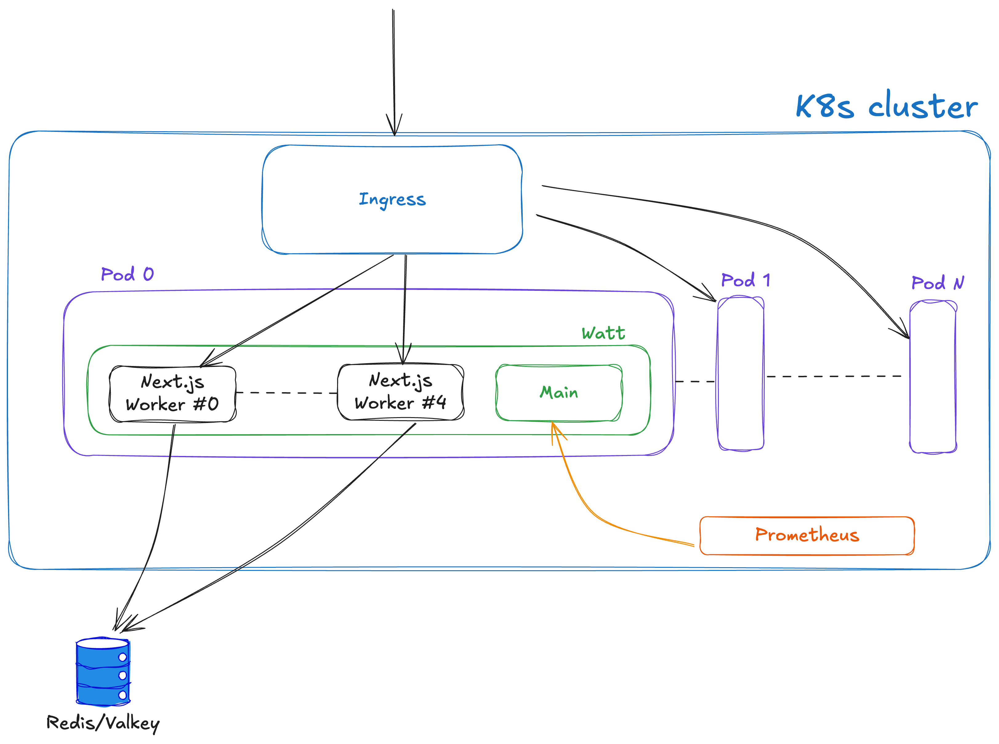

# Deploy Next.js in Kubernetes with Watt

In this guide, we are configuring and setting up a Next.js application in
very common enterprise environment: Kubernetes.

We will use Watt, the application server for Node.js, to set up:

1. metrics with Prometheus
2. multithreading server-side rendering
3. distributed caching with Redis/Valkey

Here is the highlight of the architecture:



## Create a new Next.js application (or use your own)

### Add Incremental Site Regeneration or 'use cache'

## Add `watt.json`

In order to run your existing Next.js application with Watt, you can use the import capability of `wattpm-utils`.

From the root of your application, run:

```
npx wattpm-utils import
```

The command will create a `watt.json` for you and also install `@platformatic/next` as part of your dependencies.

By default, Watt will run on random port. If you want to choose a specific port, add an entry in the `watt.json` file:

```json
{
  "$schema": "https://schemas.platformatic.dev/@platformatic/next/3.8.0.json?autogenerated=true",
  "runtime": {
    "server": {
      "port": 3000
    }
  }
}
```

If you prefer, you can also use YAML format.

## Create Docker file

## Deploy Prometheus and Valkey in K8s

## Deploy the application

## Verify metrics

