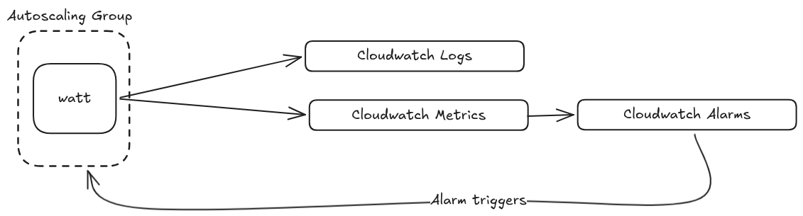

# Deploy Watt in Elastic Container Services

In this guide, we are deploying an existing Watt application to Elastic
Container Services (ECS) using the AWS CLI v2.

Here is the highlight of the architecture:



To complete this guide, you will need the following:

* AWS CLI v2 - [see AWS documentation](https://docs.aws.amazon.com/cli/latest/userguide/getting-started-install.html)
* jq - [see jq documentation](https://jqlang.org/download/)

Here is a policy that can be used for the various configuration:

```json
{
  "Version": "2012-10-17",
  "Statement": [
    {
      "Effect": "Allow",
      "Action": [
        "ecr:CreateRepository",
        "ecr:DeleteRepository",
        "ecr:DescribeRepositories",
        "ecr:GetAuthorizationToken",
        "ecr:BatchCheckLayerAvailability",
        "ecr:GetDownloadUrlForLayer",
        "ecr:BatchGetImage",
        "ecr:PutImage",
        "ecr:InitiateLayerUpload",
        "ecr:UploadLayerPart",
        "ecr:CompleteLayerUpload"
      ],
      "Resource": "*"
    },
    {
      "Effect": "Allow",
      "Action": [
        "ec2:CreateVpc",
        "ec2:DeleteVpc",
        "ec2:DescribeVpcs",
        "ec2:ModifyVpcAttribute",
        "ec2:CreateSubnet",
        "ec2:DeleteSubnet",
        "ec2:DescribeSubnets",
        "ec2:ModifySubnetAttribute",
        "ec2:CreateInternetGateway",
        "ec2:DeleteInternetGateway",
        "ec2:AttachInternetGateway",
        "ec2:DetachInternetGateway",
        "ec2:CreateRouteTable",
        "ec2:DeleteRouteTable",
        "ec2:CreateRoute",
        "ec2:AssociateRouteTable",
        "ec2:DescribeAvailabilityZones",
        "ec2:CreateSecurityGroup",
        "ec2:DeleteSecurityGroup",
        "ec2:AuthorizeSecurityGroupIngress",
        "ec2:RunInstances",
        "ec2:TerminateInstances",
        "ec2:DescribeInstances",
        "ec2:DescribeInstanceStatus",
        "ec2:GetConsoleOutput",
        "ec2:CreateTags"
      ],
      "Resource": "*"
    },
    {
      "Effect": "Allow",
      "Action": [
        "iam:CreateRole",
        "iam:DeleteRole",
        "iam:GetRole",
        "iam:AttachRolePolicy",
        "iam:DetachRolePolicy",
        "iam:PassRole"
      ],
      "Resource": "*"
    }
  ]
}
```

## Configure existing Watt application

The first change to make is configuring the application to export logs. The
logger needs a new timestamp format and an exporter added to _watt.json_:

```json
{
    "logger": {
        "timestamp": "isoTime",
        "openTelemetryExporter": {
            "url": "http://localhost:4318/v1/logs"
        }
    }
}
```

This makes sure our logs are shipped to Cloudwatch and we integrate with the
`@timestamp` property of Cloudwatch.

Next, a `telemetry` block must be added to _watt.json_ so that metrics flow into Cloudwatch.

```json
{
    "telemetry": {
        "applicationName": "the-app-name",
        "version": "1.0.0",
        "enabled": true,
        "exporter": {
            "type": "otlp",
            "options": {
                "url": "http://localhost:4318/v1/traces"
            }
        }
    }
}
```


## Create and build the Docker image

In order to run our application inside ECS, we need to build our Docker image first.

The most basic Dockerfile needed is:

```Dockerfile
FROM node:22-alpine

ENV APP_HOME=/home/app/node/
RUN mkdir -p $APP_HOME/node_modules && chown -R node:node $APP_HOME

WORKDIR $APP_HOME
COPY ./ ./

RUN npm install

COPY --chown=node:node . .

EXPOSE 3042
EXPOSE 9090

ENV PLT_BASE_PATH="/app-name"

RUN npm run build

CMD [ "watt", "start" ]
```

### Building the image

```bash
docker build -t watt-ecs:latest .
```

### Verify the image was built

Check that the image exists:

```bash
docker images | grep watt-ecs
```

You should see `watt-ecs:latest` in the list.

## Create the AWS resources

We recommend using [`aws-vault`](https://github.com/ByteNess/aws-vault) whenever the AWS CLI will be used.

Required variables:

* `AWS_PROFILE` - profile name
* `AWS_REGION` - region name
* `AWS_ACCOUNT_ID` - the account ID
* `CLUSTER_NAME` - for tagging and naming resources

### Elastic Container Registry

Login to ECR through Docker.

```sh
aws ecr get-login-password \
    --profile "$AWS_PROFILE" \
    --region "$AWS_REGION" | \
    docker login \
        --username AWS \
        --password-stdin \
        "${AWS_ACCOUNT_ID}.dkr.ecr.${AWS_REGION}.amazonaws.com"
```

**Optional:** create a new repository

```sh
aws ecr create-repository \
    --repository-name "watt-ecs" \
    --profile "$AWS_PROFILE" \
    --image-scanning-configuration scanOnPush=false
```

Tag the image with the new or existing ECR:

```sh
docker image tag \
    watt-ecs:latest \
    "${AWS_ACCOUNT_ID}.dkr.ecr.${AWS_REGION}.amazonaws.com/watt-ecs:lastest"
```

Push to ECR:

```sh
docker push "${AWS_ACCOUNT_ID}.dkr.ecr.${AWS_REGION}.amazonaws.com/watt-ecs:lastest"
```

### VPC

Create and configure the VPC, storing the `VPC_ID` for later use:

```sh
VPC_ID=$(aws ec2 create-vpc \
    --cidr-block 10.0.0.0/16 \
    --profile "$AWS_PROFILE" \
    --tag-specifications "ResourceType=vpc,Tags=[{Key=Name,Value=ecs-vpc-$CLUSTER_NAME}]" \
    --query 'Vpc.VpcId' \
    --output text)

aws ec2 modify-vpc-attribute \
    --vpc-id "$VPC_ID" \
    --enable-dns-hostnames \
    --profile "$AWS_PROFILE"
```

Create the gateway:

```sh
IGW_ID=$(aws ec2 create-internet-gateway \
    --profile "$AWS_PROFILE" \
    --tag-specifications "ResourceType=internet-gateway,Tags=[{Key=Name,Value=ecs-igw-$CLUSTER_NAME}]" \
    --query 'InternetGateway.InternetGatewayId' \
    --output text)

aws ec2 attach-internet-gateway \
    --vpc-id "$VPC_ID" \
    --internet-gateway-id "$IGW_ID" \
    --profile "$AWS_PROFILE"
```

Get a list of available AZs:

```sh
AZS=($(aws ec2 describe-availability-zones \
    --profile "$AWS_PROFILE" \
    --query 'AvailabilityZones[0:2].ZoneName' \
    --output text))
```

Create and modify subnets:

```sh
SUBNET_1=$(aws ec2 create-subnet \
    --vpc-id "$VPC_ID" \
    --cidr-block 10.0.1.0/24 \
    --availability-zone "${AZS[0]}" \
    --profile "$AWS_PROFILE" \
    --tag-specifications "ResourceType=subnet,Tags=[{Key=Name,Value=ecs-public-subnet-1}]" \
    --query 'Subnet.SubnetId' \
    --output text)
aws ec2 modify-subnet-attribute \
    --subnet-id "$SUBNET_1" \
    --map-public-ip-on-launch \
    --profile "$AWS_PROFILE"

SUBNET_2=$(aws ec2 create-subnet \
    --vpc-id "$VPC_ID" \
    --cidr-block 10.0.2.0/24 \
    --availability-zone "${AZS[1]}" \
    --profile "$AWS_PROFILE" \
    --tag-specifications "ResourceType=subnet,Tags=[{Key=Name,Value=ecs-public-subnet-2}]" \
    --query 'Subnet.SubnetId' \
    --output text)
aws ec2 modify-subnet-attribute \
    --subnet-id "$SUBNET_2" \
    --map-public-ip-on-launch \
    --profile "$AWS_PROFILE"
```

Finally, create routes:

```sh
RTB_ID=$(aws ec2 create-route-table \
    --vpc-id "$VPC_ID" \
    --profile "$AWS_PROFILE" \
    --tag-specifications "ResourceType=route-table,Tags=[{Key=Name,Value=ecs-public-rtb}]" \
    --query 'RouteTable.RouteTableId' \
    --output text)

aws ec2 create-route \
--route-table-id "$RTB_ID" \
--destination-cidr-block 0.0.0.0/0 \
--gateway-id "$IGW_ID" \
--profile "$AWS_PROFILE"

aws ec2 associate-route-table \
--route-table-id "$RTB_ID" \
--subnet-id "$SUBNET_1" \
--profile "$AWS_PROFILE"

aws ec2 associate-route-table \
    --route-table-id "$RTB_ID" \
    --subnet-id "$SUBNET_2" \
    --profile "$AWS_PROFILE"
```

### Endpoints

These are endpoints for Cloudwatch logs

```sh
VPC_ENDPOINT_SG_ID=$(aws ec2 create-security-group \
    --group-name "vpc-endpoints-sg-$CLUSTER_NAME" \
    --description "Allow HTTPS from VPC to AWS service endpoints" \
    --vpc-id "$VPC_ID" \
    --profile "$AWS_PROFILE" \
    --query 'GroupId' \
    --output text)

aws ec2 authorize-security-group-ingress \
    --group-id "$VPC_ENDPOINT_SG_ID" \
    --protocol tcp \
    --port 443 \
    --cidr 10.0.0.0/16 \
    --profile "$AWS_PROFILE"

aws ec2 create-vpc-endpoint \
    --vpc-id "$VPC_ID" \
    --vpc-endpoint-type Interface \
    --service-name "com.amazonaws.$AWS_REGION.logs" \
    --subnet-ids "$SUBNET_1" "$SUBNET_2" \
    --security-group-ids "$VPC_ENDPOINT_SG_ID" \
    --private-dns-enabled \
    --profile "$AWS_PROFILE" \
    --query 'VpcEndpoint.VpcEndpointId' \
    --output text
aws ec2 create-vpc-endpoint \
    --vpc-id "$VPC_ID" \
    --vpc-endpoint-type Interface \
    --service-name "com.amazonaws.$AWS_REGION.xray" \
    --subnet-ids "$SUBNET_1" "$SUBNET_2" \
    --security-group-ids "$VPC_ENDPOINT_SG_ID" \
    --private-dns-enabled \
    --profile "$AWS_PROFILE" \
    --query 'VpcEndpoint.VpcEndpointId' \
    --output text
```

### Cloudwatch

Create the log group:

```sh
aws logs create-log-group \
    --log-group-name "/ecs/$CLUSTER_NAME" \
    --profile "$AWS_PROFILE"

aws logs put-retention-policy \
    --log-group-name "/ecs/$CLUSTER_NAME" \
    --retention-in-days 7 \
    --profile "$AWS_PROFILE"
```

### ECS

Create and attach the task role:

```sh
cat >/tmp/ecs-task-exec-trust.json <<'EOF'
{
  "Version": "2012-10-17",
  "Statement": [
    {
      "Effect": "Allow",
      "Principal": {
        "Service": "ecs-tasks.amazonaws.com"
      },
      "Action": "sts:AssumeRole"
    }
  ]
}
EOF

aws iam create-role \
    --role-name "ecsTaskExecRole-$CLUSTER_NAME" \
    --assume-role-policy-document file:///tmp/ecs-task-exec-trust.json \
    --profile "$AWS_PROFILE"

aws iam attach-role-policy \
    --policy-arn arn:aws:iam::aws:policy/service-role/AmazonECSTaskExecutionRolePolicy \
    --role-name "ecsTaskExecRole-$CLUSTER_NAME" \
    --profile "$AWS_PROFILE"

aws iam attach-role-policy \
    --policy-arn arn:aws:iam::aws:policy/AmazonEC2ContainerRegistryPullOnly \
    --role-name "ecsTaskExecRole-$CLUSTER_NAME" \
    --profile "$AWS_PROFILE"

TASK_EXEC_ROLE_ARN=$(aws iam get-role \
    --role-name "ecsTaskExecRole-$CLUSTER_NAME" \
    --profile "$AWS_PROFILE" \
    --query 'Role.Arn' \
    --output text)
```

Create and attach instance IAM role:

```sh
cat >/tmp/ecs-container-instance-trust.json <<'EOF'
{
  "Version": "2012-10-17",
  "Statement": [
    {
      "Effect": "Allow",
      "Principal": {
        "Service": "ec2.amazonaws.com"
      },
      "Action": "sts:AssumeRole"
    }
  ]
}
EOF

aws iam create-role \
    --role-name "ecsContainerInstanceRole-$CLUSTER_NAME" \
    --assume-role-policy-document file:///tmp/ecs-container-instance-trust.json \
    --profile "$AWS_PROFILE"

aws iam attach-role-policy \
    --policy-arn arn:aws:iam::aws:policy/service-role/AmazonEC2ContainerServiceforEC2Role \
    --role-name "ecsContainerInstanceRole-$CLUSTER_NAME" \
    --profile "$AWS_PROFILE"

aws iam create-instance-profile \
    --instance-profile-name "ecsContainerInstanceProfile-$CLUSTER_NAME" \
    --profile "$AWS_PROFILE"

aws iam add-role-to-instance-profile \
    --instance-profile-name "$profile_name" \
    --role-name "ecsContainerInstanceRole-$CLUSTER_NAME" \
    --profile "$AWS_PROFILE"
```

Create the ECS cluster:

```sh
aws ecs create-cluster \
    --cluster-name "$CLUSTER_NAME" \
    --profile "$AWS_PROFILE"
```

Create security group for task:

```sh
ECS_TASK_SG_ID=$(aws ec2 create-security-group \
    --group-name "ecs-task-sg-$CLUSTER_NAME" \
    --description "Security group for ECS tasks and container instances" \
    --vpc-id "$VPC_ID" \
    --query 'GroupId' \
    --output text \
    --profile "$AWS_PROFILE")

# Allow all TCP inbound from VPC CIDR (tasks communicate within VPC + NLB health checks)
aws ec2 authorize-security-group-ingress \
    --group-id "$ECS_TASK_SG_ID" \
    --protocol tcp \
    --port 0-65535 \
    --cidr 10.0.0.0/16 \
    --profile "$AWS_PROFILE"

# Allow inbound from anywhere on app port (public NLB)
aws ec2 authorize-security-group-ingress \
    --group-id "$ECS_TASK_SG_ID" \
    --protocol tcp \
    --port 3042 \
    --cidr 0.0.0.0/0 \
    --profile "$AWS_PROFILE"
```

Find a suitable AMI ID:

```sh
ECS_AMI_ID=$(aws ssm get-parameter \
    --name /aws/service/ecs/optimized-ami/amazon-linux-2023/recommended \
    --query 'Parameter.Value' \
    --output text \
    --region "$AWS_REGION" \
    --profile "$AWS_PROFILE" | jq -r '.image_id')
```

Create the launch template:

```sh
# Create user data script
local user_data_script="#!/bin/bash
echo ECS_CLUSTER=${CLUSTER_NAME} >> /etc/ecs/ecs.config"
local user_data
user_data=$(base64_encode "$user_data_script")

# Create launch template file
LT_DATA=$(cat <<EOF
{
  "ImageId": "${ECS_AMI_ID}",
  "InstanceType": "${NODE_TYPE}",
  "IamInstanceProfile": {"Name": "${EC2_INSTANCE_PROFILE_NAME}"},
  "SecurityGroupIds": ["${ECS_TASK_SG_ID}"],
  "UserData": "${user_data}",
  "TagSpecifications": [{
    "ResourceType": "instance",
    "Tags": [{"Key": "Name", "Value": "ecs-container-instance-${CLUSTER_NAME}"}]
  }]
}
EOF
)
```

Create task definition:

```sh
jq -n \
    --arg image "${AWS_ACCOUNT_ID}.dkr.ecr.${AWS_REGION}.amazonaws.com/watt-ecs:latest" \
    --argjson port "3042" \
    --arg log_group "/ecs/$CLUSTER_NAME" \
    --arg region "$AWS_REGION" \
    --arg svc "watt-ecs" \
    --arg adot_config "$ADOT_CONFIG_CONTENT" \
    '[
      {
        "name": "app",
        "image": $image,
        "cpu": 2048,
        "memory": 4096,
        "essential": true,
        "command": ["watt-extra", "start"],
        "portMappings": [{"containerPort": $port, "protocol": "tcp"}],
        "logConfiguration": {
          "logDriver": "awslogs",
          "options": {
            "awslogs-group": $log_group,
            "awslogs-region": $region,
            "awslogs-stream-prefix": $svc
          }
        }
      },
      {
        "name": "aws-otel-collector",
        "image": "public.ecr.aws/aws-observability/aws-otel-collector:latest",
        "cpu": 256,
        "memory": 512,
        "essential": false,
        "command": ["--config", "env:AOT_CONFIG_CONTENT"],
        "environment": [
          {"name": "AOT_CONFIG_CONTENT", "value": $adot_config}
        ],
        "logConfiguration": {
          "logDriver": "awslogs",
          "options": {
            "awslogs-group": $log_group,
            "awslogs-region": $region,
            "awslogs-stream-prefix": "adot"
          }
        }
      }
    ]' >/tmp/td-leads-demo.json

aws ecs register-task-definition \
    --family "watt-ecs" \
    --network-mode awsvpc \
    --requires-compatibilities EC2 \
    --execution-role-arn "$TASK_EXEC_ROLE_ARN" \
    --task-role-arn "$TASK_ROLE_ARN" \
    --cpu 2304 \
    --memory 4608 \
    --container-definitions file:///tmp/td-leads-demo.json \
    --profile "$AWS_PROFILE"
```

Create the ECS service:

```sh
aws ecs create-service \
    --cluster "$CLUSTER_NAME" \
    --service-name "watt-ecs" \
    --task-definition "watt-ecs" \
    --desired-count 2 \
    --launch-type EC2 \
    --network-configuration "awsvpcConfiguration={subnets=[$SUBNET_1,$SUBNET_2],securityGroups=[$ECS_TASK_SG_ID],assignPublicIp=DISABLED}" \
    --load-balancers "targetGroupArn=$TG_ARN,containerName=app,containerPort=3042" \
    --health-check-grace-period-seconds 120 \
    --profile "$AWS_PROFILE"
```

### ADOT

Create and attach ADOT role:

```sh
cat >/tmp/ecs-adot-task-trust.json <<'EOF'
{
  "Version": "2012-10-17",
  "Statement": [
    {
      "Effect": "Allow",
      "Principal": {
        "Service": "ecs-tasks.amazonaws.com"
      },
      "Action": "sts:AssumeRole"
    }
  ]
}
EOF

aws iam create-role \
    --role-name "$role_name" \
    --assume-role-policy-document file:///tmp/ecs-adot-task-trust.json \
    --profile "$AWS_PROFILE"

aws iam attach-role-policy \
    --policy-arn arn:aws:iam::aws:policy/CloudWatchAgentServerPolicy \
    --role-name "$role_name" \
    --profile "$AWS_PROFILE"

aws iam attach-role-policy \
    --policy-arn arn:aws:iam::aws:policy/AWSXRayDaemonWriteAccess \
    --role-name "$role_name" \
    --profile "$AWS_PROFILE"

TASK_ROLE_ARN=$(aws iam get-role \
    --role-name "$role_name" \
    --profile "$AWS_PROFILE" \
    --query 'Role.Arn' \
    --output text)
```

Save this ADOT configuartion file. Make sure to replace `$CLUSTER_NAME` in the
file.

```yaml
# adot-config.yaml

extensions:
  health_check:

receivers:
  otlp:
    protocols:
      http:
        endpoint: 0.0.0.0:4318
      grpc:
        endpoint: 0.0.0.0:4317
  prometheus:
    config:
      scrape_configs:
        - job_name: watt-metrics
          scrape_interval: 30s
          static_configs:
            - targets: ["localhost:9090"]

exporters:
  awscloudwatchlogs:
    log_group_name: "/ecs/$CLUSTER_NAME/otel-logs"
    log_stream_name: otel
    region: $AWS_REGION
  awsemf:
    namespace: ECS/leads-demo
    region: $AWS_REGION
    log_group_name: "/ecs/$CLUSTER_NAME/otel-metrics"
    dimension_rollup_option: NoDimensionRollup
    metric_declarations:
      - dimensions: [[serviceId, method, status_code]]
        metric_name_selectors: [".*"]
        label_matchers:
          - label_names: [method]
            regex: ".+"
      - dimensions: [[serviceId, type]]
        metric_name_selectors: [".*"]
        label_matchers:
          - label_names: [type]
            regex: ".+"
      - dimensions: [[serviceId, space]]
        metric_name_selectors: [".*"]
        label_matchers:
          - label_names: [space]
            regex: ".+"
      - dimensions: [[serviceId, kind]]
        metric_name_selectors: [".*"]
        label_matchers:
          - label_names: [kind]
            regex: ".+"
      - dimensions: [[serviceId, version]]
        metric_name_selectors: [".*"]
        label_matchers:
          - label_names: [version]
            regex: ".+"
      - dimensions: [[serviceId]]
        metric_name_selectors: [".*"]
  awsxray:
    region: $AWS_REGION

service:
  extensions: [health_check]
  pipelines:
    logs:
      receivers: [otlp]
      exporters: [awscloudwatchlogs]
    metrics:
      receivers: [prometheus, otlp]
      exporters: [awsemf]
    traces:
      receivers: [otlp]
      exporters: [awsxray]
```

Add this config as an SSM parameter:

```sh
aws ssm put-parameter \
    --name "/ecs/$CLUSTER_NAME/adot-config" \
    --value "file://adot-config.yaml" \
    --type String \
    --overwrite \
    --profile "$AWS_PROFILE"
```

Create log groups:

```sh
# otel-logs
aws logs create-log-group \
    --log-group-name "/ecs/$CLUSTER_NAME/otel-logs" \
    --profile "$AWS_PROFILE"
aws logs put-retention-policy \
    --log-group-name "/ecs/$CLUSTER_NAME/otel-logs" \
    --retention-in-days 7 \
    --profile "$AWS_PROFILE"

# otel-metrics
aws logs create-log-group \
    --log-group-name "/ecs/$CLUSTER_NAME/otel-metrics" \
    --profile "$AWS_PROFILE"
aws logs put-retention-policy \
    --log-group-name "/ecs/$CLUSTER_NAME/otel-metrics" \
    --retention-in-days 7 \
    --profile "$AWS_PROFILE"
```

### Ingress

Create the network load balancer:

```sh
NLB_ARN=$(aws elbv2 create-load-balancer \
    --name "${CLUSTER_NAME:0:27}-watt" \
    --type network \
    --scheme internet-facing \
    --subnets $SUBNET_1 $SUBNET_2 \
    --profile "$AWS_PROFILE" \
    --query 'LoadBalancers[0].LoadBalancerArn' \
    --output text)

TG_ARN=$(aws elbv2 create-target-group \
    --name "${CLUSTER_NAME:0:27}-watt" \
    --protocol TCP \
    --port 3042 \
    --target-type ip \
    --vpc-id "$VPC_ID" \
    --health-check-protocol HTTP \
    --health-check-path / \
    --health-check-interval-seconds 10 \
    --healthy-threshold-count 2 \
    --unhealthy-threshold-count 2 \
    --profile "$AWS_PROFILE" \
    --query 'TargetGroups[0].TargetGroupArn' \
    --output text)

aws elbv2 create-listener \
    --load-balancer-arn "$NLB_ARN" \
    --protocol TCP \
    --port 80 \
    --default-actions "Type=forward,TargetGroupArn=$TG_ARN" \
    --profile "$AWS_PROFILE"
```

### Autoscaling

Register the autoscaling target:

```sh
aws application-autoscaling register-scalable-target \
    --service-namespace ecs \
    --resource-id "$resource_id" \
    --scalable-dimension ecs:service:DesiredCount \
    --min-capacity "$MIN_TASK_COUNT" \
    --max-capacity "$MAX_TASK_COUNT" \
    --profile "$AWS_PROFILE"
```

Create the ECS scaling policies:

```sh
ECS_SCALE_OUT_POLICY_ARN=$(aws application-autoscaling put-scaling-policy \
    --service-namespace ecs \
    --resource-id "service/${CLUSTER_NAME}/watt-ecs" \
    --scalable-dimension ecs:service:DesiredCount \
    --policy-name "${CLUSTER_NAME}-ecs-scale-out" \
    --policy-type StepScaling \
    --step-scaling-policy-configuration '{
        "AdjustmentType": "ChangeInCapacity",
        "StepAdjustments": [{"MetricIntervalLowerBound": 0, "ScalingAdjustment": 1}],
        "Cooldown": 120,
        "MetricAggregationType": "Average"
    }' \
    --profile "$AWS_PROFILE" --query 'PolicyARN' --output text)

ECS_SCALE_IN_POLICY_ARN=$(aws application-autoscaling put-scaling-policy \
    --service-namespace ecs \
    --resource-id "service/${CLUSTER_NAME}/watt-ecs" \
    --scalable-dimension ecs:service:DesiredCount \
    --policy-name "${CLUSTER_NAME}-ecs-scale-in" \
    --policy-type StepScaling \
    --step-scaling-policy-configuration '{
        "AdjustmentType": "ChangeInCapacity",
        "StepAdjustments": [{"MetricIntervalUpperBound": 0, "ScalingAdjustment": -1}],
        "Cooldown": 300,
        "MetricAggregationType": "Average"
    }' \
    --profile "$AWS_PROFILE" --query 'PolicyARN' --output text)
```

Create the AutoScalingGroup policies:

```sh
ASG_SCALE_OUT_POLICY_ARN=$(aws autoscaling put-scaling-policy \
    --auto-scaling-group-name "$CLUSTER_NAME-asg" \
    --policy-name "${CLUSTER_NAME}-asg-scale-out" \
    --policy-type StepScaling \
    --adjustment-type ChangeInCapacity \
    --step-adjustments "MetricIntervalLowerBound=0,ScalingAdjustment=1" \
    --cooldown 120 \
    --profile "$AWS_PROFILE" --query 'PolicyARN' --output text)

ASG_SCALE_IN_POLICY_ARN=$(aws autoscaling put-scaling-policy \
    --auto-scaling-group-name "$CLUSTER_NAME-asg" \
    --policy-name "${CLUSTER_NAME}-asg-scale-in" \
    --policy-type StepScaling \
    --adjustment-type ChangeInCapacity \
    --step-adjustments "MetricIntervalUpperBound=0,ScalingAdjustment=-1" \
    --cooldown 300 \
    --profile "$AWS_PROFILE" --query 'PolicyARN' --output text)
```

Create the cloudwatch alarms:

```sh
aws cloudwatch put-metric-alarm \
    --alarm-name "$CLUSTER_NAME-elu-high" \
    --alarm-description "Scale out when Node.js ELU > 0.7" \
    --namespace ECS/leads-demo \
    --metric-name nodejs_eventloop_utilization \
    --dimensions "Name=serviceId,Value=service" \
    --statistic Average --period 60 --evaluation-periods 2 \
    --threshold 0.7 --comparison-operator GreaterThanThreshold \
    --treat-missing-data notBreaching \
    --alarm-actions "$ECS_SCALE_OUT_POLICY_ARN" "$ASG_SCALE_OUT_POLICY_ARN" \
    --profile "$AWS_PROFILE"

aws cloudwatch put-metric-alarm \
    --alarm-name "$CLUSTER_NAME-elu-low" \
    --alarm-description "Scale in when Node.js ELU < 0.3" \
    --namespace ECS/leads-demo \
    --metric-name nodejs_eventloop_utilization \
    --dimensions "Name=serviceId,Value=service" \
    --statistic Average --period 60 --evaluation-periods 5 \
    --threshold 0.3 --comparison-operator LessThanThreshold \
    --treat-missing-data notBreaching \
    --alarm-actions "$ECS_SCALE_IN_POLICY_ARN" "$ASG_SCALE_IN_POLICY_ARN" \
    --profile "$AWS_PROFILE"
```

## Conclusion

Congratulations! You've successfully deployed a Watt application to ECS.

**What You've Accomplished:**

1. **Containerized Deployment**: Built and pushed a Docker image to ECR and configured an ECS task definition to run it
2. **Networking**: Set up a VPC with public subnets, an internet gateway, and a Network Load Balancer for public traffic
3. **Observability**: Configured OpenTelemetry log and trace export via ADOT, with metrics scraped from Watt's Prometheus endpoint and forwarded to CloudWatch
4. **Autoscaling**: Wired ECS service scaling and EC2 ASG scaling to CloudWatch alarms based on Node.js event loop utilization

**Key Takeaways:**

- The `watt.json` logger and telemetry configuration connects Watt to the ADOT sidecar running on `localhost:4318`
- ADOT handles routing: logs to CloudWatch Logs, metrics to CloudWatch via EMF, and traces to X-Ray
- Autoscaling is driven by `nodejs_eventloop_utilization`, a more accurate signal of Node.js saturation than CPU

**Next Steps:**

- Tighten security groups to restrict inbound access beyond the VPC CIDR where possible
- Add HTTPS to the NLB listener with an ACM certificate
- Implement CI/CD pipelines to automate image builds and ECS service updates
- Tune autoscaling thresholds and cooldown periods based on observed traffic patterns
