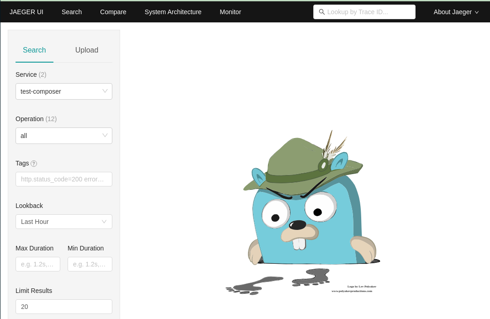

# Telemetry with Jaeger

## Introduction

Platformatic supports Open Telemetry integration. This allows you to send telemetry data to one of the OTLP compatible servers ([see here](https://opentelemetry.io/ecosystem/vendors/)) or to a Zipkin server. Let's show this with [Jaeger](https://www.jaegertracing.io/).

:::tip Advanced Setup
For manual OpenTelemetry SDK setup with custom instrumentations or exporters, see the [Advanced OpenTelemetry Setup](./opentelemetry-sdk-setup.md) guide.
:::

## Jaeger setup

The quickest way is to use docker:

```bash
docker run -d --name jaeger \
  -e COLLECTOR_OTLP_ENABLED=true \
  -p 16686:16686 \
  -p 4317:4317 \
  -p 4318:4318 \
  jaegertracing/all-in-one:latest
```

Check that the server is running by opening [http://localhost:16686/](http://localhost:16686/) in your browser.

## Platformatic setup

We'll test this with a Platformatic Gateway that proxies requests to a Watt Application, which in turn invokes a Platformatic DB Application.
In this way we show that the telemetry is propagated from the Gateway throughout the applications and the collected correctly.
Let's setup all these components:

### Platformatic DB Application

Create a DB application using `npm create wattpm`:

```bash
mkdir test-db
cd test-db
npm create wattpm
```

To make it simple, use `sqlite` and create/apply the default migrations. This DB Application is exposed on port `5042`:

```bash
Hello YOURNAME, welcome to Platformatic 3.0.0!
? Where would you like to create your project? .
? Which kind of application do you want to create? @platformatic/db
? What is the name of the application? main
? What is the connection string? sqlite://./db.sqlite
? Do you want to create default migrations? yes
? Do you want to use TypeScript? no
? Do you want to create another application? no
? What port do you want to use? 5042
```

Open the `web/main/platformatic.json` file and add the telemetry configuration:

```json
  "telemetry": {
    "applicationName": "test-db",
    "exporter": {
      "type": "otlp",
      "options": {
        "url": "http://localhost:4318/v1/traces"
      }
    }
  }
```

Finally, start the application:

```bash
npm run start
```

### Watt Application

Create at the same level of `test-db` another folder for Application and cd into it:

```bash
mkdir test-application
cd test-application
npm create wattpm
```

Then create a `service` on the `5043` port in the folder using `npm create wattpm`:

```bash
Hello YOURNAME, welcome to Platformatic 3.0.0!
? Where would you like to create your project? .
? Which kind of application do you want to create? @platformatic/service
? What is the name of the application? main
? Do you want to use TypeScript? no
? Do you want to create another application? no
? What port do you want to use? 5043
```

Open the `web/main/platformatic.json` file and add the following telemetry configuration (it's exactly the same as `DB`, but with a different `applicationName`)

```json
  "telemetry": {
    "applicationName": "test-service",
    "exporter": {
      "type": "otlp",
      "options": {
        "url": "http://localhost:4318/v1/traces"
      }
    }
  }
```

We want this application to invoke the DB application, so we need to add a [Massimo client](https://massimohttp.dev/) for `test-db` to it:

```bash
cd web/main
npm install massimo
npx massimo-cli http://127.0.0.1:5042 --name movies
```

Then add the url to `.env`:

```
PLT_MOVIES_URL=http://127.0.0.1:5042/
```

Now open `routes/root.js` and changes as follows:

```javascript
'use strict'

const { buildOpenAPIClient } = require('massimo')
const { resolve } = require('node:path')

module.exports = async function (fastify, opts) {
  const client = await buildOpenAPIClient({
    url: process.env.PLT_MOVIES_URL,
    path: resolve(__dirname, '../movies/movies.openapi.json'),
    fullResponse: false
  })

  fastify.get('/movies-length', async (request, reply) => {
    const movies = await client.getMovies()
    return { length: movies.length }
  })
}
```

This code calls `movies` to get all the movies and returns the length of the array.

Finally, start the application:

```bash
npm run start
```

### Platformatic Gateway

Create at the same level of `test-db` and `test-service` another folder for Gateway and cd into it:

```bash
mkdir test-gateway
cd test-gateway
npm create wattpm
```

```bash
Hello YOURNAME, welcome to Platformatic 3.0.0!
? Where would you like to create your project? .
? Which kind of application do you want to create? @platformatic/gateway
? What is the name of the application? main
? Do you want to use TypeScript? no
? Do you want to create another application? no
? What port do you want to use? 5044
```

Open `web/main/platformatic.json` and change it to the following:

```json
{
  "$schema": "https://schemas.platformatic.dev/@platformatic/gateway/3.0.0.json",
  "gateway": {
    "applications": [
      {
        "id": "example",
        "origin": "http://127.0.0.1:5043",
        "openapi": {
          "url": "/documentation/json"
        }
      }
    ],
    "refreshTimeout": 3000
  },
  "telemetry": {
    "applicationName": "test-gateway",
    "exporter": {
      "type": "otlp",
      "options": {
        "url": "http://localhost:4318/v1/traces"
      }
    }
  },
  "watch": true
}
```

Note that we just added `test-service` as `origin` of the proxied application and added the usual `telemetry` configuration, with a different `applicationName`.

Finally, start the gateway:

```bash
npm run start
```

## Run the Test

Check that the gateway is exposing `movies-length` opening: http://127.0.0.1:5044/documentation/

You should see:


To add some data, we can POST directly to the DB application (port `5042`):

```bash
curl -X POST -H "Content-Type: application/json" -d '{"title":"The Matrix"}' http://127.0.0.1:5042/movies
curl -X POST -H "Content-Type: application/json" -d '{"title":"The Matrix Reloaded"}'  http://127.0.0.1:5042/movies
```

Now, let's check that the gateway (port 5044) is working:

```bash
curl http://127.0.0.1:5044/movies-length
```

If the gateway is working correctly, you should see:

```json
{ "length": 2 }
```

However, the main interest of this example is to show how to use the Platformatic Telemetry, so let's check it.
Open the Jaeger UI at [http://localhost:16686/](http://localhost:16686/) and you should see something like this:



Select on the left the `test-gateway` service and the `GET /movies-length` operation, click on "Find traces" and you should see something like this:


You can then click on the trace and see the details:


Note that every time a request is received or client call is done, a new span is started. So we have:

- One span for the request received by the `test-gateway`
- One span for the client call to `test-service`
- One span for the request received by `test-service`
- One span for the client call to `test-db`
- One span for the request received by `test-db`

All these spans are linked together, so you can see the whole trace.

## What if you want to use Zipkin?

Starting from this example, it's also possible to run the same test using Zipkin. To do so, you need to start the Zipkin server:

```bash
docker run -d -p 9411:9411 openzipkin/zipkin
```

Then, you need to change the `telemetry` configuration in all the `platformatic.*.json` to the following (only the `exporter` object is different`)

```json
  "telemetry": {
    (...)
    "exporter": {
      "type": "zipkin",
      "options": {
        "url": "http://127.0.0.1:9411/api/v2/spans"
      }
    }
  }
```

The zipkin ui is available at [http://localhost:9411/](http://localhost:9411/)
