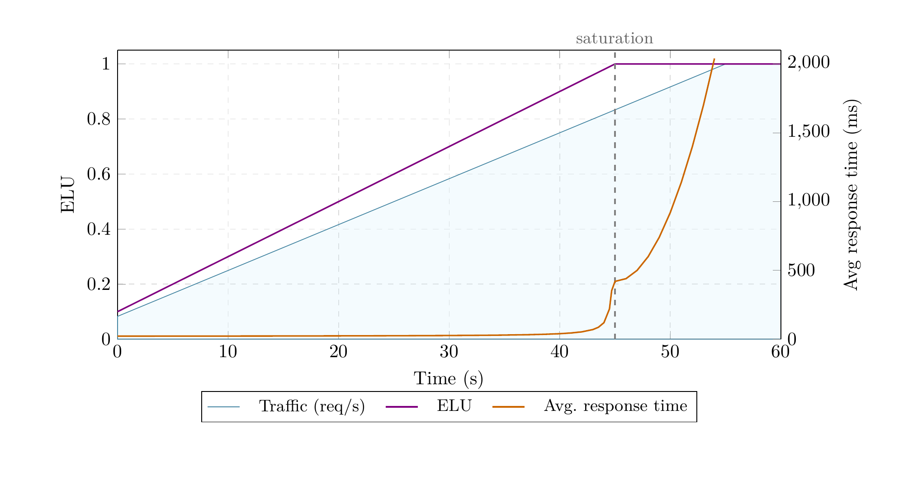
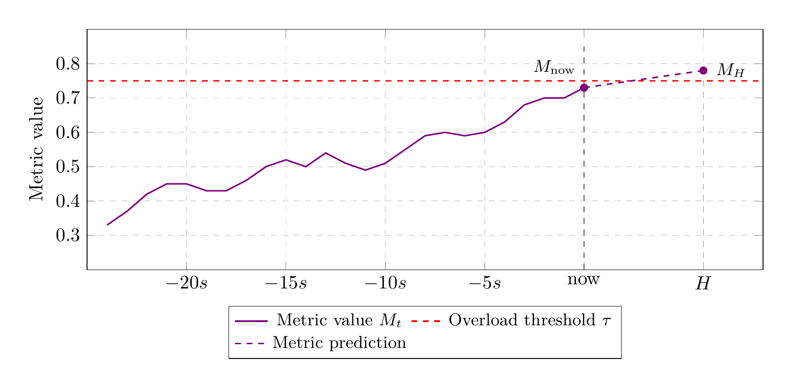
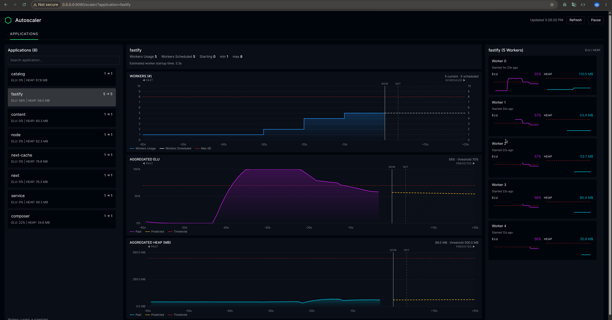

# Dynamic Workers

A fixed worker count has to cover both quiet periods and busy ones. Too few workers leave requests waiting as traffic grows; keeping enough workers for peak traffic uses memory even when most of them are idle. Dynamic scaling adjusts the worker count of each application inside a WATT as its load changes.

To decide when another worker would help, the scaler needs to understand where the application is running out of capacity. For Node.js, two useful signals are event loop utilization (ELU) and JavaScript heap usage.

## Why event loop utilization matters

We’ll start with a quick review of some Node.js and JavaScript basics. The heart of Node.js is the event loop, which runs JavaScript callbacks one at a time on a single thread. It cycles through different phases, picking up ready callbacks and running them in order.

A typical HTTP request shows how this works. When a request comes in, the event loop runs the handler callback, which parses data, checks the input, and runs business logic. This part is synchronous, so nothing else can happen in the loop at the same time. If the handler needs to access a database or call an external API, Node.js hands off that work to the operating system or a background thread pool, and the event loop moves on to other callbacks. When the I/O finishes, a new callback is added to the queue, and the event loop picks it up later to finish processing, like reading the database result and sending the response.

This design is what makes Node.js efficient. At any time, an app might have hundreds of requests in progress, but most are just waiting for I/O and not using the event loop. One thread can handle thousands of connections with little overhead, since there's no context switching or lock contention. This efficiency relies on the event loop having some idle time between callbacks.

As traffic grows, the synchronous parts of handling requests—like parsing bodies, serializing JSON, running business logic, or rendering server-side React—start to use up more of the idle time. While this code runs, nothing else can happen. Eventually, those idle gaps disappear.

[Event Loop Utilization (ELU)](https://nodesource.com/blog/event-loop-utilization-nodejs) measures this effect. It's a value from 0 to 1 that shows how much time the event loop spends running code versus being idle. An ELU of 0.5 means the loop is active half the time, while 0.9 means there's almost no idle time left.




WATT provides two scaling algorithms. **Threshold-based scaling (v1)**, the default, reacts to recent ELU averages and uses heap usage to check whether another worker fits in memory. **Predictive scaling (v2)** forecasts demand from ELU and, optionally, heap usage so it can request capacity before the current workers become overloaded.

## Threshold-based scaling (v1)

Threshold-based scaling adds capacity when an application's recent average ELU exceeds an upper threshold and removes capacity when it falls below a lower threshold. Separate thresholds leave room for normal fluctuations without repeatedly adding and removing a worker.

For example, with the defaults, an application whose workers average 85% ELU over the last 10 seconds qualifies for an extra worker. If its average falls below 20% over the last minute, it qualifies to lose a worker. The longer scale-down window avoids removing capacity in response to a brief drop in traffic.

### How a decision works

The threshold-based scaler samples eligible workers approximately once per second. It ignores a new worker's metrics during its startup grace period, which defaults to 30 seconds. For each application, it averages each worker's readings over the relevant window, then averages those worker values:

| Decision | ELU window | Default threshold |
| --- | --- | --- |
| Scale up | Last 10 seconds | Above `0.8` |
| Scale down | Last 60 seconds | Below `0.2` |

The threshold-based scaler checks for scaling when a sampled worker exceeds its application's scale-up threshold. It also checks every 60 seconds, so low-load applications can scale down without a high-load trigger.

Each scaling check looks at all applications and can:

- Remove one worker from each application whose average ELU is below the scale-down threshold, without going below its minimum worker count.
- Add one worker to one application whose average ELU is above the scale-up threshold, if worker and memory limits allow it.

If an application's worker count is already outside its configured minimum or maximum, the scaler can add or remove multiple workers to bring it back within those limits.

After applying scaling updates, the threshold-based scaler waits for a global cooldown before making another decision. The default is 20 seconds, and it blocks both directions across all applications. Metric collection continues during the cooldown.

### Sharing capacity between applications

Assume the default thresholds, a minimum of one worker per application, no active cooldown, and sufficient memory unless stated otherwise. ELU values below are the averages for the relevant decision window.

| Situation | Result |
| --- | --- |
| A has two workers at 85% ELU; no other app needs scaling; worker and memory limits allow growth | A receives one additional worker |
| A has two workers at 90%; B has two at 30%; `total` is four | No change: A cannot grow, and B is above the 20% scale-down threshold |
| A has two workers at 50%; B has three at 10% | B loses one worker |
| A has three workers at 15%; B has two at 18% | Each loses one worker |
| A needs to grow, but its average worker heap is 1.5 GB and only 1 GB remains below `maxMemory` | A does not grow |

The scaler does not remove a worker from an application solely to make room for another one. The application must qualify for scale-down itself.

### Configuration

#### Global configuration

Enable threshold-based scaling by setting `dynamic` to `true` and `version` to `"v1"` in the runtime-level `workers` object. This algorithm is also selected when `version` is omitted. Durations are in milliseconds.

```json
{
  "workers": {
    "dynamic": true,
    "version": "v1",
    "minimum": 1,
    "maximum": 4,
    "total": 8,
    "scaleUpELU": 0.8,
    "scaleDownELU": 0.2,
    "cooldown": 20000,
    "gracePeriod": 30000
  }
}
```

This gives each dynamically scaled application between one and four workers, with a total budget of eight across the runtime.

For a framework application running directly through WATT, put the settings inside its configuration's `runtime` section instead:

```json
{
  "runtime": {
    "workers": {
      "dynamic": true,
      "version": "v1",
      "minimum": 1,
      "maximum": 4,
      "total": 4
    }
  }
}
```

These are configuration fragments; keep your existing application and server settings. Start the application through WATT, for example with `wattpm start`. Starting a framework directly, such as with `next start`, does not run the WATT scaler. The algorithm version is selected for the whole runtime.

| Setting | Default | Meaning |
| --- | --- | --- |
| `dynamic` | `false` | Enable automatic worker scaling |
| `version` | `"v1"` | Use `"v1"` or omit this setting to select threshold-based scaling |
| `static` | `1` | Initial worker count; also the fixed count when dynamic scaling is disabled |
| `minimum` | `1` | Default minimum workers per application |
| `maximum` | `total` | Default maximum workers per application |
| `total` | `os.availableParallelism()` | Runtime-wide worker limit for load-driven scale-ups, including fixed applications |
| `maxMemory` | 90% of detected total memory | Memory usage limit, in bytes, used when considering scale-ups |
| `scaleUpELU` | `0.8` | Scale-up threshold for the 10-second application average |
| `scaleDownELU` | `0.2` | Scale-down threshold for the 60-second application average |
| `cooldown` | `20000` | Global delay after scaling updates before another decision |
| `gracePeriod` | `30000` | Time after each worker starts before the threshold-based scaler uses its metrics |

Memory usage and capacity come from cgroup files when available, otherwise from the host operating system. On a host, the check therefore includes memory used outside this WATT. `maxMemory` is a scaling constraint; setting it does not impose an operating-system memory limit.

The threshold-based scaler estimates whether there is room for another worker using the application's average heap usage. Heap usage constrains whether a new worker can be started; it does not independently trigger threshold-based scaling.

Choose application minima and fixed counts that fit within `total` and the available memory. Provisioning the configured minimum is separate from the checks for load-driven scale-ups. A runtime can otherwise start above its intended budget.

On platforms without the required `reusePort` support, the scaler limits an entrypoint application to one worker and logs a warning.

#### Per-application configuration

In a multi-application runtime, set overrides in `applications[].workers`. Threshold-based scaling supports `minimum`, `maximum`, `scaleUpELU`, and `scaleDownELU` per application. Omitted values use the runtime-level settings.

```json
{
  "workers": {
    "dynamic": true,
    "version": "v1",
    "minimum": 1,
    "maximum": 4,
    "total": 8
  },
  "applications": [
    {
      "id": "api",
      "path": "./services/api",
      "workers": {
        "minimum": 2,
        "maximum": 6,
        "scaleUpELU": 0.7
      }
    },
    {
      "id": "jobs",
      "path": "./services/jobs",
      "workers": 1
    }
  ]
}
```

Here, `api` can scale between two and six workers. `jobs` stays at one worker, which still counts toward `total`. Cooldown and grace-period settings apply across the runtime.

## Predictive scaling (v2)

Starting a worker takes time: it must load the application and initialize its dependencies before handling requests. During that time, the existing workers continue to carry the traffic. Waiting until average ELU exceeds the configured limit can leave them overloaded before the new worker is ready.

Predictive scaling accounts for this delay by tracking the application's load and how quickly it changes. It estimates the capacity needed when a new worker is expected to be ready, so a rising trend can trigger a scale-up while current ELU is still below the threshold. The underlying method is described in the [algorithm whitepaper](https://arxiv.org/abs/2604.19705).



In the chart, ELU has risen to 73%, still below the 75% threshold. The threshold-based scaler would not request another worker yet. But the dashed purple line shows that, if the trend continues, ELU will reach 78% by the forecast horizon, `H`, when extra capacity is expected to be ready.

That forecast lets predictive scaling request workers before the measured load crosses the limit. Starting them earlier gives them a chance to take traffic before the existing workers become overloaded and requests begin to queue.

The rest of this section explains how the algorithm builds this prediction.

**The core idea.** The algorithm takes per-worker metric values, combines them into a single number for the application, predicts where that number is heading, and converts the prediction back into a per-worker value to compare against the threshold. Each application has its own forecast and worker recommendation.

**Why predict on an aggregate?** Per-worker metrics change for two reasons: incoming traffic changes and the scaler's own actions. When another worker starts handling requests, ELU on the existing workers drops, even though traffic has not changed. Predicting directly from those readings could make the algorithm interpret this as falling demand and delay further scaling when it is still needed.

Combining ELU across the application's workers gives a more stable view of demand. Once traffic has redistributed, roughly the same work is spread across more workers. Their individual readings change, but the combined load is less affected by the change in worker count.

**Cleaning the data.** Runtime collects worker measurements approximately once per second. Missing readings and the temporary changes caused by starting workers need to be accounted for before those measurements can support a forecast.

Alignment places samples onto a common one-second time grid, interpolating between readings so that workers can be compared at the same points in time.

Imputation fills gaps by carrying a live worker's last valid measurement forward. A worker contributes only after its first measurement, and runtime lifecycle events determine when it has exited. Processing moves forward from the current state; late readings do not cause past predictions to be recomputed.

Redistribution accounts for the transition after a scale-up. New workers' measurements are included gradually as they take on traffic. At the same time, the algorithm compensates for the drop on existing workers as they shed load. This reduces the distortion caused by scaling while still allowing increases in demand to pass through.

**Predicting the trend.** The resulting aggregate enters Holt's double exponential smoothing. This maintains two values: the level, a smoothed estimate of the current load, and the trend, an estimate of how quickly it is changing. Each new measurement updates both. Smoothing reduces the effect of individual noisy readings while allowing sustained changes to shape the forecast.

**Asymmetric reaction.** The algorithm can respond differently to measurements above and below its forecast. By default, the load level responds faster to higher readings and more slowly to lower ones. Missing a sustained increase can leave workers overloaded; reacting too quickly to a brief drop can cause unnecessary scaling down and then back up. Separate settings control how quickly the level and trend adjust in each direction.

**The prediction horizon.** The horizon, `H`, determines how far ahead the algorithm looks. It follows observed worker startup times, so an application that takes longer to initialize is given more time to prepare for rising traffic. The estimate adapts as workers start. A small safety buffer extends the forecast beyond the estimated startup time, and fixed lower and upper bounds keep it within a useful range.

**Handling metric saturation.** ELU cannot exceed 100%. Once the workers' event loops are saturated, more traffic can arrive without the metric increasing. Normally, a flat measurement would make the estimated trend fade toward zero. During saturation, the algorithm preserves that trend, allowing it to continue requesting capacity even though ELU cannot show how much demand has grown.

**The scaling decision.** The forecast estimates the application's total load at the horizon. Dividing it by the approved worker target, including workers already requested, gives the expected load per worker. If that exceeds the threshold, the algorithm calculates a higher worker count, with margins to avoid reacting to small differences. If the trend is flat or falling and current load fits, it considers scaling down while keeping spare capacity. Recommendations remain subject to application limits, cooldowns, and the runtime controller's resource checks.

### Coordinating applications

Applications share the WATT's CPU and memory. A recommendation from one application cannot assume that all spare resources are available to it. The runtime controller compares the desired worker counts and decides which updates to approve:

- It accepts scale-down recommendations for all eligible applications in the same cycle.
- For scale-up, it selects the application with the largest relative increase: `(desiredTarget - approvedTarget) / approvedTarget`.
- It adds at most `maxScaleUpStep` workers to that application, limited by its requested count, the total worker budget, and the memory check.

For example, a request from two to four workers has a relative increase of 100%; a request from four to five has an increase of 25%. The first application gets priority. The controller uses worker counts, so this choice does not depend on whether ELU or heap produced the request.

The default is one extra worker per cycle. Starting workers can involve compilation, database connections, and memory allocation that compete with the other applications in the WATT. Increase `maxScaleUpStep` only when the workload and container have enough spare resources for several starts at once.

### Configuration

#### Global configuration

Enable predictive scaling by setting `version` to `"v2"` in the runtime-level `workers` object. This example scales on ELU; add `heapThresholdMb` when heap usage should also influence worker count. Durations are in milliseconds.

```json
{
  "workers": {
    "dynamic": true,
    "version": "v2",
    "minimum": 1,
    "maximum": 4,
    "total": 8,
    "eluThreshold": 0.8,
    "processIntervalMs": 10000,
    "maxScaleUpStep": 1
  }
}
```

For a framework application running directly through WATT, put this `workers` object inside its configuration's `runtime` section. Start it through WATT, for example with `wattpm start`; a framework's own start command does not run the scaler. The version applies to the whole runtime.

| Setting | Default | Meaning |
| --- | --- | --- |
| `dynamic` | `false` | Enable automatic worker scaling |
| `version` | `"v1"` | Set to `"v2"` to select predictive scaling |
| `static` | `1` | Initial worker count; also the fixed count when dynamic scaling is disabled |
| `minimum` | `1` | Default minimum workers per application |
| `maximum` | `os.availableParallelism()` | Default maximum workers per application |
| `total` | `os.availableParallelism()` | Runtime-wide worker limit for load-driven scale-ups, including fixed applications |
| `maxMemory` | 90% of detected total memory | Memory usage limit, in bytes, used when considering scale-ups |

Memory usage and capacity come from cgroup files when available, otherwise from the host operating system. On a host, the check therefore includes memory used outside this WATT. `maxMemory` is a scaling constraint; setting it does not impose an operating-system memory limit.

The predictive scaler checks whether current memory usage is below `maxMemory`; it does not reserve an estimated amount for new workers. Allow enough headroom for startup work and other memory allocations.

Choose application minima and fixed counts that fit within `total` and the available memory. Provisioning the configured minimum is separate from the checks for load-driven scale-ups. A runtime can otherwise start above its intended budget.

On platforms without the required `reusePort` support, the scaler limits an entrypoint application to one worker and logs a warning.

#### Thresholds and decision timing

| Setting | Default | Meaning |
| --- | --- | --- |
| `eluThreshold` | `0.8` | Per-worker ELU capacity used to convert aggregate load into a worker count |
| `heapThresholdMb` | Disabled | Per-worker heap capacity in MB, where 1 MB is 1,048,576 bytes. Enables an independent heap-based recommendation |
| `processIntervalMs` | `10000` | Time between processing runs. Samples arriving between runs are processed together. Runtime-level only |
| `maxScaleUpStep` | `1` | Maximum workers added to the selected application per run. Positive integer; runtime-level only |
| `redistributionMs` | `10000` | Expected time for a new worker to absorb its share of traffic; controls how its contribution is introduced into the aggregate |
| `scaleUpMargin` | `0.1` | Fractional-worker margin for rounding up a forecast-based request. Current overload bypasses this margin |
| `scaleDownMargin` | `0.3` | Extra capacity retained when calculating a lower worker count |

For example, an adjusted forecast requiring 2.08 workers does not pass a `0.1` scale-up margin by itself. Current overload can still justify rounding up. Scale-down uses the current smoothed load with additional headroom; it does not simply reverse the scale-up calculation.

#### Trend detecting

Holt smoothing maintains a load level and a trend. These parameters control how much new measurements change that state. Higher values respond more quickly but also follow noise more closely.

| Setting | Default | Applied when |
| --- | --- | --- |
| `alphaUp` | `0.2` | Updating the level when the measurement is above the one-step forecast |
| `alphaDown` | `0.1` | Updating the level when the measurement is at or below the one-step forecast |
| `betaUp` | `0.1` | Updating the trend when the measurement is above the one-step forecast |
| `betaDown` | `0.1` | Updating the trend when the measurement is at or below the one-step forecast |

The default level smoothing reacts more quickly to measurements above the forecast. ELU also has saturation handling: near 100% utilization, a flat measurement may mean that the event loop has reached its reporting limit, rather than that demand has stopped growing.

#### Cooldowns

Predictive scaling cooldowns apply independently to each application. They are enabled with the following defaults; set a duration to `0` to remove that particular delay. Processing intervals and pending-worker checks still apply.

| Setting | Default | What it delays |
| --- | --- | --- |
| `cooldowns.scaleUpAfterScaleUpMs` | `5000` | Another scale-up after the last approved scale-up |
| `cooldowns.scaleUpAfterScaleDownMs` | `5000` | A scale-up after the last approved scale-down |
| `cooldowns.scaleDownAfterScaleUpMs` | `30000` | A scale-down after the most recent worker start, including initial and replacement workers |
| `cooldowns.scaleDownAfterScaleDownMs` | `20000` | Another scale-down after the last approved scale-down |

The predictive scaler does not use the `cooldown` or `gracePeriod` settings of threshold-based scaling. It starts using a worker's valid measurements as they arrive and accounts for its startup through redistribution and pending-worker tracking.

#### Per-application configuration

In a multi-application runtime, set overrides in `applications[].workers`. Predictive scaling supports `minimum`, `maximum`, metric thresholds, margins, redistribution time, smoothing parameters, and cooldowns per application. Omitted values use the runtime-level settings.

```json
{
  "workers": {
    "dynamic": true,
    "version": "v2",
    "minimum": 1,
    "maximum": 4,
    "total": 8
  },
  "applications": [
    {
      "id": "api",
      "path": "./services/api",
      "workers": {
        "minimum": 2,
        "maximum": 6,
        "eluThreshold": 0.7
      }
    },
    {
      "id": "jobs",
      "path": "./services/jobs",
      "workers": 1
    }
  ]
}
```

Here, `api` can scale between two and six workers using a 70% ELU threshold. `jobs` stays at one worker, which still counts toward `total`.

The algorithm version, processing interval, scale-up step, total worker limit, and memory budget are runtime-level settings. For a standalone framework application, use `runtime.workers`.

### Applications dashboard

Enable the metrics server alongside predictive scaling in the runtime configuration:

```json
{
  "workers": {
    "dynamic": true,
    "version": "v2"
  },
  "metrics": {
    "enabled": true,
    "hostname": "127.0.0.1",
    "port": 9090
  }
}
```

For a standalone framework application, put both properties inside `runtime`. Open **http://127.0.0.1:9090/scaler/** on the metrics server. This is separate from the application's HTTP port. The page uses the metrics server's existing HTTPS and authentication settings and is available only when predictive scaling is active.

Select an application to see its worker counts, aggregated metrics, forecasts, and individual worker charts. Heap charts require `heapThresholdMb`. The page also reports current worker and memory constraints and workers taking longer than expected to start.

#### Reading the charts

- **Current workers** are registered live workers. **Scheduled workers** are the controller's approved target, including pending starts. The page does not retain unapproved recommendations or a decision log.
- **Past metric values** come from the algorithm's existing 60-second history. **Dashed projections** show its current smoothed level and trend divided by the approved target. These lines are a display of the current state, not a second execution of the decision algorithm.
- **NOW** marks the snapshot time. **INIT** marks the estimated startup delay when it fits in the chart. The chart shows 20 seconds into the future; metric projections can extend beyond the algorithm's forecast horizon to fill that display window.
- **Displayed ELU** is bounded to 0–100%. Heap has a zero lower bound. These display bounds do not cap the algorithm's internal forecast or worker recommendation.

Worker-count history is recorded only while the page receives snapshots and is cleared on refresh. Individual worker charts can include a silent worker's last valid measurement.

The page polls every five seconds and pauses polling when hidden or when **Pause** is selected. The UI can refresh between algorithm runs; this does not trigger another scaling decision. Snapshot requests read existing state and add no history buffers or metric collection to the scaling loop. Worker-count history and chart rendering stay in the browser.


