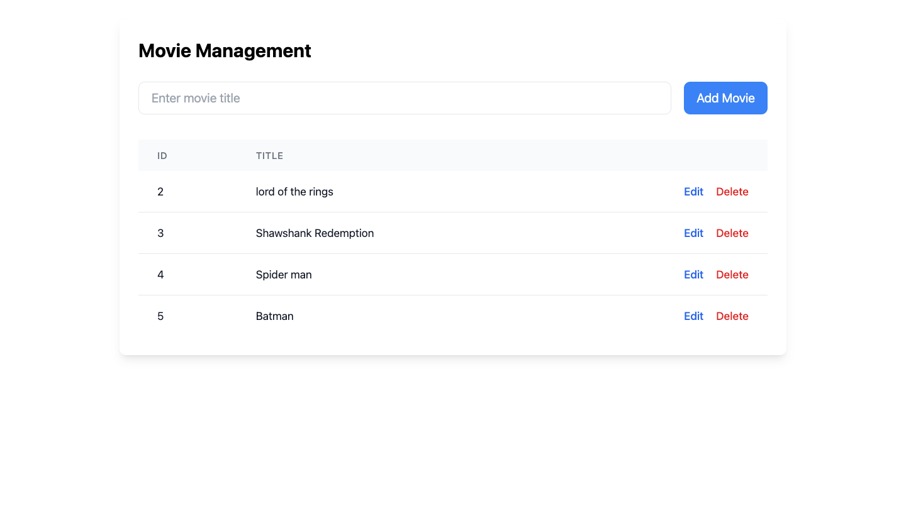

import Tabs from '@theme/Tabs';
import TabItem from '@theme/TabItem';
import NewApiProjectInstructions from '../getting-started/new-api-project-instructions.md';
import SetupWatt from '../getting-started/setup-watt.md';

# Build Front-end for Platformatic REST API

Platformatic apps expose REST APIs that provide provide CRUD (Create, Read,
Update, Delete) functionality for each entity (see the
[Introduction to the REST API](https://docs.platformatic.dev/docs/reference/sql-openapi/introduction)
documentation for more information on the REST API) by default.

In this guide, you will learn how to create a new Platformatic guide with Watt, Frontend Client, add a frontend to consume your Platformatic REST API.

## Create a Watt Application

<SetupWatt />


### Add a Platformatic DB service


<NewApiProjectInstructions/>


### Add a new Platformatic service

Every Platformatic service uses the "Movie" demo entity and includes the corresponding table, migrations, and REST API to create, read, update, and delete movies.

Launch your application with the command below:

```sh
npm run dev
```

Your Platformatic app should be at the `http://127.0.0.1:3042/` URL.

## Create a Front-end Application

Refer to the [Scaffolding Your First Vite Project](https://vitejs.dev/guide/#scaffolding-your-first-vite-project) documentation to create a new front-end application, and call it "rest-api-frontend".

:::info
Please note Vite is suggested only for practical reasons, Platformatic Watt supports Astro, Remix, Next.js and Vite frameworks.
:::

In the `web` directory of your application, run the command:


<Tabs groupId="import-new-component">
<TabItem value="react" label="React">

```bash
npm create vite@latest rest-api-frontend -- --template react
```

</TabItem>
<TabItem value="vue" label="Vue.js">

```bash
npm create vite@latest rest-api-frontend -- --template vue-ts
```

</TabItem>
</Tabs>

and then follow the Vite's instructions

```bash
Scaffolding project in /Users/noriste/Sites/temp/platformatic/rest-api-frontend...

Done. Now run:

  cd rest-api-frontend
  npm install
  npm run dev
```

Once done, run the command below to add `watt.json` file to your frontend application:

```sh
npx wattpm import web/frontend
```

Add your frontend `id` and DB service to your `platformatic.json` file in your `web/composer` application:

```json
{
  "$schema": "https://schemas.platformatic.dev/@platformatic/composer/2.15.0.json",
  "composer": {
    "services": [
      {
        "id": "db",
        "openapi": {
          "url": "/documentation/json",
          "prefix": "/db"
        }
      },
      {
        "id":"frontend" // Frontend ID for Vite applications
      }
    ],
    "refreshTimeout": 1000
  },
  "watch": true
}
```


### Add a Frontend Client for REST API 

To consume REST APIs in your Platformatic application. run the command to use Platformatic [frontend client](https://docs.platformatic.dev/docs/client/frontend) for exposing a client for your remote OpenAPI server, the client uses fetch and runs on the browser. 

```bash
cd rest-api-frontend/src
npx --package @platformatic/client-cli plt-client http://127.0.0.1:3042 --frontend --name frontend-client
```

Refer to the [Platformatic CLI frontend command](https://docs.platformatic.dev/docs/reference/cli#frontend) documentation to know about the available options.

The Platformatic CLI will generate `frontend-client.mjs`, `frontend-client-types.d.ts`, `frontend-client.openapi.json`. Refer to the [frontend client documentation](https://docs.platformatic.dev/docs/client/frontend) to learn more about the [Client](https://docs.platformatic.dev/docs/client/frontend) and [CLI](https://docs.platformatic.dev/docs/cli).  


### React component for CRUD operations 

In this section, you’ll build a React component for CRUD operations using the autogenerated client code provided by Platformatic. The code showcases a `MovieManager.jsx` file that manages movies in a database. You will implement features to create, read, update, and delete movies.


```js
import { useState, useEffect } from 'react';
import { setBaseUrl, dbGetMovies, dbCreateMovie, dbUpdateMovie, dbDeleteMovies } from './frontend-client/frontend-client.mjs';

// Set the base URL for the API client
setBaseUrl(window.location.origin); // Or your specific API base URL

export default function MovieManager() {
  const [movies, setMovies] = useState([]);
  const [newMovie, setNewMovie] = useState({ title: '' });
  const [editMovie, setEditMovie] = useState(null);
  const [showEditModal, setShowEditModal] = useState(false);

  useEffect(() => {
    fetchMovies();
  }, []);

  const fetchMovies = async () => {
    try {
      const response = await dbGetMovies({});
      setMovies(response);
    } catch (error) {
      console.error('Error fetching movies:', error);
    }
  };

  const handleCreateMovie = async (e) => {
    e.preventDefault();
    try {
      await dbCreateMovie(newMovie);
      setNewMovie({ title: '' });
      fetchMovies();
    } catch (error) {
      console.error('Error creating movie:', error);
    }
  };

  const handleEditMovie = async (e) => {
    e.preventDefault();
    try {
      await dbUpdateMovie(editMovie);
      setShowEditModal(false);
      setEditMovie(null);
      fetchMovies();
    } catch (error) {
      console.error('Error updating movie:', error);
    }
  };

  const handleDeleteMovie = async (id) => {
    try {
      await dbDeleteMovies({ id });
      fetchMovies();
    } catch (error) {
      console.error('Error deleting movie:', error);
    }
  };

  return (
    <div className="p-6 max-w-4xl mx-auto">
      <div className="bg-white rounded-lg shadow-lg p-6">
        <h1 className="text-2xl font-bold mb-6">Movie Management</h1>
        
        {/* Create Movie Form */}
        <form onSubmit={handleCreateMovie} className="mb-8 flex gap-4">
          <input
            type="text"
            placeholder="Enter movie title"
            value={newMovie.title}
            onChange={(e) => setNewMovie({ title: e.target.value })}
            className="flex-1 px-4 py-2 border rounded-lg focus:outline-none focus:ring-2 focus:ring-blue-500"
          />
          <button
            type="submit"
            className="px-4 py-2 bg-blue-500 text-white rounded-lg hover:bg-blue-600 focus:outline-none focus:ring-2 focus:ring-blue-500"
          >
            Add Movie
          </button>
        </form>

        {/* Movies Table */}
        <div className="overflow-x-auto">
          <table className="w-full">
            <thead className="bg-gray-50">
              <tr>
                <th className="px-6 py-3 text-left text-xs font-medium text-gray-500 uppercase tracking-wider">ID</th>
                <th className="px-6 py-3 text-left text-xs font-medium text-gray-500 uppercase tracking-wider">Title</th>
                <th className="px-6 py-3 text-right text-xs font-medium text-gray-500 uppercase tracking-wider">Actions</th>
              </tr>
            </thead>
            <tbody className="bg-white divide-y divide-gray-200">
              {movies.map((movie) => (
                <tr key={movie.id}>
                  <td className="px-6 py-4 whitespace-nowrap text-sm text-gray-900">{movie.id}</td>
                  <td className="px-6 py-4 whitespace-nowrap text-sm text-gray-900">{movie.title}</td>
                  <td className="px-6 py-4 whitespace-nowrap text-right text-sm font-medium">
                    <button
                      onClick={() => {
                        setEditMovie(movie);
                        setShowEditModal(true);
                      }}
                      className="text-blue-600 hover:text-blue-900 mr-4"
                    >
                      Edit
                    </button>
                    <button
                      onClick={() => handleDeleteMovie(movie.id)}
                      className="text-red-600 hover:text-red-900"
                    >
                      Delete
                    </button>
                  </td>
                </tr>
              ))}
            </tbody>
          </table>
        </div>

        {/* Edit Modal */}
        {showEditModal && (
          <div className="fixed inset-0 bg-black bg-opacity-50 flex items-center justify-center p-4">
            <div className="bg-white rounded-lg p-6 w-full max-w-md">
              <h2 className="text-xl font-bold mb-4">Edit Movie</h2>
              <form onSubmit={handleEditMovie}>
                <input
                  type="text"
                  value={editMovie?.title || ''}
                  onChange={(e) => setEditMovie({ ...editMovie, title: e.target.value })}
                  className="w-full px-4 py-2 mb-4 border rounded-lg focus:outline-none focus:ring-2 focus:ring-blue-500"
                />
                <div className="flex justify-end gap-4">
                  <button
                    type="button"
                    onClick={() => setShowEditModal(false)}
                    className="px-4 py-2 border rounded-lg hover:bg-gray-100"
                  >
                    Cancel
                  </button>
                  <button
                    type="submit"
                    className="px-4 py-2 bg-blue-500 text-white rounded-lg hover:bg-blue-600"
                  >
                    Save Changes
                  </button>
                </div>
              </form>
            </div>
          </div>
        )}
      </div>
    </div>
  );
}
```

This component handles all the CRUD operations for managing movies by interacting with the autogenerated client functions (`dbGetMovies`, `dbCreateMovie`, etc.) from your Platformatic API.

#### Rendering in App.jsx

To include this component in your app, import it into your `App.jsx` file:

```js 
import MovieManager from './MovieManager';
import './App.css'

function App() {
  return (
    <div>
      <MovieManager />
    </div>
  );
}

export default App;
```

The styling for the `MovieManager.jsx` file uses Tailwind CSS.  See the [tailwind documentation](https://tailwindcss.com/docs/installation) on how to install and set it up. 

### Start your Server 

In the root of your project directory, run the command:

```sh
npm run dev
```

Your application is now up and running on `http://127.0.0.1:3042/frontend`

