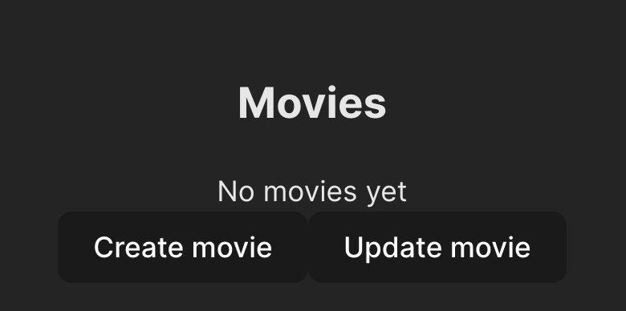
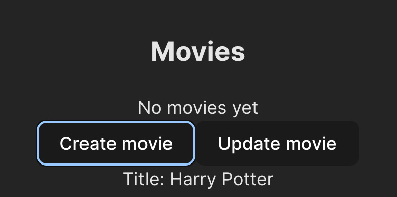
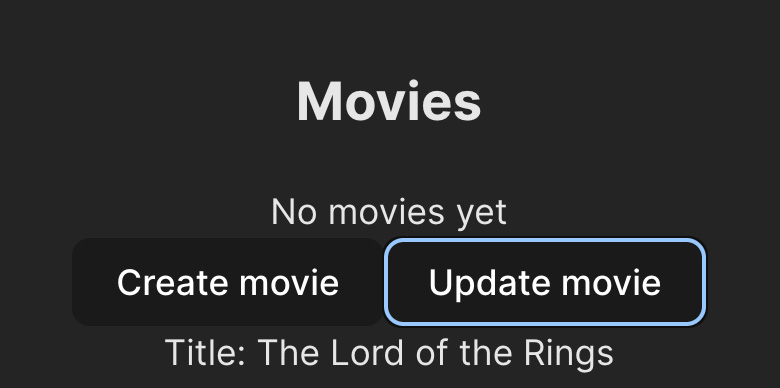

import Tabs from '@theme/Tabs';
import TabItem from '@theme/TabItem';
import NewApiProjectInstructions from '../getting-started/new-api-project-instructions.md';

# Generate Front-end Code to Consume Platformatic REST API

By default, a Platformatic app exposes REST API that provide CRUD (Create, Read,
Update, Delete) functionality for each entity (see the
[Introduction to the REST API](https://docs.platformatic.dev/docs/reference/sql-openapi/introduction)
documentation for more information on the REST API).

Platformatic CLI allows to auto-generate the front-end code to import in your
front-end application to consume the Platformatic REST API.

This guide
* Explains how to create a new Platformatic app.
* Explains how to configure the new Platformatic app.
* Explains how to create a new React or Vue.js front-end application.
* Explains how to generate the front-end TypeScript code to consume the Platformatic app REST API.
* Provide some React and Vue.js components (either of them written in TypeScript) that read, create, and update an entity.
* Explains how to import the new component in your front-end application.


## Create a new Platformatic app


<NewApiProjectInstructions/>


## Configure the new Platformatic app

documentation to create a new Platformatic app. Every Platformatic app uses the "Movie" demo entity and includes
the corresponding table, migrations, and REST API to create, read, update, and delete movies.

Once the new Platformatic app is ready:

* Set up CORS in `platformatic.db.json`

```diff
{
  "$schema": "https://platformatic.dev/schemas/v0.24.0/db",
  "server": {
    "hostname": "{PLT_SERVER_HOSTNAME}",
    "port": "{PORT}",
    "logger": {
      "level": "{PLT_SERVER_LOGGER_LEVEL}"
    },
+   "cors": {
+     "origin": {
+       "regexp": "/*/"
+     }
+   }
  },
  ...
}
```

  You can find more details about the cors configuration [here](https://docs.platformatic.dev/docs/guides/generate-frontend-code-to-consume-platformatic-rest-api).

* launch Platformatic through `npm start`.
Then, the Platformatic app should be available at the `http://127.0.0.1:3042/` URL.

## Create a new Front-end Application

Refer to the [Scaffolding Your First Vite Project](https://vitejs.dev/guide/#scaffolding-your-first-vite-project)
documentation to create a new front-end application, and call it "rest-api-frontend".

:::info
Please note Vite is suggested only for practical reasons, but the bundler of choice does not make any difference.
:::

If you are using npm 7+ you should run


<Tabs groupId="import-new-component">
<TabItem value="react" label="React">

```bash
npm create vite@latest rest-api-frontend -- --template react-ts
```

</TabItem>
<TabItem value="vue" label="Vue.js">

```bash
npm create vite@latest rest-api-frontend -- --template vue-ts
```

</TabItem>
</Tabs>

and then follow the Vite's instructions

```bash
Scaffolding project in /Users/noriste/Sites/temp/platformatic/rest-api-frontend...

Done. Now run:

  cd rest-api-frontend
  npm install
  npm run dev
```

Once done, the front-end application is available at `http://localhost:5174/`.

## Generate the front-end code to consume the Platformatic app REST API

Now that either the Platformatic app and the front-end app are running, go to the front-end codebase and run the Platformatic CLI

```bash
cd rest-api-frontend/src
npx platformatic client http://127.0.0.1:3042 --frontend --language ts
```

Refer to the [Platformatic CLI frontend command](https://docs.platformatic.dev/docs/reference/cli#frontend)
documentation to know about the available options.

The Platformatic CLI generates

  * `api.d.ts`: A TypeScript module that includes all the OpenAPI-related types.
Here is part of the generated code

```ts
interface GetMoviesRequest {
  'limit'?: number;
  'offset'?: number;
  // ... etc.
}

interface GetMoviesResponseOK {
  'id'?: number;
  'title': string;
}


// ... etc.

export interface Api {
  setBaseUrl(baseUrl: string): void;
  getMovies(req: GetMoviesRequest): Promise<Array<GetMoviesResponseOK>>;
  createMovie(req: CreateMovieRequest): Promise<CreateMovieResponseOK>;
  // ... etc.
}
```

  * `api.ts`: A TypeScript module that includes a typed function for every single OpenAPI endpoint.
Here is part of the generated code

```ts
import type { Api } from './api-types'

let baseUrl = ''
export function setBaseUrl(newUrl: string) { baseUrl = newUrl };

export const createMovie: Api['createMovie'] = async (request) => {
  const response = await fetch(`${baseUrl}/movies/`, {
    method:'post',
    body: JSON.stringify(request),
    headers: {
      'Content-Type': 'application/json'
    }
  })

  if (!response.ok) {
    throw new Error(await response.text())
  }

  return await response.json()
}

// etc.

```

You can add a `--name` option to the command line to provide a custom name for the generated files.

```bash
cd rest-api-frontend/src
npx platformatic client http://127.0.0.1:3042 --frontend --name foobar --language ts
```

will generated `foobar.ts` and `foobar-types.d.ts`


## React and Vue.js components that read, create, and update an entity

You can copy/paste the following React or Vue.js components that import the code
the Platformatic CLI generated.

<Tabs groupId="import-new-component">
<TabItem value="react" label="React">

Create a new file `src/PlatformaticPlayground.tsx` and copy/paste the following code.

```tsx
import { useEffect, useState } from 'react'

// getMovies, createMovie, and updateMovie are all functions automatically generated by Platformatic
// in the `api.ts` module.
import { getMovies, createMovie, updateMovie, setBaseUrl } from './api'

setBaseUrl('http://127.0.0.1:3042') // configure this according to your needs

export function PlatformaticPlayground() {
  const [movies, setMovies] = useState<Awaited<ReturnType<typeof getMovies>>>([])
  const [newMovie, setNewMovie] = useState<Awaited<ReturnType<typeof createMovie>>>()

  async function onCreateMovie() {
    const newMovie = await createMovie({ title: 'Harry Potter' })
    setNewMovie(newMovie)
  }

  async function onUpdateMovie() {
    if (!newMovie || !newMovie.id) return

    const updatedMovie = await updateMovie({ id: newMovie.id, title: 'The Lord of the Rings' })
    setNewMovie(updatedMovie)
  }

  useEffect(() => {
    async function fetchMovies() {
      const movies = await getMovies({})
      setMovies(movies)
    }

    fetchMovies()
  }, [])

  return (
    <>
      <h2>Movies</h2>

      {movies.length === 0 ? (
        <div>No movies yet</div>
      ) : (
        <ul>
          {movies.map((movie) => (
            <li key={movie.id}>{movie.title}</li>
          ))}
        </ul>
      )}

      <button onClick={onCreateMovie}>Create movie</button>
      <button onClick={onUpdateMovie}>Update movie</button>

      {newMovie && <div>Title: {newMovie.title}</div>}
    </>
  )
}
```

</TabItem>
<TabItem value="vue" label="Vue.js">

Create a new file `src/PlatformaticPlayground.vue` and copy/paste the following code.

```vue
<script lang="ts" setup>
import { ref, onMounted } from 'vue';

// getMovies, createMovie, and updateMovie are all functions automatically generated by Platformatic
// in the `api.ts` module.
import { getMovies, createMovie, updateMovie } from './api'

const movies = ref<Awaited<ReturnType<typeof getMovies>>>([])
const newMovie = ref<Awaited<ReturnType<typeof createMovie>> | undefined>()

async function onCreateMovie() {
  const newMovie = await createMovie({ title: 'Harry Potter' })
  newMovie.value = newMovie
}

async function onUpdateMovie() {
  if (!newMovie.value || !newMovie.value.id) return

  const updatedMovie = await updateMovie({ id: newMovie.value.id, title: 'The Lord of the Rings' })
  newMovie.value = updatedMovie
}

onMounted(async () => {
  const movies = await getMovies({})
  movies.value = movies
})
</script>

<template>
  <h2>Movies</h2>

  <div v-if="movies.length === 0">No movies yet</div>
  <ul v-else>
    <li v-for="movie in movies" :key="movie.id">
      {{ movie.title }}
    </li>
  </ul>

  <button @click="onCreateMovie">Create movie</button>
  <button @click="onUpdateMovie">Update movie</button>

  <div v-if="newMovie">{{ newMovie.title }}</div>
</template>
```

</TabItem>
</Tabs>

## Import the new component in your front-end application

You need to import and render the new component in the front-end application.

<Tabs groupId="import-new-component">
<TabItem value="react" label="React">

Change the App.tsx as follows

```diff
import { useState } from 'react'
import reactLogo from './assets/react.svg'
import viteLogo from '/vite.svg'
import './App.css'

+import { PlatformaticPlayground } from './PlatformaticPlayground'

function App() {
  const [count, setCount] = useState(0)

  return (
    <>
+     <PlatformaticPlayground />
      <div>
        <a href="https://vitejs.dev" target="_blank">
          
        </a>
        <a href="https://react.dev" target="_blank">
          
        </a>
      </div>
      <h1>Vite + React</h1>
      <div className="card">
        <button onClick={() => setCount((count) => count + 1)}>count is {count}</button>
        <p>
          Edit <code>src/App.tsx</code> and save to test HMR
        </p>
      </div>
      <p className="read-the-docs">Click on the Vite and React logos to learn more</p>
    </>
  )
}

export default App
```

</TabItem>
<TabItem value="vue" label="Vue.js">

Change the App.vue as follows

```diff
<script setup lang="ts">
import HelloWorld from './components/HelloWorld.vue'

+import PlatformaticPlayground from './PlatformaticPlayground.vue'
</script>

<template>
+ <PlatformaticPlayground />
  <div>
    <a href="https://vitejs.dev" target="_blank">
      
    </a>
    <a href="https://vuejs.org/" target="_blank">
      
    </a>
  </div>
  <HelloWorld msg="Vite + Vue" />
</template>

<style scoped>
.logo {
  height: 6em;
  padding: 1.5em;
  will-change: filter;
  transition: filter 300ms;
}
.logo:hover {
  filter: drop-shadow(0 0 2em #646cffaa);
}
.logo.vue:hover {
  filter: drop-shadow(0 0 2em #42b883aa);
}
</style>
```

</TabItem>
</Tabs>

## Have fun

Art the top of the front-end application the new component requests the movies to the Platformatic app and list them.



Click on "Create movie" to create a new movie called "Harry Potter".



Click on "Update movie" to rename "Harry Potter" into "Lord of the Rings".



Reload the front-end application to see the new "Lord of the Rings" movie listed.


.
