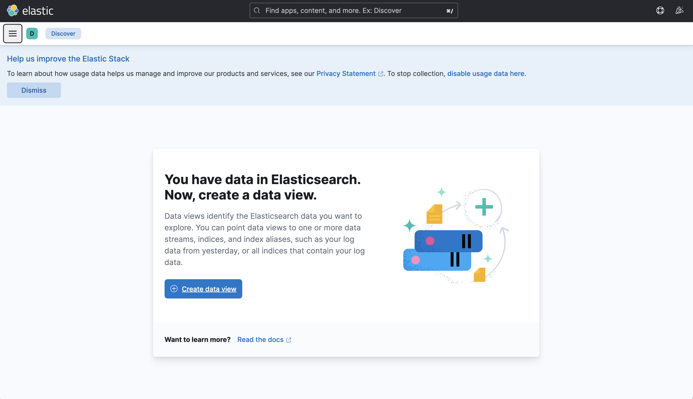

# Logging to ElasticSearch (or any other destination)

This guide shows how to configure a Platformatic application to
deliver logs to [ElasticSearch](https://www.elastic.co/elasticsearch/)
or via any other supported [transports](https://getpino.io/#/docs/transports).
The logs will then be visualized via [Kibana](https://www.elastic.co/kibana).

## Create a platformatic application

Create a platformatic application using `npx create-platformatic@latest`.

## Setup ElasticSearch and Kibana

If you are logging to ElasticSearch and visualizing with Kibana,
you might want to set it up using [Docker Compose](https://docs.docker.com/compose/)
for local testing.

Write the following as `docker-compose.yml`:

```yaml
---
version: '3.8'
services:
  elasticsearch:
    image: docker.elastic.co/elasticsearch/elasticsearch:8.3.3
    environment:
      - discovery.type=single-node
      # Elasticsearch 8.x has HTTPS and auth on by default. This option is
      # needed to use HTTP and no auth (as used in the tests).
      - xpack.security.enabled=false
    container_name: elasticsearch
    ports: ['9200:9200']

  kibana:
    image: docker.elastic.co/kibana/kibana:8.3.3
    container_name: kibana
    ports: ['5601:5601']
    depends_on: ['elasticsearch']
```

Then, start ElasticSearch and Kibana with `docker-compose -f docker-compose.yml up`.

## Install transport

```bash
npm i pino-elasticsearch
```

## Configure Logger Transport

Configuring your platformatic application to log to ElasticSearch is straighforward,
you just have to configure it like the following:

```json
{
  ...
  "server": {
    "hostname": "{PLT_SERVER_HOSTNAME}",
    "port": "{PORT}",
    "logger": {
      "level": "{PLT_SERVER_LOGGER_LEVEL}",
      "transport": {
        "targets": [{
          "target": "pino-elasticsearch",
          "options": {
            "node": "http://127.0.0.1:9200"
          }
        }, {
          "target": "pino-pretty"
        }]
      }
    }
  }
}
```

This snippet can be applied either to the `platformatic.runtime.json` config
for Platformatic Runtime applications, or as part of the applicaiton configuration
for any other application.

This setup will allow you to log both to the terminal (TTY)
and to ElasticSearch at the same time.

Start your server with `platformatic start`, and navigate across
its API.

## Configure Kibana

1. Open `http://localhost:5601` in your browser


2. Click on the hamburger menu on top left, and then "Discover"



3. Click on the "Create Data View"


4. Write `pino*` as `name` and select `time` as timestamp field


5. Enjoy your logs
