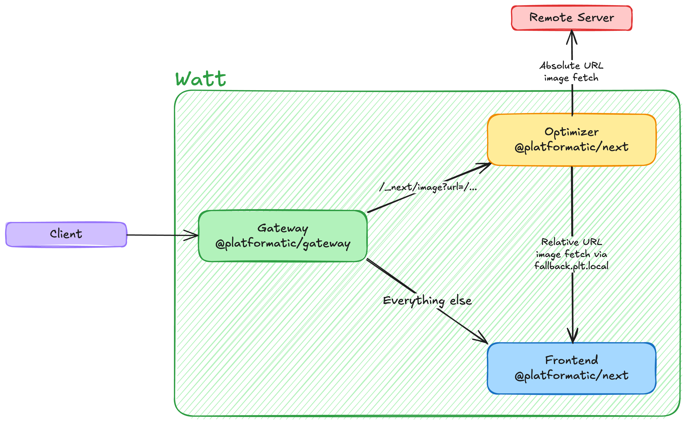

# Run Next.js Image Optimizer as a Dedicated Service

In this guide, you will configure Platformatic Next to run in **Image Optimizer mode** as a standalone service.

Instead of running a full Next.js application in the same process, you expose only the `/_next/image` endpoint and delegate image optimization to a dedicated component.



## Why this architecture

Using a dedicated optimizer service behind Gateway has practical advantages:

- **Scalability**: image transformations are CPU-intensive and can be scaled independently from frontend rendering.
- **Operational isolation**: spikes on image traffic do not starve your frontend workers.
- **Centralized behavior**: width/quality validation, retry policy, timeout, and cache/storage settings are configured once.
- **Flexible storage backends**: in-memory for local dev, filesystem for simple deployments, Redis/Valkey for multi-instance environments.
- **Runtime-native service discovery**: relative image paths are fetched from a sibling application (for example `http://frontend.plt.local`) without hardcoding external URLs.

---

## Prerequisites

Before starting, make sure you have:

- npm available on your machine
- `wattpm` available through `npx wattpm` (or installed globally)

## What you will build

You will create a runtime with three applications:

1. **gateway** (entrypoint)
   - runs `@platformatic/gateway`
   - routes only `GET /_next/image` to `optimizer` using `proxy.routes`; everything else goes to `frontend`
2. **frontend**
   - runs your regular Next.js app (pages, APIs, and static assets)
   - serves static files (for example `public/platformatic.png`)
   - provides original assets for relative image URLs
3. **optimizer**
   - runs `@platformatic/next` in Image Optimizer mode
   - exposes only `/_next/image`

At the end, you will test:

- optimization of a relative URL (`/platformatic.png`) resolved through local service discovery
- optimization of an absolute URL (`https://...`) fetched directly

---

## 1) Create a runtime with three applications

Create this structure:

```text
my-runtime/
  watt.json
  web/
    gateway/
      watt.json
      package.json
    frontend/
      watt.json
      package.json
      next.config.js
      public/
        platformatic.png
      src/
        app/
          page.jsx
    optimizer/
      watt.json
      package.json
      next.config.js
```

In this setup:

- `gateway` is the external-facing entrypoint
- `frontend` is where relative assets are fetched from
- `optimizer` handles only `/_next/image`

## 2) Configure the runtime

Create `my-runtime/watt.json`:

```json
{
  "$schema": "https://schemas.platformatic.dev/@platformatic/runtime/3.0.0.json",
  "entrypoint": "gateway",
  "applications": [
    {
      "id": "gateway",
      "path": "./web/gateway"
    },
    {
      "id": "frontend",
      "path": "./web/frontend"
    },
    {
      "id": "optimizer",
      "path": "./web/optimizer"
    }
  ]
}
```

### Why this configuration?

- `entrypoint: "gateway"` means incoming runtime traffic goes first to Gateway.
- Gateway routes by method + path (via `proxy.methods` and `proxy.routes`).
- `frontend` and `optimizer` are in the same runtime, so service discovery works automatically.
- `frontend` is reachable from `optimizer` as `http://frontend.plt.local`.

## 3) Configure Gateway with route-based proxying

Create `my-runtime/web/gateway/watt.json`:

```json
{
  "$schema": "https://schemas.platformatic.dev/@platformatic/gateway/3.0.0.json",
  "gateway": {
    "applications": [
      {
        "id": "frontend",
        "proxy": {
          "prefix": "/",
          "routes": ["/*"]
        }
      },
      {
        "id": "optimizer",
        "proxy": {
          "prefix": "/",
          "routes": ["/_next/image"],
          "methods": ["GET"]
        }
      }
    ]
  }
}
```

### Why use `proxy.routes`?

- `/_next/image` requests are routed to `optimizer` only.
- all other requests are routed to `frontend`.
- this keeps image optimization isolated while the frontend app serves regular pages/assets.

## 4) Configure the optimizer application

Create `my-runtime/web/optimizer/watt.json`:

```json
{
  "$schema": "https://schemas.platformatic.dev/@platformatic/next/3.38.1.json",
  "next": {
    "imageOptimizer": {
      "enabled": true,
      "fallback": "frontend",
      "timeout": 30000,
      "maxAttempts": 3
    }
  }
}
```

### What these options mean

- `enabled: true` enables dedicated Image Optimizer mode.
- `fallback: "frontend"` resolves relative URLs against `http://frontend.plt.local`.
- `timeout: 30000` sets a 30-second timeout budget for fetch/optimization jobs.
- `maxAttempts: 3` retries failed jobs up to 3 times.

## 5) Configure the frontend application

Create `my-runtime/web/frontend/watt.json`:

```json
{
  "$schema": "https://schemas.platformatic.dev/@platformatic/next/3.38.1.json"
}
```

Then place a test image here:

- `my-runtime/web/frontend/public/platformatic.png`

This makes `/platformatic.png` available from the frontend application.

### Keep frontend as a standard Next.js app

`frontend` should be your full frontend application, not a stripped-down placeholder. Keep the same pages, route handlers, API routes, middleware, and static assets you would normally ship.

Minimal example (`my-runtime/web/frontend/src/app/page.jsx`):

```jsx
import Image from 'next/image'

export default function Page () {
  return (
    <main>
      <h1>Frontend app served by frontend</h1>
      <Image src="/platformatic.png" alt="Platformatic logo" width={512} height={512} />
    </main>
  )
}
```

The optimizer service remains dedicated to `/_next/image`; all other application behavior continues to live in `frontend`.

## 6) Install dependencies

Define dependencies in each application folder.

### 6.1) Gateway `package.json`

Create or update `my-runtime/web/gateway/package.json`:

```json
{
  "name": "gateway",
  "private": true,
  "dependencies": {
    "@platformatic/gateway": "^3.0.0"
  }
}
```

### 6.2) Frontend `package.json`

Create or update `my-runtime/web/frontend/package.json`:

```json
{
  "name": "frontend",
  "private": true,
  "dependencies": {
    "@platformatic/next": "^3.38.1",
    "next": "^15.0.0",
    "react": "^19.0.0",
    "react-dom": "^19.0.0"
  }
}
```

### 6.3) Optimizer `package.json`

Create or update `my-runtime/web/optimizer/package.json`:

```json
{
  "name": "optimizer",
  "private": true,
  "dependencies": {
    "@platformatic/next": "^3.38.1",
    "next": "^15.0.0",
    "react": "^19.0.0",
    "react-dom": "^19.0.0"
  }
}
```

### 6.4) Install in one pass (recommended)

From `my-runtime/`, run:

```bash
npx wattpm-utils install
```

## 7) Start the runtime

From `my-runtime/`, run:

```bash
npx wattpm start
```

By default, Runtime listens on `http://127.0.0.1:3042` unless you configure a different host/port.

## 8) Test the optimizer endpoint

### Test A: optimize an internal image (relative URL)

```bash
curl -i "http://127.0.0.1:3042/_next/image?url=/platformatic.png&w=1024&q=75"
```

Request flow:

1. Gateway receives the request.
2. `proxy.routes` matches `/_next/image` and forwards to `optimizer`.
3. `optimizer` detects `url=/platformatic.png` is relative.
4. Source is resolved to `http://frontend.plt.local/platformatic.png`.
5. The image is fetched and optimized.
6. Gateway returns the optimized bytes.

### Test B: optimize an external image (absolute URL)

```bash
curl -i "http://127.0.0.1:3042/_next/image?url=https%3A%2F%2Fexample.com%2Fimage.png&w=1024&q=75"
```

This request is forwarded by Gateway to `optimizer`, then fetched directly from the absolute URL.

### Expected result

For valid requests, you should receive:

- `HTTP/1.1 200 OK`
- an image `content-type` (for example `image/png`)

---

## 9) Production topology: Gateway in front of your main Next.js app + optimizer

A common production setup is:

- one **frontend** Next.js application for pages and APIs
- one dedicated **optimizer** application
- one **gateway** entrypoint routing traffic between them

Example Gateway routing:

- `GET /_next/image` -> `optimizer`
- `/*` -> `frontend`

`web/gateway/watt.json`:

```json
{
  "$schema": "https://schemas.platformatic.dev/@platformatic/gateway/3.0.0.json",
  "gateway": {
    "applications": [
      {
        "id": "frontend",
        "proxy": {
          "prefix": "/",
          "routes": ["/*"]
        }
      },
      {
        "id": "optimizer",
        "proxy": {
          "prefix": "/",
          "routes": ["/_next/image"],
          "methods": ["GET"]
        }
      }
    ]
  }
}
```

`web/optimizer/watt.json`:

```json
{
  "$schema": "https://schemas.platformatic.dev/@platformatic/next/3.38.1.json",
  "next": {
    "imageOptimizer": {
      "enabled": true,
      "fallback": "frontend"
    }
  }
}
```

In this model, relative image URLs are fetched from `frontend.plt.local`, while optimization workloads are isolated in the dedicated optimizer application.

---

## 10) Kubernetes ingress example (NGINX Ingress Controller)

If you expose `frontend` and `optimizer` as separate Kubernetes Services, you can route image requests at the ingress layer:

- `/_next/image` -> `optimizer` Service
- all other paths -> `frontend` Service

Example `Ingress` resource:

```yaml
apiVersion: networking.k8s.io/v1
kind: Ingress
metadata:
  name: next-image-optimizer
  annotations:
    kubernetes.io/ingress.class: nginx
spec:
  rules:
    - host: app.example.com
      http:
        paths:
          - path: /_next/image
            pathType: Exact
            backend:
              service:
                name: optimizer
                port:
                  number: 3044
          - path: /
            pathType: Prefix
            backend:
              service:
                name: frontend
                port:
                  number: 3043
```

Notes:

- `pathType: Exact` on `/_next/image` prevents broad prefix matching from capturing the route.
- Service names/ports must match your Kubernetes `Service` definitions.
- If you expose only the Platformatic Runtime `gateway` service externally, keep ingress pointing to `gateway` and let `proxy.routes` handle `/_next/image` internally.

---

## Storage options

Image optimization jobs run through a queue. You can control queue persistence with `next.imageOptimizer.storage`.

If you do not set `storage`, the default is in-memory storage.

### 1) Memory storage (default)

Best for local development or simple deployments where persistence across restarts is not required.

```json
{
  "next": {
    "imageOptimizer": {
      "enabled": true,
      "fallback": "frontend",
      "storage": {
        "type": "memory"
      }
    }
  }
}
```

### 2) Filesystem storage

Useful when you want persistence on local disk (single node/container with writable volume).

```json
{
  "next": {
    "imageOptimizer": {
      "enabled": true,
      "fallback": "frontend",
      "storage": {
        "type": "filesystem",
        "path": "./.next/cache/image-optimizer"
      }
    }
  }
}
```

### 3) Redis/Valkey storage

Recommended for distributed/multi-instance deployments.

```json
{
  "next": {
    "imageOptimizer": {
      "enabled": true,
      "fallback": "frontend",
      "storage": {
        "type": "valkey",
        "url": "redis://localhost:6379",
        "prefix": "next-image:",
        "db": 0
      }
    }
  }
}
```

You can also use `"type": "redis"`.

## Next steps

- Put this optimizer pattern in front of one or more frontend applications.
- Configure Redis/Valkey storage for production.
- Tune `timeout` and `maxAttempts` based on traffic profile and upstream reliability.

For full option details, see the [Next.js Image Optimizer reference](../reference/next/image-optimizer.md).
