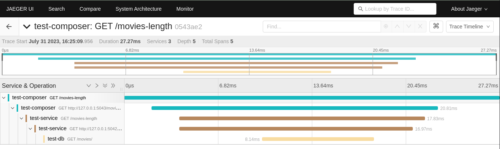

# Telemetry with Jaeger

## Introduction
Platformatic supports Open Telemetry integration. This allows you to send telemetry data to one of the OTLP compatible servers ([see here](https://opentelemetry.io/ecosystem/vendors/)) or to a Zipkin server. Let's show this with [Jaeger](https://www.jaegertracing.io/).

## Jaeger setup
The quickest way is to use docker: 

```bash
docker run -d --name jaeger \
  -e COLLECTOR_OTLP_ENABLED=true \
  -p 16686:16686 \
  -p 4317:4317 \
  -p 4318:4318 \
  jaegertracing/all-in-one:latest
```
Check that the server is running by opening [http://localhost:16686/](http://localhost:16686/) in your browser.

## Platformatic setup

Will test this with a Platformatic Composer that proxy requests to a Platformatic Service, which in turn invokes a Platformatic DB Service.
In this way we show that the telemetry is propagated from the Composer throughout the services and the collected correctly.
Let's setup all these components:

### Platformatic DB Service

Create a DB service using `npx wattpm create`:

```bash
mkdir test-db
cd test-db
npx wattpm create
```

To make it simple, use `sqlite` and create/apply the default migrations. This DB Service is exposed on port `5042`:

```bash 
Hello User, welcome to Watt 2.64.0!
? Where would you like to create your project? .
? Which kind of service do you want to create? @platformatic/db
? What is the name of the service? main
? What is the connection string? sqlite://./db.sqlite
? Do you want to create default migrations? yes
? Do you want to create another service? no
? Do you want to use TypeScript? no
? What port do you want to use? 5042
[12:11:45.131] INFO (504): /work/package.json written!
[12:11:45.135] INFO (504): /work/watt.json written!
[12:11:45.137] INFO (504): /work/.env written!
[12:11:45.138] INFO (504): /work/.env.sample written!
[12:11:45.138] INFO (504): /work/.gitignore written!
[12:11:45.139] INFO (504): /work/README.md written!
[12:11:45.140] INFO (504): /work/web/main/package.json written!
[12:11:45.141] INFO (504): /work/web/main/platformatic.json written!
[12:11:45.142] INFO (504): /work/web/main/plugins/example.js written!
[12:11:45.144] INFO (504): /work/web/main/routes/root.js written!
[12:11:45.144] INFO (504): /work/web/main/test/helper.js written!
[12:11:45.145] INFO (504): /work/web/main/test/plugins/example.test.js written!
[12:11:45.146] INFO (504): /work/web/main/test/routes/root.test.js written!
[12:11:45.146] INFO (504): /work/web/main/.gitignore written!
[12:11:45.147] INFO (504): /work/web/main/migrations/001.do.sql written!
[12:11:45.148] INFO (504): /work/web/main/migrations/001.undo.sql written!
[12:11:45.148] INFO (504): /work/web/main/README.md written!
[12:11:45.149] INFO (504): /work/web/main/test/routes/movies.test.js written!
[12:11:45.149] INFO (504): /work/web/main/plt-env.d.ts written!
? Do you want to init the git repository? no
[12:11:46.798] INFO (504): Installing dependencies for the application using npm ...
[12:11:51.343] INFO (504): Installing dependencies for the service db using npm ...
[12:11:52.165] INFO (504): Project created successfully, executing post-install actions...
[12:11:52.166] INFO (504): You are all set! Run `npm start` to start your project.
```

Open the `web/main/platformatic.json` file and add the telemetry configuration:

```json
  "telemetry": {
    "serviceName": "test-db",
    "exporter": {
      "type": "otlp",
      "options": {
        "url": "http://localhost:4318/v1/traces"
      }
    }
  }
```

Finally, start the application:

```bash
npm run start
```

### Platformatic Service

Create at the same level of `test-db` another folder for Service and cd into it:

```bash
mkdir test-service
cd test-service
npx wattpm create
```

Then create a `service` on the `5043` port in the folder using `npx wattpm create`:

```bash
Hello User, welcome to Watt 2.64.0!
? Where would you like to create your project? .
? Which kind of service do you want to create? @platformatic/service
? What is the name of the service? main
? Do you want to create another service? no
? Do you want to use TypeScript? no
? What port do you want to use? 5043
[12:14:16.552] INFO (1819): /work/test-service/package.json written!
[12:14:16.557] INFO (1819): /work/test-service/watt.json written!
[12:14:16.558] INFO (1819): /work/test-service/.env written!
[12:14:16.559] INFO (1819): /work/test-service/.env.sample written!
[12:14:16.560] INFO (1819): /work/test-service/.gitignore written!
[12:14:16.560] INFO (1819): /work/test-service/README.md written!
[12:14:16.562] INFO (1819): /work/test-service/web/main/package.json written!
[12:14:16.563] INFO (1819): /work/test-service/web/main/platformatic.json written!
[12:14:16.564] INFO (1819): /work/test-service/web/main/plugins/example.js written!
[12:14:16.566] INFO (1819): /work/test-service/web/main/routes/root.js written!
[12:14:16.566] INFO (1819): /work/test-service/web/main/test/helper.js written!
[12:14:16.567] INFO (1819): /work/test-service/web/main/test/plugins/example.test.js written!
[12:14:16.567] INFO (1819): /work/test-service/web/main/test/routes/root.test.js written!
[12:14:16.567] INFO (1819): /work/test-service/web/main/.gitignore written!
[12:14:16.568] INFO (1819): /work/test-service/web/main/plt-env.d.ts written!
[12:14:16.568] INFO (1819): /work/test-service/web/main/README.md written!
? Do you want to init the git repository? no
[12:14:17.793] INFO (1819): Installing dependencies for the application using npm ...
[12:14:45.663] INFO (1819): Installing dependencies for the service service using npm ...
[12:14:46.568] INFO (1819): Project created successfully, executing post-install actions...
[12:14:46.568] INFO (1819): You are all set! Run `npm start` to start your project.
```

Open the `web/main/platformatic.json` file and add the following telemetry configuration (it's exactly the same as `DB`, but with a different `serviceName`)

```json
  "telemetry": {
    "serviceName": "test-service",
    "exporter": {
      "type": "otlp",
      "options": {
        "url": "http://localhost:4318/v1/traces"
      }
    }
  }
```
We want this service to invoke the DB service, so we need to add a client for `test-db` to it:

```bash
npx platformatic client http://127.0.0.1:5042 js --name movies
```

Check `platformatic.service.json` to see that the client has been added (`PLT_MOVIES_URL` is defined in `.env`):

```json
    "clients": [
    {
      "schema": "movies/movies.openapi.json",
      "name": "movies",
      "type": "openapi",
      "url": "{PLT_MOVIES_URL}"
    }
  ]
```

Now open `routes/root.js` and add the following:

```javascript
  fastify.get('/movies-length', async (request, reply) => {
    const movies = await request.movies.getMovies()
    return { length: movies.length }
  })
```

This code calls `movies` to get all the movies and returns the length of the array.

Finally, start the service:

```bash
npm run start
```

### Platformatic Composer
Create at the same level of `test-db` and `test-service` another folder for Composer and cd into it:


```bash
mkdir test-composer
cd test-composer
npx wattpm create
```

```bash
Hello User, welcome to Watt 2.64.0!
? Where would you like to create your project? .
? Which kind of service do you want to create? @platformatic/composer
? What is the name of the service? main
? Do you want to create another service? no
? Do you want to use TypeScript? no
? What port do you want to use? 5044
[12:19:25.784] INFO (3205): /work/test-composer/package.json written!
[12:19:25.790] INFO (3205): /work/test-composer/watt.json written!
[12:19:25.791] INFO (3205): /work/test-composer/.env written!
[12:19:25.792] INFO (3205): /work/test-composer/.env.sample written!
[12:19:25.793] INFO (3205): /work/test-composer/.gitignore written!
[12:19:25.793] INFO (3205): /work/test-composer/README.md written!
[12:19:25.794] INFO (3205): /work/test-composer/web/main/package.json written!
[12:19:25.795] INFO (3205): /work/test-composer/web/main/platformatic.json written!
[12:19:25.796] INFO (3205): /work/test-composer/web/main/.gitignore written!
[12:19:25.797] INFO (3205): /work/test-composer/web/main/plt-env.d.ts written!
[12:19:25.798] INFO (3205): /work/test-composer/web/main/README.md written!
? Do you want to init the git repository? no
[12:19:26.820] INFO (3205): Installing dependencies for the application using npm ...
[12:19:57.209] INFO (3205): Installing dependencies for the service main using npm ...
[12:19:58.573] INFO (3205): Project created successfully, executing post-install actions...
[12:19:58.573] INFO (3205): You are all set! Run `npm start` to start your project.
```

Open `web/main/platformatic.json` and change it to the following:

```json
{
  "$schema": "https://schemas.platformatic.dev/@platformatic/composer/2.64.0.json",
  "composer": {
    "services": [
      {
        "id": "example",
        "origin": "http://127.0.0.1:5043",
        "openapi": {
          "url": "/documentation/json"
        }
      }
    ],
    "refreshTimeout": 3000
  },
  "telemetry": {
    "serviceName": "test-composer",
    "exporter": {
      "type": "otlp",
      "options": {
        "url": "http://localhost:4318/v1/traces"
      }
    }
  },
  "watch": true
}
```

Note that we just added `test-service` as `origin` of the proxied service and added the usual `telemetry` configuration, with a different `serviceName`.

Finally, start the composer:

```bash
npm run start
```

## Run the Test

Check that the composer is exposing `movies-length` opening: http://127.0.0.1:5044/documentation/

You should see:


To add some data, we can POST directly to the DB service (port `5042`):

```bash 
curl -X POST -H "Content-Type: application/json" -d '{"title":"The Matrix"}' http://127.0.0.1:5042/movies 
curl -X POST -H "Content-Type: application/json" -d '{"title":"The Matrix Reloaded"}'  http://127.0.0.1:5042/movies 
```
Now, let's check that the composer (port 5044) is working:

```bash
curl http://127.0.0.1:5044/movies-length
```
If the composer is working correctly, you should see:

```json
{"length":2}
```
However, the main interest of this example is to show how to use the Platformatic Telemetry, so let's check it. 
Open the Jaeger UI at [http://localhost:16686/](http://localhost:16686/) and you should see something like this:


Select on the left the `test-composer` service and the `GET /movies-length` operation, click on "Find traces" and you should see something like this:


You can then click on the trace and see the details:



Note that every time a request is received or client call is done, a new span is started. So we have:
- One span for the request received by the `test-composer` 
- One span for the client call to `test-service`
- One span for the request received by `test-service`
- One span for the client call to `test-db`
- One span for the request received by `test-db`

All these spans are linked together, so you can see the whole trace.

## What if you want to use Zipkin?
Starting from this example, it's also possible to run the same test using Zipkin. To do so, you need to start the Zipkin server:

```bash
docker run -d -p 9411:9411 openzipkin/zipkin
```

Then, you need to change the `telemetry` configuration in all the  `platformatic.*.json` to the following (only the `exporter` object is different`)

```json
  "telemetry": {
    (...)
    "exporter": {
      "type": "zipkin",
      "options": {
        "url": "http://127.0.0.1:9411/api/v2/spans"
      }
    }
  }
```
The zipkin ui is available at [http://localhost:9411/](http://localhost:9411/)
