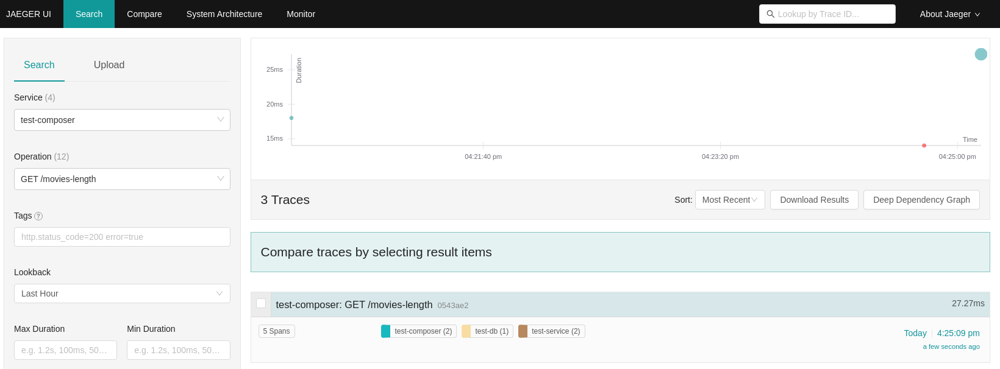

# Telemetry with Jaeger

## Introduction
Platformatic supports Open Telemetry integration. This allows you to send telemetry data to one of the OTLP compatible servers ([see here](https://opentelemetry.io/ecosystem/vendors/)) or to a Zipkin server. Let's show this with [Jaeger](https://www.jaegertracing.io/).

## Jaeger setup
The quickest way is to use docker: 

```bash
docker run -d --name jaeger \
  -e COLLECTOR_OTLP_ENABLED=true \
  -p 16686:16686 \
  -p 4317:4317 \
  -p 4318:4318 \
  jaegertracing/all-in-one:latest
```
Check that the server is running by opening [http://localhost:16686/](http://localhost:16686/) in your browser.

## Platformatic setup

Will test this with a Platformatic Composer that proxy requests to a Platformatic Service, which in turn invokes a Platformatic DB Service.
In this way we show that the telemetry is propagated from the Composer throughout the services and the collected correctly.
Let's setup all this components:

### Platformatic DB Service
Create a folder for DB and cd into it:
```bash
mkdir test-db
cd test-db
```
Then create a `db` in the folder using `npx create-platformatic@latest`:

```bash
npx create-platformatic@latest
```
To make it simple, use `sqlite` and create/apply the default migrations. This DB Service is exposed on port `5042`:

```bash 

➜ npx create-platformatic@latest

 Hello user, welcome to Platformatic 0.32.0!
 Let's start by creating a new project.
? Which kind of project do you want to create? DB
? Where would you like to create your project? .
? What database do you want to use? SQLite
? Do you want to use the connection string "sqlite://./db.sqlite"? Confirm
? Do you want to create default migrations? yes
? Do you want to create a plugin? no
? Do you want to use TypeScript? no
? What port do you want to use? 5042
[15:40:46] INFO: Configuration file platformatic.db.json successfully created.
[15:40:46] INFO: Environment file .env successfully created.
[15:40:46] INFO: Migrations folder migrations successfully created.
[15:40:46] INFO: Migration file 001.do.sql successfully created.
[15:40:46] INFO: Migration file 001.undo.sql successfully created.
[15:40:46] INFO: Plugin file created at plugin.js
? Do you want to run npm install? no
? Do you want to apply migrations? yes
✔ ...done!
? Do you want to generate types? no
? Do you want to create the github action to deploy this application to Platformatic Cloud dynamic workspace? no
? Do you want to create the github action to deploy this application to Platformatic Cloud static workspace? no
 
All done! Please open the project directory and check the README.
Will test this in one example with a Platformatic Composer that proxy requests to a Platformatic Service, which in turn invokes a Platformatic DB.

```
Open the `platformatic.db.json` file and add the telementry configuration:

```json
  "telemetry": {
    "serviceName": "test-db",
    "exporter": {
      "type": "otlp",
      "options": {
        "url": "http://localhost:4318/v1/traces"
      }
    }
  }
```
Finally, start the DB service:

```bash
npx platformatic db start
```
### Platformatic Service
Create at the same level of `test-db` another folder for Service and cd into it:

```bash
mkdir test-service
cd test-service
```

Then create a `service` on the `5043` port in the folder using `npx create-platformatic@latest`:

```bash
➜ npx create-platformatic@latest

 Hello user, welcome to Platformatic 0.32.0!
 Let's start by creating a new project.
? Which kind of project do you want to create? Service
? Where would you like to create your project? .
? Do you want to run npm install? no
? Do you want to use TypeScript? no
? What port do you want to use? 5043
[15:55:35] INFO: Configuration file platformatic.service.json successfully created.
[15:55:35] INFO: Environment file .env successfully created.
[15:55:35] INFO: Plugins folder "plugins" successfully created.
[15:55:35] INFO: Routes folder "routes" successfully created.
? Do you want to create the github action to deploy this application to Platformatic Cloud dynamic workspace? no
? Do you want to create the github action to deploy this application to Platformatic Cloud static workspace? no

```
Open the `platformatic.service.json` file and add the following telemetry configuration (it's exactly the same as `DB`, but with a different `serviceName`)

```json
  "telemetry": {
    "serviceName": "test-service",
    "exporter": {
      "type": "otlp",
      "options": {
        "url": "http://localhost:4318/v1/traces"
      }
    }
  }
```
We want this service to invoke the DB service, so we need to add a client for `test-db` to it:

```bash
npx platformatic client http://127.0.0.1:5042 js --name movies
```

Check `platformatic.service.json` to see that the client has been added (`PLT_MOVIES_URL` is defined in `.env`):

```json
    "clients": [
    {
      "schema": "movies/movies.openapi.json",
      "name": "movies",
      "type": "openapi",
      "url": "{PLT_MOVIES_URL}"
    }
  ]
```

Now open `routes/root.js` and add the following:

```javascript
  fastify.get('/movies-length', async (request, reply) => {
    const movies = await request.movies.getMovies()
    return { length: movies.length }
  })
```

This code calls `movies` to get all the movies and returns the length of the array.

Finally, start the service:

```bash
npx platformatic service start
```
### Platformatic Composer
Create at the same level of `test-db` and `test-service` another folder for Composer and cd into it:


```bash
mkdir test-composer
cd test-composer
```
Then create a `composer` on the `5044` port in the folder using `npx create-platformatic@latest`:

```bash
➜ npx create-platformatic@latest

 Hello marcopiraccini, welcome to Platformatic 0.32.0!
 Let's start by creating a new project.
? Which kind of project do you want to create? Composer
? Where would you like to create your project? .
? What port do you want to use? 5044
? Do you want to run npm install? no
[16:05:28] INFO: Configuration file platformatic.composer.json successfully created.
[16:05:28] INFO: Environment file .env successfully created.
? Do you want to create the github action to deploy this application to Platformatic Cloud dynamic workspace? no
? Do you want to create the github action to deploy this application to Platformatic Cloud static workspace? no
 
All done! Please open the project directory and check the README.
```

Open `platformatic.composer.js` and change it to the following:

```json
{
  "$schema": "https://platformatic.dev/schemas/v0.32.0/composer",
  "server": {
    "hostname": "{PLT_SERVER_HOSTNAME}",
    "port": "{PORT}",
    "logger": {
      "level": "{PLT_SERVER_LOGGER_LEVEL}"
    }
  },
  "composer": {
    "services": [
      {
        "id": "example",
        "origin": "http://127.0.0.1:5043",
        "openapi": {
          "url": "/documentation/json"
        }
      }
    ],
    "refreshTimeout": 3000
  },
  "telemetry": {
    "serviceName": "test-composer",
    "exporter": {
      "type": "otlp",
      "options": {
        "url": "http://localhost:4318/v1/traces"
      }
    }
  },
  "watch": true
}
```

Note that we just added `test-service` as `origin` of the proxed service and added the usual `telementry` configuration, with a different `serviceName`.

Finally, start the composer:

```bash
npx platformatic composer start
```

## Run the Test
Check that the composer is exposing `movies-length` opening: http://127.0.0.1:5044/documentation/

You should see:


To add some data, we can POST directly to the DB service (port `5042`):

```bash 
curl -X POST -H "Content-Type: application/json" -d '{"title":"The Matrix"}' http://127.0.0.1:5042/movies 
curl -X POST -H "Content-Type: application/json" -d '{"title":"The Matrix Reloaded"}'  http://127.0.0.1:5042/movies 
```
Now, let's check that the composer (port 5044) is working:

```bash
curl http://127.0.0.1:5044/movies-length
```
If the composer is working correctly, you should see:

```json
{"length":2}
```
However, the main interest of this example is to show how to use the Platformatic Telemetry, so let's check it. 
Open the Jaeger UI at [http://localhost:16686/](http://localhost:16686/) and you should see something like this:


Select on the left the `test-composer` service and the `GET /movies-length` operation, click on "Find traces" and you should see something like this:



You can then click on the trace and see the details:


Note that everytime a request is received or client call is done, a new span is started. So we have:
- One span for the request received by the `test-composer` 
- One span for the client call to `test-service`
- One span for the request received by `test-service`
- One span for the client call to `test-db`
- One span for the request received by `test-db`

All these spans are linked together, so you can see the whole trace.

## What if you want to use Zipkin?
Starting from this example, it's also possible to run the same test using Zipkin. To do so, you need to start the Zipkin server:

```bash
docker run -d -p 9411:9411 openzipkin/zipkin
```

Then, you need to change the `telemetry` configuration in all the  `platformatic.*.json` to the following (only the `exporter` object is different`)

```json
  "telemetry": {
    (...)
    "exporter": {
      "type": "zipkin",
      "options": {
        "url": "http://127.0.0.1:9411/api/v2/spans"
      }
    }
  }
```
The zipkin ui is available at [http://localhost:9411/](http://localhost:9411/)
