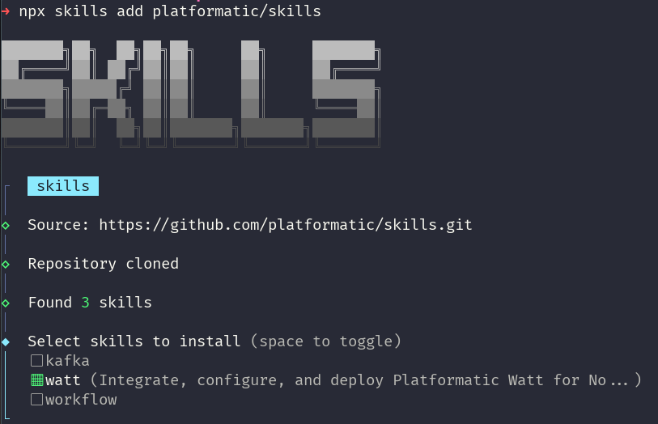

# Use Watt with AI Coding Agents

## Problem

You want an AI coding agent (Claude Code, Cursor, GitHub Copilot, Gemini CLI, and others) to set up and run Platformatic Watt for you, instead of writing `watt.json` and wiring up dependencies and deployment manifests by hand. You need the agent to:

- Detect your framework and generate a correct `watt.json`
- Install the right `wattpm` and `@platformatic/*` packages
- Produce Docker, Kubernetes, and cloud deployment configuration
- Guide you through `wattpm` CLI commands, observability, scheduling, and profiling

**When to use this solution:**

- You are starting a new Watt project or porting an existing application
- You already use an AI coding agent and want it to follow Watt best practices
- You want consistent, repeatable Watt setup across projects and teammates

## Solution

Platformatic publishes an official Agent Skill for Watt. A skill is a set of Markdown instructions that a skills-compatible agent reads and follows. The Watt skill tells your agent how to set up, configure, and deploy Watt, so you do not have to spell out each step.

The skill follows the [Agent Skills open standard](https://agentskills.io/), so it works with any skills-compatible agent. Loaded into Claude Code, it also adds slash commands.

The skill is maintained in the [`platformatic/skills`](https://github.com/platformatic/skills) repository.

### Install the skill

For any skills-compatible agent:

```bash
npx skills add platformatic/skills
```

The installer clones the repository and lets you pick which skills to install. Select `watt` (and optionally `kafka` and `workflow`):



Alternatively, clone the repository and point your agent at the `skills/` directory:

```bash
git clone https://github.com/platformatic/skills.git
```

For Claude Code, load it as a plugin to enable slash commands:

```bash
claude --plugin-dir /path/to/skills
```

### Use the skill

Once the skill is installed, describe what you want in plain language. The agent matches the request against the skill and runs the matching workflow. For example:

- "Add Watt to this Next.js project"
- "Generate a Dockerfile for my Watt app"
- "Deploy this to Kubernetes"
- "Create a multi-service enterprise setup"
- "Capture a CPU profile for my Watt app with pprof"

### Claude Code slash commands

When the skill is loaded as a Claude Code plugin, it exposes argument-based slash commands. These are specific to Claude Code and are not part of the Agent Skills standard:

```
/watt                  # auto-detect the framework and integrate Watt
/watt init nextjs      # integrate with a framework hint
/watt deploy docker    # generate Docker configuration
/watt deploy k8s       # generate Kubernetes manifests
/watt enterprise       # multi-service setup
/watt migrate          # migrate an existing application
/watt cli              # wattpm CLI reference
/watt status           # check Watt configuration health
```

## What the skill can do

| Capability | Description |
|------------|-------------|
| Framework detection | Identifies Next.js, Nuxt, React Router, TanStack Start, Vite, Remix, Astro, NestJS, Express, Fastify, Koa, WordPress, Laravel, and PHP |
| Configuration generation | Creates a `watt.json` tuned to the detected framework |
| Dependency installation | Installs `wattpm` and the matching `@platformatic/*` package |
| Deployment automation | Generates Docker, Kubernetes, and cloud (Fly.io, Railway, Render) configuration |
| CLI guidance | Explains `wattpm` commands such as `create`, `inject`, `logs`, `ps`, and `pprof` |
| Observability | Sets up logging (Pino), tracing (OpenTelemetry), and metrics (Prometheus) |
| Scheduled jobs | Configures cron-based tasks with retry support |
| Performance profiling | Captures CPU profiles and heap snapshots, and generates flamegraphs |

## Supported frameworks

| Framework | Package | Detection |
|-----------|---------|-----------|
| Next.js | `@platformatic/next` | `next.config.{js,ts,mjs}` |
| Nuxt | `@platformatic/nuxt` | `nuxt.config.{ts,js,mjs}` |
| React Router | `@platformatic/react-router` | `react-router.config.{ts,js}` |
| TanStack Start | `@platformatic/tanstack` | `@tanstack/react-start` in dependencies |
| Vite | `@platformatic/vite` | `vite.config.{js,ts,mjs}` (fallback for Vite apps) |
| Remix | `@platformatic/remix` | `remix.config.js` |
| Astro | `@platformatic/astro` | `astro.config.{mjs,ts}` |
| Express | `@platformatic/node` | `express` in dependencies |
| Fastify | `@platformatic/node` | `fastify` in dependencies |
| Koa | `@platformatic/node` | `koa` in dependencies |
| NestJS | `@platformatic/node` | `nest-cli.json` or `@nestjs/core` |
| WordPress | `@platformatic/php` | `wp-config.php` |
| Laravel | `@platformatic/php` | `artisan` plus `composer.json` |
| PHP | `@platformatic/php` | `composer.json` plus `public/index.php` |

Several frameworks build on Vite (React Router, TanStack Start, Remix, Astro) and ship a `vite.config.*`. The agent matches the specific framework first and falls back to `@platformatic/vite` only when no more specific signal is present.

## Requirements

- Node.js v22.19.0 or higher
- A skills-compatible agent (Claude Code, Cursor, GitHub Copilot, Gemini CLI, and others)

## Related skills

The `platformatic/skills` repository also ships companion skills:

- **`kafka`** - event-driven microservices with `@platformatic/kafka` and kafka-hooks, including migrations from KafkaJS and node-rdkafka
- **`workflow`** - building applications with the Vercel Workflow SDK against a self-hosted Platformatic Workflow Service via `@platformatic/world`

## See also

- [Watt overview](../reference/wattpm/overview.md)
- [Watt CLI commands](../reference/wattpm/cli-commands.md)
- [`platformatic/skills` repository](https://github.com/platformatic/skills)
- [Agent Skills standard](https://agentskills.io/)
