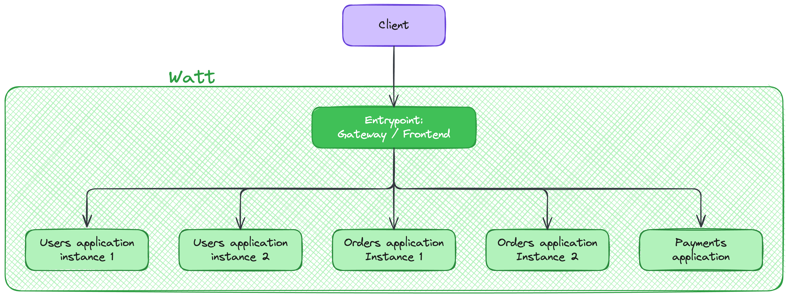
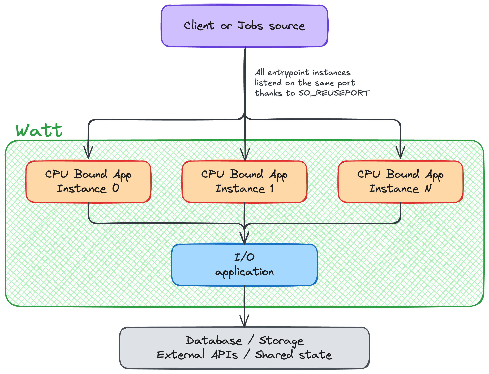
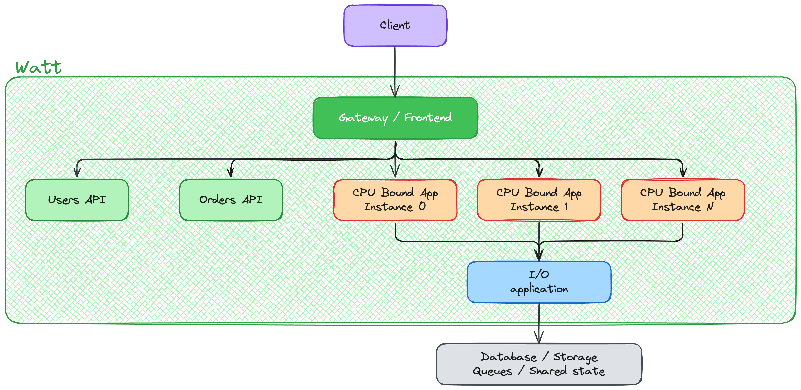

# Watt Architecture Patterns

Watt can run several applications inside one application server. Each application can
have its own responsibility, framework, worker configuration, and operational profile.

This guide explains two common architecture patterns for Watt applications:

- **Pyramid architecture**: one entrypoint fans out to many applications.
- **Funnel architecture**: many identical CPU-bound instances feed one I/O-focused application.

Use these patterns to decide where to place entrypoints, CPU-heavy work, I/O-heavy work,
and service boundaries in your Watt application.

## Choose a Pattern

| Pattern | Shape | Use when |
| --- | --- | --- |
| Pyramid | 1 to N | One public application coordinates many downstream applications |
| Funnel | N to 1 | Many identical CPU-bound instances feed one I/O-focused application |

You can also combine both patterns in the same Watt application. For example, a public
gateway can route normal API requests to domain applications and send expensive jobs to
CPU-bound instances that store results through a shared I/O application.

## Pyramid Architecture

Use the pyramid pattern when one application receives requests and coordinates work
across several downstream applications.

The Watt boundary contains the entrypoint and all downstream applications. Clients sit
outside Watt and reach the application through the entrypoint.

In this pattern, the top application is the public boundary. It can be a frontend, an
API gateway, a composer, or another HTTP application. The downstream applications own
separate domains or tasks.

### When to Use Pyramid Architecture

Use pyramid architecture when:

- You need one public API or frontend over multiple internal applications.
- You are building an API gateway or API composition layer.
- You want a modular monolith with clear domain boundaries.
- You want to split a large backend into smaller applications without operating separate services.
- Your main scaling concern is request throughput across multiple downstream applications.

This pattern fits applications where a request often starts at one public boundary and
then needs data or behavior from multiple domains.

### How to Scale It

Scale the downstream applications according to their workload. A high-traffic domain can
use more workers than a low-traffic domain while staying inside the same Watt application.

The entrypoint can also run multiple workers, but keep its responsibilities focused on
routing, authentication, composition, and request coordination. Avoid putting all domain
logic in the entrypoint, or it becomes the new monolith.

### Tradeoffs

Pyramid architecture gives you one clear public boundary and simple deployment, but the
entrypoint can become a bottleneck if it does too much work. Cross-application request
flows also need good tracing, because one client request can touch several applications.

Use metrics to identify overloaded applications and tracing to understand fan-out paths.

## Funnel Architecture

Use the funnel pattern when many identical CPU-bound instances perform expensive work and
converge on one I/O-focused application. They are separate instances of the same Watt
application exposed with `SO_REUSEPORT`.

The Watt boundary contains the identical CPU instances and the I/O application. Job or request
sources sit outside Watt and reach one of the CPU instances through `SO_REUSEPORT`.

In this pattern, the wide side handles CPU load. The narrow side handles I/O load. The
I/O application centralizes access to databases, object storage, queues, shared state,
external APIs, or other resources that need pooling, rate limiting, retries, or
transactional control.

### When to Use Funnel Architecture

Use funnel architecture when:

- You process images, audio, video, or other media.
- You generate PDFs, reports, archives, or exports.
- You transform, parse, validate, enrich, or index large payloads.
- You wrap AI inference, embedding generation, or other compute-heavy work.
- You need many identical instances for CPU work but want coordinated database, storage, shared state,
  or API access.

This pattern fits systems where CPU saturation in the entrypoint is the main bottleneck
and cannot be shifted, while I/O and shared state access need to stay controlled and
consistent.

### How to Scale It

Scale the CPU-bound instances first. Give them worker limits that match the CPU budget
of the container or host. Keep the I/O application smaller and focused on resource access,
backpressure, and consistency.

If the I/O application becomes saturated, increase its workers carefully and verify that
the backing database, storage service, shared state, queue, or external API can handle
the extra load.

### Tradeoffs

Funnel architecture isolates expensive computation, but it needs clear backpressure. CPU
workers should be idempotent where possible, because retries are common in processing
pipelines.

The I/O application should not absorb CPU-heavy work. If it does, it becomes both the CPU
and I/O bottleneck.

Use profiling to find CPU hot spots and metrics to verify that the I/O application is not
overloaded.

## Combine Both Patterns

Many production systems use both patterns in the same Watt application.

The Watt boundary contains the public entrypoint, domain applications, CPU instances, and I/O
applications. Clients and external resources stay outside that boundary.

Use a combined architecture when your application has both request/response paths and
CPU-heavy processing paths. For example, an API can handle user requests through domain
applications while background workers process media, generate reports, or enrich data.

Keep the boundaries explicit:

- The gateway or frontend handles public traffic.
- Domain applications handle request/response business logic.
- CPU instances handle expensive computation.
- I/O applications coordinate databases, storage, queues, shared state, and external APIs.

## Operational Guidance

Design each Watt application around one primary load profile.

| Load profile | Typical responsibility | Scaling signal |
| --- | --- | --- |
| Public entrypoint | Routing, auth, composition, SSR | Request rate and latency |
| Domain application | Business logic for one area | Request rate, latency, and error rate |
| CPU-bound instance | Processing, rendering, parsing, transformation | CPU profile and event loop utilization |
| I/O-focused application | Database, storage, queues, shared state, external APIs | Connection usage, latency, and backpressure |

Start with explicit worker limits for the applications that have known bottlenecks. Then
use metrics, tracing, and profiling to tune worker counts.

## Related Guides

- [Build and deploy a modular monolith](./build-modular-monolith.md)
- [Use Watt with multiple repository applications](./use-watt-multiple-repository.md)
- [Dynamic Workers](./dynamic-workers.md)
- [Profiling Applications with Watt](./profiling-with-watt.md)
- [Metrics with Prometheus and Grafana](./metrics.md)
- [Distributed Tracing](./distributed-tracing.md)
