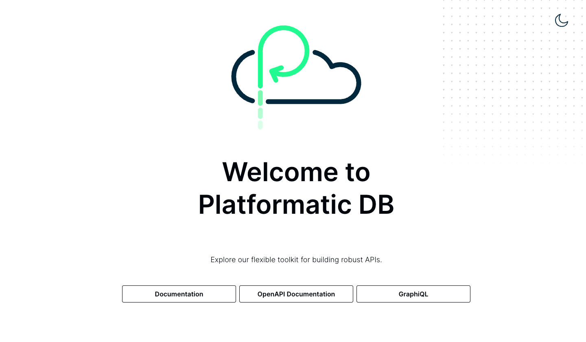
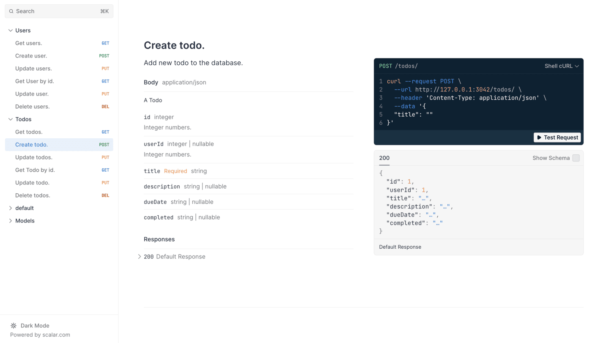
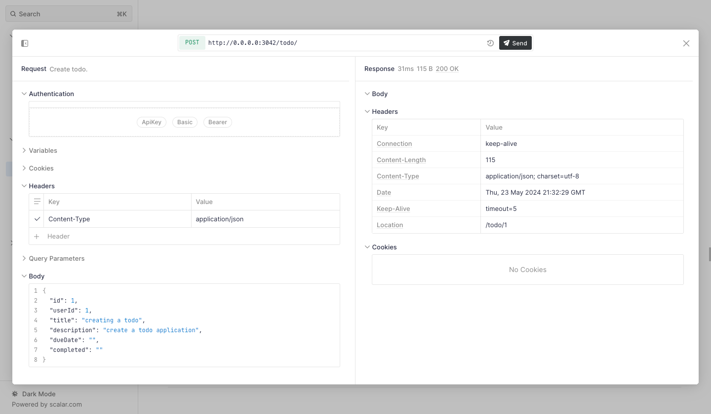

import NewApiProjectInstructions from '../../getting-started/new-api-project-instructions.md';
import SetupWatt from '../../getting-started/setup-watt.md';

# Build a Todo API with Platformatic Watt and DB

## What You'll Learn

In this tutorial, you'll build a complete Todo API from scratch. By the end, you will:

- ✅ Set up a Platformatic Watt application server
- ✅ Add a Platformatic DB service that auto-generates REST and GraphQL APIs
- ✅ Create database migrations for Users and Todos tables
- ✅ Test your API endpoints using the built-in OpenAPI documentation
- ✅ Configure CORS for frontend integration
- ✅ Understand how Platformatic accelerates API development

**Time to complete:** 30 minutes  
**Skill level:** Beginner (basic SQL and JavaScript knowledge helpful)

## Why Platformatic for APIs?

Traditional API development requires writing boilerplate code for database connections, CRUD operations, validation, and documentation. Platformatic DB eliminates this by:

- **Auto-generating APIs** from your database schema (both REST and GraphQL)
- **Providing built-in API documentation** with interactive testing
- **Handling database migrations** automatically
- **Including TypeScript types** generated from your schema

This means you can focus on your business logic instead of infrastructure code.

## Prerequisites

Before starting, ensure you have:

- [Node.js](https://nodejs.org/) (v20.16.0+ or v22.3.0+)
- [npm](https://www.npmjs.com/) (comes with Node.js)
- A code editor (like VS Code)
- Basic familiarity with the command line

You'll install the Platformatic CLI during the tutorial.

## Step 1: Set Up Your Watt Application

Let's start by creating a new Platformatic Watt application. Watt is the Node.js application server that will host our Todo API.

### Why Watt?
Watt provides a production-ready environment for your Node.js applications with built-in logging, monitoring, and service management. Think of it as your application's foundation.

<SetupWatt />

**✓ Success Check:** You should see a `web/` directory created with configuration files inside.

## Step 2: Add a Database Service

Now we'll add a Platformatic DB service to our Watt application. This service will:
- Connect to a SQLite database (by default)
- Auto-generate REST and GraphQL APIs from our schema
- Provide an admin UI for testing

Navigate to your web directory and run:

<NewApiProjectInstructions />

**✓ Success Check:** After running the command, you should see:
- A new `db/` directory inside `web/`
- Configuration files including `platformatic.json`
- An initial migration file in `db/migrations/`

Let's verify everything works:

```bash
npm start
```

Open your browser to `http://localhost:3042/` (or the port shown in your terminal).

**✓ Success Check:** You should see the Platformatic welcome page with links to OpenAPI documentation.

## Step 3: Create Your Database Schema

Now we'll define our database structure using migrations. Migrations are SQL files that describe changes to your database schema.

### Why Migrations?
Migrations provide version control for your database schema. They let you:
- Track schema changes over time
- Safely update production databases
- Share schema changes with your team

Platformatic DB uses SQLite by default (perfect for development). You can see the database configuration in your `.env` file.

### Create the Users Table

Navigate to `web/db/migrations/` and edit the `001.do.sql` file:

```sql
CREATE TABLE IF NOT EXISTS Users (
    id INTEGER PRIMARY KEY,
    username TEXT NOT NULL UNIQUE,
    password TEXT NOT NULL,
    created_at DATETIME DEFAULT CURRENT_TIMESTAMP
);
```

Also edit `web/db/migrations/001.undo.sql` to define how to reverse this migration:

```sql
DROP TABLE Users;
```

### Why Plural Table Names?
Platformatic generates RESTful endpoints based on your table names. Using plural names (Users, not User) creates more intuitive API endpoints like `/users` for listing all users.

### Create the Todos Table

Create a new file `web/db/migrations/002.do.sql`:

```sql
CREATE TABLE IF NOT EXISTS Todos (
    id INTEGER PRIMARY KEY,
    user_id INTEGER,
    title TEXT NOT NULL,
    description TEXT,
    due_date DATE,
    completed BOOLEAN DEFAULT 0,
    FOREIGN KEY (user_id) REFERENCES Users(id)
);
```

Create `web/db/migrations/002.undo.sql`:

```sql
DROP TABLE Todos;
```

### Apply Your Migrations

Now let's create these tables in your database:

```bash
npx platformatic db migrations apply
```

**✓ Success Check:** You should see output confirming the migrations were applied. Also notice:
- A `global.d.ts` file was created with TypeScript types
- A `types/` folder contains detailed type definitions for your tables

### Why Auto-Generated Types?
Platformatic automatically generates TypeScript types from your database schema. This gives you:
- Type safety when writing custom plugins
- IntelliSense in your editor
- Compile-time error checking

## Step 4: Explore Your Auto-Generated API

Start your application:

```bash
npm run dev
```

Open `http://localhost:3042/` in your browser.



**✓ Success Check:** You should see the Platformatic welcome page.

### Discover Your API Endpoints

Click on the **OpenAPI Documentation** link. This opens an interactive API explorer where you can:
- See all auto-generated endpoints
- Test requests directly in the browser
- View request/response schemas



### Test Your API

Let's create your first todo item:

1. Find the `POST /todos` endpoint
2. Click **Test Request**
3. Enter this JSON body:
   ```json
   {
     "title": "Complete Platformatic tutorial",
     "description": "Learn how to build APIs with Platformatic",
     "completed": false
   }
   ```
4. Click **Send**



**✓ Success Check:** You should receive a 200 OK response with the created todo item, including its generated ID.

### Available Endpoints

Platformatic DB generated these REST endpoints for each table:
- `GET /users` - List all users
- `POST /users` - Create a user
- `GET /users/{id}` - Get a specific user
- `PUT /users/{id}` - Update a user
- `DELETE /users/{id}` - Delete a user

The same pattern applies to `/todos`. You also get GraphQL endpoints at `/graphql`!

## Step 5: Configure CORS for Frontend Integration

If you plan to build a frontend application, you'll need to configure CORS (Cross-Origin Resource Sharing) to allow browser-based requests.

### Why CORS?
Browsers block requests between different origins (domains/ports) by default for security. Since your frontend will likely run on a different port than your API, we need to explicitly allow this.

Open your `web/db/.env` file and add:

```
PLT_SERVER_CORS_ORIGIN=http://localhost:3000
```

Now add the CORS configuration to your API's config file in `web/db/platformatic.json`:

```json
{
  "server": {
    "cors": {
      "origin": "{PLT_SERVER_CORS_ORIGIN}"
    }
  },
  "db": {
    "connectionString": "{DATABASE_URL}"
  }
}
```

Restart your application with `npm run dev`.

**✓ Success Check:** Your API responses will now include the `access-control-allow-origin` header, allowing frontend applications on `http://localhost:3000` to make requests.

## 🎉 Congratulations!

You've successfully built a complete Todo API with Platformatic! Let's review what you accomplished:

### What You Built
- ✅ A Watt application server hosting your API
- ✅ Auto-generated REST and GraphQL APIs for Users and Todos
- ✅ Interactive API documentation for testing
- ✅ Database migrations for schema management
- ✅ TypeScript types generated from your schema
- ✅ CORS configuration for frontend integration

### What Makes This Different
Unlike traditional API development, you wrote **zero boilerplate code**. No route handlers, no database connection logic, no validation code, no API documentation generation - Platformatic handled it all based on your database schema.

## What's Next?

Now that you have a working Todo API, you can:

1. **Build a Frontend**: Create a React, Vue, or vanilla JavaScript app that consumes your API
2. **Add Authentication**: Learn about [Platformatic DB Authorization](../../reference/db/authorization.md)
3. **Custom Business Logic**: Add [custom routes and plugins](../../guides/add-custom-functionality/add-custom-functionality.md)
4. **Deploy to Production**: Follow our [deployment guide](../../guides/deployment/deploy-to-the-cloud.md)
5. **Add More Services**: Create additional services in your Watt application

### Related Tutorials
- [Add Authentication to Your API](../intermediate/authentication.md)
- [Build a Full-Stack App with Next.js](../examples/nextjs-integration.md)
- [Deploy Your API to Production](../advanced/production-deployment.md)

### Get Help
- Check the [Reference Documentation](../../reference/) for detailed configuration options
- Join our [Community Discord](https://discord.gg/platformatic) for support
- Browse [Example Applications](https://github.com/platformatic/examples) on GitHub

Happy building! 🚀
