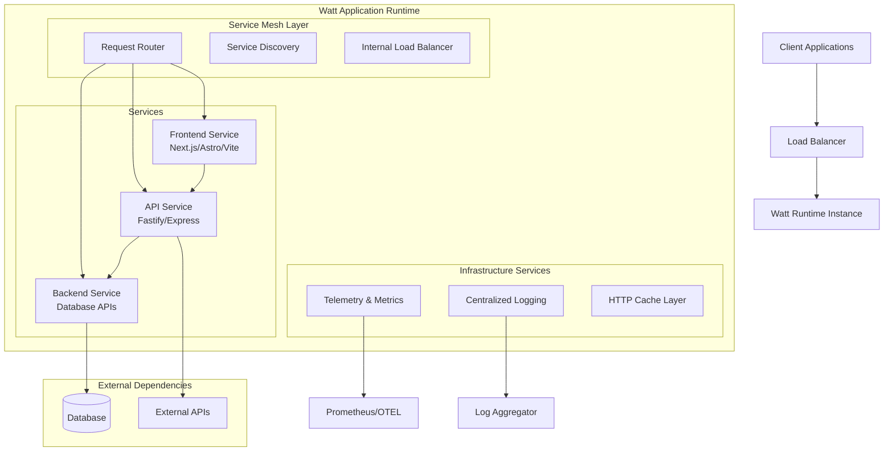

# Architecture Overview

Watt is designed as a next-generation Node.js application server that reimagines how distributed applications are built and deployed. Unlike traditional monolithic or microservice architectures, Watt provides a **modular monolith** approach that combines the best of both worlds.

## Executive Summary

Watt delivers a complete application runtime that orchestrates multiple services within a single process, providing:

- **Unified Development Experience**: Build multiple services with different technologies (Next.js, Express, Fastify) as a single application
- **Built-in Service Mesh**: Automatic inter-service communication without complex networking setup
- **Enterprise-Grade Operations**: Production-ready logging, monitoring, and observability out of the box
- **Cloud-Native Deployment**: Deploy as containers or serverless functions with zero configuration changes

## Conceptual Architecture



## Why Watt's Architecture Matters

### Traditional Problems

**Monoliths**: Single point of failure, difficult to scale individual components, technology lock-in

**Microservices**: Complex networking, service discovery overhead, debugging challenges, deployment complexity

### Watt's Solution

Watt introduces the **Modular Monolith** pattern:

- Services are **logically separated** but **physically co-located**
- **Zero network latency** between services (in-process communication)
- **Unified deployment** with **independent scaling** capabilities
- **Technology diversity** within a single runtime

## Technical Architecture Layers

### 1. Runtime Orchestration Layer

The Watt runtime acts as a sophisticated process manager and service orchestrator:

```ascii
┌─────────────────────────────────────────────────────────────┐
│                    Watt Runtime Manager                     │
├─────────────────────────────────────────────────────────────┤
│  ┌─────────────┐  ┌─────────────┐  ┌─────────────────────┐  │
│  │   Service   │  │   Worker    │  │     Health &        │  │
│  │   Loader    │  │ Coordinator │  │   Monitoring        │  │
│  └─────────────┘  └─────────────┘  └─────────────────────┘  │
│  ┌─────────────┐  ┌─────────────┐  ┌─────────────────────┐  │
│  │ Config Mgmt │  │   Process   │  │   Resource          │  │
│  │             │  │   Manager   │  │   Management        │  │
│  └─────────────┘  └─────────────┘  └─────────────────────┘  │
└─────────────────────────────────────────────────────────────┘
```

**Key Responsibilities:**
- Service lifecycle management (start, stop, restart, health checks)
- Configuration distribution and environment management
- Worker thread orchestration for horizontal scaling
- Resource allocation and limits enforcement

### 2. Service Mesh Layer

Watt includes a built-in service mesh that handles all inter-service communication:

```ascii
┌─────────────────────────────────────────────────────────────┐
│                    Service Mesh Layer                       │
├─────────────────────────────────────────────────────────────┤
│  ┌─────────────┐  ┌─────────────┐  ┌─────────────────────┐  │
│  │   Request   │  │   Service   │  │    Load Balancer    │  │
│  │   Router    │  │  Discovery  │  │   (Round Robin)     │  │
│  └─────────────┘  └─────────────┘  └─────────────────────┘  │
│  ┌─────────────┐  ┌─────────────┐  ┌─────────────────────┐  │
│  │ Interceptor │  │    Cache    │  │    Telemetry        │  │
│  │   System    │  │  Manager    │  │    Hooks            │  │
│  └─────────────┘  └─────────────┘  └─────────────────────┘  │
└─────────────────────────────────────────────────────────────┘
```

**Key Features:**
- **Automatic Service Discovery**: Services register automatically using `.plt.local` domain
- **Zero-Config Networking**: No manual service registration or endpoint management
- **Built-in Load Balancing**: Round-robin distribution across service workers
- **Request Interceptors**: Extensible middleware for cross-cutting concerns
- **HTTP Caching**: Intelligent caching with cache-aside patterns

### 3. Worker Thread Architecture

Watt leverages Node.js Worker Threads for true horizontal scaling within a single process:

```ascii
                    ┌─ Main Thread (Runtime Manager) ─┐
                    │                                 │
                    │  ┌─────────────────────────┐    │
                    │  │   Service Configuration │    │
                    │  └─────────────────────────┘    │
                    │                                 │
                    │  ┌─────────────────────────┐    │
                    │  │   Round Robin Loader    │    │
                    │  └─────────────────────────┘    │
                    └─────────────┬───────────────────┘
                                  │
          ┌───────────────────────┼───────────────────────┐
          │                       │                       │
          ▼                       ▼                       ▼
    ┌───────────┐           ┌───────────┐           ┌───────────┐
    │  Worker   │           │  Worker   │           │  Worker   │
    │ Thread 1  │           │ Thread 2  │           │ Thread N  │
    ├───────────┤           ├───────────┤           ├───────────┤
    │ Service   │           │ Service   │           │ Service   │
    │ Instance  │           │ Instance  │           │ Instance  │
    │           │           │           │           │           │
    │ Mesh      │           │ Mesh      │           │ Mesh      │
    │ Client    │           │ Client    │           │ Client    │
    │           │           │           │           │           │
    │ Health    │           │ Health    │           │ Health    │
    │ Monitor   │           │ Monitor   │           │ Monitor   │
    └───────────┘           └───────────┘           └───────────┘
```

**Benefits:**
- **True Parallelism**: Each worker runs on a separate thread, utilizing multiple CPU cores
- **Fault Isolation**: Worker failures don't affect other workers or the main runtime
- **Independent Scaling**: Different services can have different worker counts
- **Memory Efficiency**: Shared code with isolated heaps per worker

### 4. Stackables Integration Layer

Watt's "Stackables" provide first-class support for popular Node.js frameworks:

```ascii
┌─────────────────────────────────────────────────────────────┐
│                      Stackables Layer                       │
├─────────────────────────────────────────────────────────────┤
│                                                             │
│  ┌─────────────┐ ┌─────────────┐ ┌─────────────┐ ┌─────────┐ │
│  │   Next.js   │ │    Astro    │ │    Vite     │ │  Remix  │ │
│  │ Stackable   │ │ Stackable   │ │ Stackable   │ │Stackable│ │
│  └─────────────┘ └─────────────┘ └─────────────┘ └─────────┘ │
│                                                             │
│  ┌─────────────┐ ┌─────────────┐ ┌─────────────┐ ┌─────────┐ │
│  │   Express   │ │   Fastify   │ │    Node     │ │  Nest   │ │
│  │ Stackable   │ │ Stackable   │ │ Stackable   │ │Stackable│ │
│  └─────────────┘ └─────────────┘ └─────────────┘ └─────────┘ │
│                                                             │
│                 ┌─────────────────────────────┐             │
│                 │    Stackable Runtime API    │             │
│                 └─────────────────────────────┘             │
└─────────────────────────────────────────────────────────────┘
```

**Stackable Features:**
- **Framework Abstraction**: Each stackable handles framework-specific concerns
- **Unified Configuration**: Single configuration format across all frameworks
- **Common Services**: Shared logging, telemetry, and caching across stackables
- **Build Integration**: Unified build pipeline regardless of framework choice

## Service Communication Patterns

### Internal Service Communication

Services within a Watt application communicate through the internal service mesh:

```javascript
// Automatic service discovery - no configuration needed
const response = await fetch('http://user-service.plt.local/api/users/123')

// Services are automatically load-balanced across workers
const products = await fetch('http://product-api.plt.local/products')
```

### External Communication

External API calls are enhanced with observability and caching:

```javascript
// External calls get automatic tracing and metrics
const weather = await fetch('https://api.weather.com/current')

// HTTP caching is applied automatically based on cache headers
const cached = await fetch('https://api.slow-service.com/data')
```

## Deployment Architecture Patterns

### Single Instance Deployment

```ascii
┌─────────────────────────────────────┐
│           Load Balancer             │
└─────────────────┬───────────────────┘
                  │
┌─────────────────▼───────────────────┐
│          Watt Instance              │
│  ┌─────────────────────────────┐    │
│  │     Frontend Service        │    │
│  │      (3 workers)            │    │
│  └─────────────────────────────┘    │
│  ┌─────────────────────────────┐    │
│  │      API Service            │    │
│  │      (5 workers)            │    │
│  └─────────────────────────────┘    │
│  ┌─────────────────────────────┐    │
│  │    Database Service         │    │
│  │      (2 workers)            │    │
│  └─────────────────────────────┘    │
└─────────────────────────────────────┘
```

### Multi-Instance (Cluster) Deployment

```ascii
┌─────────────────────────────────────┐
│           Load Balancer             │
└─────┬─────────────────────┬─────────┘
      │                     │
┌─────▼─────┐         ┌─────▼─────┐
│   Watt    │         │   Watt    │
│Instance 1 │         │Instance 2 │
│           │         │           │
│ Frontend  │         │ Frontend  │
│ API       │         │ API       │  
│ Database  │         │ Database  │
└───────────┘         └───────────┘
      │                     │
      └─────────┬───────────┘
                │
        ┌───────▼────────┐
        │   Shared DB    │
        └────────────────┘
```

## Security Architecture

### Process-Level Security

- **Worker Isolation**: Each service runs in a separate worker thread with resource limits
- **Memory Protection**: Heap isolation prevents memory leaks from affecting other services
- **Resource Limits**: CPU and memory limits prevent resource exhaustion attacks

### Network Security

- **Internal Mesh**: All internal communication happens in-process (no network exposure)
- **External Boundaries**: Only designated entrypoint services accept external traffic
- **Request Validation**: Automatic schema validation for all API endpoints

### Authentication & Authorization

```ascii
┌─────────────┐    ┌──────────────┐    ┌─────────────┐
│   Client    │───▶│   Gateway    │───▶│   Service   │
└─────────────┘    │  (Auth)      │    │   Mesh      │
                   └──────┬───────┘    └─────────────┘
                          │                    │
                   ┌──────▼───────┐     ┌──────▼──────┐
                   │  Auth Store  │     │ Service API │
                   │ (JWT/OAuth)  │     │             │
                   └──────────────┘     └─────────────┘
```

## Observability Architecture

### Telemetry Pipeline

```ascii
┌─────────────────────────────────────────────────────────────┐
│                    Watt Application                         │
│  ┌─────────┐  ┌─────────┐  ┌─────────┐  ┌─────────────┐    │
│  │Service 1│  │Service 2│  │Service 3│  │   Runtime   │    │
│  └────┬────┘  └────┬────┘  └────┬────┘  │   Manager   │    │
│       │            │            │       └──────┬──────┘    │
│       └────────────┼────────────┼──────────────┘           │
│                    │            │                          │
│              ┌─────▼────────────▼─────┐                     │
│              │   Telemetry Layer      │                     │
│              │  ┌─────────────────┐   │                     │
│              │  │   Pino Logger   │   │                     │
│              │  └─────────────────┘   │                     │
│              │  ┌─────────────────┐   │                     │
│              │  │ OpenTelemetry   │   │                     │
│              │  └─────────────────┘   │                     │
│              │  ┌─────────────────┐   │                     │
│              │  │   Prometheus    │   │                     │
│              │  └─────────────────┘   │                     │
│              └────────────────────────┘                     │
└─────────────────────────┬───────────────────────────────────┘
                          │
              ┌───────────▼────────────┐
              │   External Systems     │
              │ ┌─────────────────────┐│
              │ │      Grafana        ││
              │ └─────────────────────┘│
              │ ┌─────────────────────┐│
              │ │      Jaeger         ││
              │ └─────────────────────┘│
              │ ┌─────────────────────┐│
              │ │   Log Aggregator    ││
              │ └─────────────────────┘│
              └────────────────────────┘
```

### Monitoring Capabilities

- **Request Tracing**: End-to-end request tracking across all services
- **Performance Metrics**: Response times, throughput, error rates per service
- **Resource Monitoring**: CPU, memory, event loop utilization per worker
- **Business Metrics**: Custom metrics and events from application logic

## Key Architectural Benefits

### For Development Teams

1. **Single Repository**: All services in one codebase with unified tooling
2. **Local Development**: Full application stack runs locally without Docker/K8s
3. **Unified Debugging**: Debug across services in a single IDE session
4. **Shared Dependencies**: Common libraries and utilities across services

### For Operations Teams

1. **Single Deployment Unit**: Deploy entire application as one artifact
2. **Unified Monitoring**: Single dashboard for all services and metrics
3. **Simplified Networking**: No service mesh configuration or DNS management
4. **Resource Efficiency**: Better resource utilization than separate containers

### For Business

1. **Faster Development**: Reduced complexity accelerates feature delivery
2. **Lower Operational Costs**: Fewer moving parts, simpler infrastructure
3. **Better Reliability**: In-process communication eliminates network failures
4. **Easier Scaling**: Scale entire application or individual services as needed

## Comparison with Traditional Architectures

| Aspect | Monolith | Microservices | Watt (Modular Monolith) |
|--------|----------|---------------|--------------------------|
| Deployment | Single unit | Multiple units | Single unit, multiple workers |
| Communication | In-process | Network (HTTP/gRPC) | In-process + Service Mesh |
| Technology Stack | Homogeneous | Heterogeneous | Heterogeneous within runtime |
| Development Complexity | Low | High | Medium |
| Operational Complexity | Low | High | Low |
| Scaling Granularity | All-or-nothing | Per service | Per service (workers) |
| Service Isolation | None | Strong | Process-level |
| Network Latency | None | Present | None (internal) |
| Debugging Experience | Simple | Complex | Simple |

## Next Steps

- **[Configuration Guide](../reference/watt/configuration.md)**: Learn how to configure Watt applications
- **[Service Mesh Details](../guides/service-mesh.md)**: Deep dive into inter-service communication
- **[Deployment Patterns](../guides/deployment/)**: Production deployment strategies
- **[Monitoring Setup](../guides/monitoring-and-observability.md)**: Setting up observability stack

This architecture enables teams to build distributed applications with the simplicity of monoliths and the flexibility of microservices, making Watt ideal for teams who want to move fast without sacrificing architectural quality.