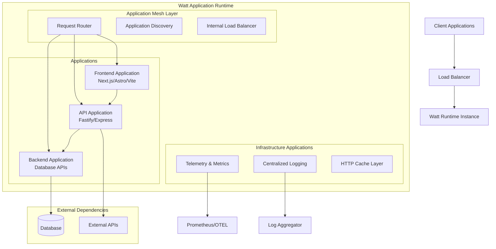

# Architecture Overview

Watt is designed as a next-generation Node.js application server that reimagines how distributed applications are built and deployed. Unlike traditional monolithic or microservice architectures, Watt provides a **modular monolith** approach that combines the best of both worlds.

## Executive Summary

Watt delivers a complete application runtime that orchestrates multiple applications within a single process, providing:

- **Unified Development Experience**: Build multiple applications with different technologies (Next.js, Express, Fastify) as a single application
- **Built-in Application Mesh**: Automatic inter-applications communication without complex networking setup
- **Enterprise-Grade Operations**: Production-ready logging, monitoring, and observability out of the box
- **Cloud-Native Deployment**: Deploy as containers or serverless functions with zero configuration changes

## Conceptual Architecture

> **📋 Documentation Note:** This diagram uses Mermaid syntax for interactive visualization. If your documentation platform doesn't support Mermaid diagrams, you can:
>
> - Use [Mermaid Live Editor](https://mermaid.live) to generate static images
> - Replace with ASCII diagrams (examples provided throughout this document)
> - Use alternative diagram formats supported by your platform


```mermaid
graph TB
    Client[Client Applications] --> LB[Load Balancer]
    LB --> Watt[Watt Runtime Instance]

    subgraph "Watt Application Runtime"
        subgraph "Application Mesh Layer"
            Router[Request Router]
            Discovery[Application Discovery]
            LBInternal[Internal Load Balancer]
        end

        subgraph "Applications"
            Frontend[Frontend Application<br/>Next.js/Astro/Vite]
            API[API Application<br/>Fastify/Express]
            Backend[Backend Application<br/>Database APIs]
        end

        subgraph "Infrastructure Applications"
            Telemetry[Telemetry & Metrics]
            Logging[Centralized Logging]
            Cache[HTTP Cache Layer]
        end
    end

    subgraph "External Dependencies"
        DB[(Database)]
        External[External APIs]
    end

    Router --> Frontend
    Router --> API
    Router --> Backend

    API --> Backend
    Frontend --> API

    Backend --> DB
    API --> External

    Telemetry --> Prometheus[Prometheus/OTEL]
    Logging --> LogAggregator[Log Aggregator]
```

## Why Watt's Architecture Matters

### Traditional Problems

**Monoliths**: Single point of failure, difficult to scale individual components, technology lock-in

**Microservices**: Complex networking, service discovery overhead, debugging challenges, deployment complexity

### Watt's Solution

Watt introduces the **Modular Monolith** pattern:

- Applications are **logically separated** but **physically co-located**
- **Zero network latency** between applications (in-process communication)
- **Unified deployment** with **independent scaling** capabilities
- **Technology diversity** within a single runtime

## Technical Architecture Layers

### 1. Runtime Orchestration Layer

The Watt runtime acts as a sophisticated process manager and application orchestrator:

```ascii
┌─────────────────────────────────────────────────────────┐
│                  Watt Runtime Manager                   │
├─────────────────────────────────────────────────────────┤
│ ┌─────────────┐ ┌─────────────┐ ┌─────────────────────┐ │
│ │ Application │ │   Worker    │ │     Health &        │ │
│ │   Loader    │ │ Coordinator │ │   Monitoring        │ │
│ └─────────────┘ └─────────────┘ └─────────────────────┘ │
│ ┌─────────────┐ ┌─────────────┐ ┌─────────────────────┐ │
│ │ Config Mgmt │ │   Process   │ │   Resource          │ │
│ │             │ │   Manager   │ │   Management        │ │
│ └─────────────┘ └─────────────┘ └─────────────────────┘ │
└─────────────────────────────────────────────────────────┘
```

**Key Responsibilities:**

- Application lifecycle management (start, stop, restart, health checks)
- Configuration distribution and environment management
- Worker thread orchestration for horizontal scaling
- Resource allocation and limits enforcement

### 2. Application Mesh Layer

Watt includes a built-in application mesh that handles all inter-application communication:

```ascii
┌─────────────────────────────────────────────────────────┐
│                   Application Mesh Layer                │
├─────────────────────────────────────────────────────────┤
│ ┌─────────────┐ ┌─────────────┐ ┌─────────────────────┐ │
│ │   Request   │ │ Application │ │    Load Balancer    │ │
│ │   Router    │ │  Discovery  │ │   (Round Robin)     │ │
│ └─────────────┘ └─────────────┘ └─────────────────────┘ │
│ ┌─────────────┐ ┌─────────────┐ ┌─────────────────────┐ │
│ │ Interceptor │ │    Cache    │ │    Telemetry        │ │
│ │   System    │ │  Manager    │ │    Hooks            │ │
│ └─────────────┘ └─────────────┘ └─────────────────────┘ │
└─────────────────────────────────────────────────────────┘
```

**Key Features:**

- **Automatic Application Discovery**: Applications register automatically using `.plt.local` domain
- **Zero-Config Networking**: No manual application registration or endpoint management
- **Built-in Load Balancing**: Round-robin distribution across application workers
- **Request Interceptors**: Extensible middleware for cross-cutting concerns
- **HTTP Caching**: Intelligent caching with cache-aside patterns

### 3. Worker Thread Architecture

Watt leverages Node.js Worker Threads for true horizontal scaling within a single process:

```ascii
                  ┌── Main Thread (Runtime Manager) ──┐
                  │                                   │
                  │  ┌───────────────────────────┐    │
                  │  │ Application Configuration │    │
                  │  └───────────────────────────┘    │
                  │                                   │
                  │  ┌───────────────────────────┐    │
                  │  │   Round Robin Loader      │    │
                  │  └───────────────────────────┘    │
                  └───────────────┬───────────────────┘
                                  │
          ┌───────────────────────┼───────────────────────┐
          │                       │                       │
          ▼                       ▼                       ▼
    ┌─────────────┐        ┌─────────────┐          ┌─────────────┐
    │  Worker     │        │  Worker     │          │  Worker     │
    │ Thread 1    │        │ Thread 2    │          │ Thread N    │
    ├─────────────┤        ├─────────────┤          ├─────────────┤
    │ Application │        │ Application │          │ Application │
    │ Instance    │        │ Instance    │          │ Instance    │
    │             │        │             │          │             │
    │ Mesh        │        │ Mesh        │          │ Mesh        │
    │ Client      │        │ Client      │          │ Client      │
    │             │        │             │          │             │
    │ Health      │        │ Health      │          │ Health      │
    │ Monitor     │        │ Monitor     │          │ Monitor     │
    └─────────────┘        └─────────────┘          └─────────────┘
```

**Benefits:**

- **True Parallelism**: Each worker runs on a separate thread, utilizing multiple CPU cores
- **Fault Isolation**: Worker failures don't affect other workers or the main runtime
- **Independent Scaling**: Different applications can have different worker counts
- **Memory Efficiency**: Shared code with isolated heaps per worker

### 4. Capabilities Integration Layer

Watt's "Capabilities" provide first-class support for popular Node.js frameworks:

```ascii
┌─────────────────────────────────────────────────────────────┐
│                     Capabilities Layer                      │
├─────────────────────────────────────────────────────────────┤
│                                                             │
│ ┌────────────┐ ┌────────────┐ ┌────────────┐ ┌────────────┐ │
│ │   Next.js  │ │    Astro   │ │    Vite    │ │  Remix     │ │
│ │ Capability │ │ Capability │ │ Capability │ │ Capability │ │
│ └────────────┘ └────────────┘ └────────────┘ └────────────┘ │
│                                                             │
│ ┌────────────┐ ┌────────────┐ ┌────────────┐ ┌────────────┐ │
│ │   Express  │ │   Fastify  │ │    Node    │ │ NestJS     │ │
│ │ Capability │ │ Capability │ │ Capability │ │ Capability │ │
│ └────────────┘ └────────────┘ └────────────┘ └────────────┘ │
│                                                             │
│                ┌───────────────────────────┐                │
│                │  Capability Runtime API   │                │
│                └───────────────────────────┘                │
└─────────────────────────────────────────────────────────────┘
```

**Capability Features:**

- **Framework Abstraction**: Each capability handles framework-specific concerns
- **Unified Configuration**: Single configuration format across all frameworks
- **Common Applications**: Shared logging, telemetry, and caching across capabilities
- **Build Integration**: Unified build pipeline regardless of framework choice

## Application Communication Patterns

### Internal Application Communication

Applications within a Watt application communicate through the internal application mesh:

```javascript
// Automatic application discovery - no configuration needed
const response = await fetch('http://user-application.plt.local/api/users/123')

// Applications are automatically load-balanced across workers
const products = await fetch('http://product-api.plt.local/products')
```

### External Communication

External API calls are enhanced with observability and caching:

```javascript
// External calls get automatic tracing and metrics
const weather = await fetch('https://api.weather.com/current')

// HTTP caching is applied automatically based on cache headers
const cached = await fetch('https://api.slow-application.com/data')
```

**Note:** HTTP caching must be enabled in your configuration file to take advantage of automatic caching:

```json
{
  "$schema": "https://schemas.platformatic.dev/wattpm/3.0.0.json",
  "httpCache": true,
  "autoload": {
    "path": "web"
  },
  "entrypoint": "api"
}
```

## Deployment Architecture Patterns

### Single Instance Deployment

```ascii
┌─────────────────────────────────┐
│          Load Balancer          │
└────────────────┬────────────────┘
                 │
┌────────────────▼────────────────┐
│         Watt Instance           │
│ ┌─────────────────────────────┐ │
│ │     Frontend Application    │ │
│ │      (3 workers)            │ │
│ └─────────────────────────────┘ │
│ ┌─────────────────────────────┐ │
│ │      API Application        │ │
│ │      (5 workers)            │ │
│ └─────────────────────────────┘ │
│ ┌─────────────────────────────┐ │
│ │    Database Application     │ │
│ │      (2 workers)            │ │
│ └─────────────────────────────┘ │
└─────────────────────────────────┘
```

### Multi-Instance (Cluster) Deployment

```ascii
┌─────────────────────────────────────┐
│           Load Balancer             │
└───────┬─────────────────────┬───────┘
        │                     │
  ┌─────▼─────┐         ┌─────▼─────┐
  │   Watt    │         │   Watt    │
  │Instance 1 │         │Instance 2 │
  │           │         │           │
  │ Frontend  │         │ Frontend  │
  │ API       │         │ API       │
  │ Database  │         │ Database  │
  └─────┬─────┘         └─────┬─────┘
        │                     │
        └─────────┬───────────┘
                  │
          ┌───────▼────────┐
          │   Shared DB    │
          └────────────────┘
```

## Security Architecture

### Process-Level Security

- **Worker Isolation**: Each application runs in a separate worker thread with resource limits
- **Memory Protection**: Heap isolation prevents memory leaks from affecting other applications
- **Resource Limits**: CPU and memory limits prevent resource exhaustion attacks

### Network Security

- **Internal Mesh**: All internal communication happens in-process (no network exposure)
- **External Boundaries**: Only designated entrypoint applications accept external traffic
- **Request Validation**: Automatic schema validation for all API endpoints

### Authentication & Authorization

```ascii
┌─────────────┐    ┌──────────────┐     ┌─────────────┐
│   Client    │───▶│   Gateway    │────▶│ Application │
└─────────────┘    │  (Auth)      │     │   Mesh      │
                   └──────┬───────┘     └──────┬──────┘
                          │                    │
                   ┌──────▼───────┐     ┌──────▼──────┐
                   │  Auth Store  │     │ Application │
                   │ (JWT/OAuth)  │     │    API      │
                   └──────────────┘     └─────────────┘
```

## Observability Architecture

Watt provides comprehensive observability through three distinct subsystems, each with different implementations and use cases:

### Logging Architecture

Watt uses [Pino](https://getpino.io/) for high-performance structured logging across all applications:

```ascii
┌─────────────────────────────────────────────────────────────────────┐
│                   Watt Application                                  │
│ ┌───────────────┐  ┌───────────────┐  ┌───────────────┐ ┌─────────┐ │
│ │ Application 1 │  │ Application 2 │  │ Application 3 │ │ Runtime │ │
│ │    (Pino)     │  │    (Pino)     │  │    (Pino)     │ │ Manager │ │
│ └───────┬───────┘  └───────┬───────┘  └───────┬───────┘ │ (Pino)  │ │
│         │                  │                  │         └────┬────┘ │
│         │                  │                  │              │      │
│         └──────────────────┴────────┬─────────┴──────────────┘      │
│                                     │                               │
│                       ┌─────────────▼───────────────┐               │
│                       │     Pino Logger System      │               │
│                       │ ┌─────────────────────────┐ │               │
│                       │ │    Log Transport        │ │               │
│                       │ │    (Configurable)       │ │               │
│                       │ │    - Console            │ │               │
│                       │ │    - File               │ │               │
│                       │ │    - Elasticsearch      │ │               │
│                       │ │    - Custom             │ │               │
│                       │ └─────────────────────────┘ │               │
│                       │ ┌─────────────────────────┐ │               │
│                       │ │    Log Processing       │ │               │
│                       │ │    - Redaction          │ │               │
│                       │ │    - Formatting         │ │               │
│                       │ │    - Filtering          │ │               │
│                       │ └─────────────────────────┘ │               │
│                       └─────────────────────────────┘               │
└─────────────────────────────────────┬───────────────────────────────┘
                                      │
                          ┌───────────▼─────────────┐
                          │    Log Destinations     │
                          │ ┌─────────────────────┐ │
                          │ │   Elasticsearch     │ │
                          │ └─────────────────────┘ │
                          │ ┌─────────────────────┐ │
                          │ │      Splunk         │ │
                          │ └─────────────────────┘ │
                          │ ┌─────────────────────┐ │
                          │ │    File System      │ │
                          │ └─────────────────────┘ │
                          │ ┌─────────────────────┐ │
                          │ │      Console        │ │
                          │ └─────────────────────┘ │
                          └─────────────────────────┘
```

### Distributed Tracing Architecture

Watt implements distributed tracing using [OpenTelemetry](https://opentelemetry.io/) with support for multiple trace exporters, including OTLP over HTTP, OTLP over gRPC, Zipkin, console, memory, and file:

```ascii
┌──────────────────────────────────────────────────────────────────────┐
│                   Watt Application                                   │
│ ┌───────────────┐  ┌───────────────┐  ┌───────────────┐  ┌─────────┐ │
│ │ Application 1 │  │ Application 2 │  │ Application 3 │  │ Runtime │ │
│ │     (OTel)    │  │     (OTel)    │  │     (OTel)    │  │ Manager │ │
│ └───────┬───────┘  └───────┬───────┘  └───────┬───────┘  └────┬────┘ │
│         │                  │                  │               │      │
│         └──────────────────┴───────┬──────────┴───────────────┘      │
│           Span Context Propagaton  │                                 │
│                                    │                                 │
│                                    │                                 │
│                                    │                                 │
│                    ┌───────────────▼─────────────┐                   │
│                    │   OpenTelemetry Tracer      │                   │
│                    │ ┌─────────────────────────┐ │                   │
│                    │ │  Span Processors        │ │                   │
│                    │ │  - BatchSpanProcessor   │ │                   │
│                    │ │  - SimpleSpanProcessor  │ │                   │
│                    │ └─────────────────────────┘ │                   │
│                    │ ┌─────────────────────────┐ │                   │
│                    │ │  Context Propagation    │ │                   │
│                    │ │  - W3C Trace Context    │ │                   │
│                    │ │  - B3 Propagation       │ │                   │
│                    │ └─────────────────────────┘ │                   │
│                    │ ┌─────────────────────────┐ │                   │
│                    │ │  Trace Exporters        │ │                   │
│                    │ │  - OTLP                 │ │                   │
│                    │ │  - Jaeger               │ │                   │
│                    │ │  - Zipkin               │ │                   │
│                    │ │  - Console/File         │ │                   │
│                    │ └─────────────────────────┘ │                   │
│                    └─────────────────────────────┘                   │
└──────────────────────────────────┬───────────────────────────────────┘
                                   │
                       ┌───────────▼────────────┐
                       │   Tracing Backends     │
                       │ ┌─────────────────────┐│
                       │ │       Jaeger        ││
                       │ └─────────────────────┘│
                       │ ┌─────────────────────┐│
                       │ │       Zipkin        ││
                       │ └─────────────────────┘│
                       │ ┌─────────────────────┐│
                       │ │   OTLP Collector    ││
                       │ └─────────────────────┘│
                       │ ┌─────────────────────┐│
                       │ │   Custom Backend    ││
                       │ └─────────────────────┘│
                       └────────────────────────┘
```

### Metrics Collection Architecture

Watt uses [Prometheus](https://prometheus.io/) client libraries for metrics collection with custom metric collectors:

```ascii
┌──────────────────────────────────────────────────────────────────────┐
│                   Watt Application                                   │
│ ┌───────────────┐  ┌───────────────┐  ┌───────────────┐  ┌─────────┐ │
│ │ Application 1 │  │ Application 2 │  │ Application 3 │  │ Runtime │ │
│ │  (Metrics)    │  │  (Metrics)    │  │  (Metrics)    │  │ Manager │ │
│ └───────┬───────┘  └───────┬───────┘  └───────┬───────┘  └────┬────┘ │
│         │                  │                  │               │      │
│         └──────────────────┴───────┬──────────┴───────────────┘      │
│                                    │                                 │
│                    ┌───────────────▼──────────────┐                  |
│                    │   Prometheus Registry        │                  │
│                    │ ┌──────────────────────────┐ │                  │
│                    │ │   Default Metrics        │ │                  │
│                    │ │   - CPU Usage            │ │                  │
│                    │ │   - Memory Usage         │ │                  │
│                    │ │   - Event Loop Util      │ │                  │
│                    │ │   - Process Stats        │ │                  │
│                    │ └──────────────────────────┘ │                  │
│                    │ ┌──────────────────────────┐ │                  │
│                    │ │   HTTP Metrics           │ │                  │
│                    │ │   - Request Duration     │ │                  │
│                    │ │   - Request Count        │ │                  │
│                    │ │   - Response Codes       │ │                  │
│                    │ │   - Active Connections   │ │                  │
│                    │ └──────────────────────────┘ │                  │
│                    │ ┌──────────────────────────┐ │                  │
│                    │ │   Custom Metrics         │ │                  │
│                    │ │   - Business Logic       │ │                  │
│                    │ │   - Thread CPU Usage     │ │                  │
│                    │ │   - Cache Metrics        │ │                  │
│                    │ └──────────────────────────┘ │                  │
│                    └──────────────────────────────┘                  │
│                    ┌──────────────────────────────┐                  │
│                    │ Prometheus HTTP Server       │                  │
│                    │ (Metrics Endpoint: /metrics) │                  │
│                    └──────────────────────────────┘                  │
└──────────────────────────────────┬───────────────────────────────────┘
                                   │
                       ┌───────────▼─────────────┐
                       │   Metrics Collection    │
                       │ ┌─────────────────────┐ │
                       │ │     Prometheus      │ │
                       │ │      Server         │ │
                       │ └─────────────────────┘ │
                       │ ┌─────────────────────┐ │
                       │ │      Grafana        │ │
                       │ └─────────────────────┘ │
                       │ ┌─────────────────────┐ │
                       │ │   Custom Scrapers   │ │
                       │ └─────────────────────┘ │
                       └─────────────────────────┘
```

### Observability Capabilities

**Logging Features:**

- **Structured Logging**: JSON-formatted logs with consistent schema across applications
- **Log Correlation**: Request IDs and context propagation for tracing logs across applications
- **Sensitive Data Redaction**: Automatic removal of secrets, tokens, and PII from logs
- **Multiple Transports**: Console, file, Elasticsearch, custom destinations
- **Environment-specific Configuration**: Different log levels and outputs per environment

**Distributed Tracing Features:**

- **Request Tracing**: End-to-end request tracking across all applications with span correlation
- **Context Propagation**: W3C Trace Context and B3 propagation standards support
- **Multiple Exporters**: OTLP, Jaeger, Zipkin, and custom trace backend support
- **Performance Analysis**: Request latency, application dependencies, and bottleneck identification
- **Error Tracking**: Exception capturing and error span correlation

**Metrics Collection Features:**

- **System Metrics**: CPU usage, memory consumption, event loop utilization per worker
- **HTTP Metrics**: Request duration, throughput, status code distribution, active connections
- **Business Metrics**: Custom counters, gauges, histograms for application-specific monitoring
- **Prometheus Integration**: Native Prometheus exposition format with configurable labels
- **Real-time Collection**: Live metrics scraping with configurable collection intervals

## Key Architectural Benefits

### For Development Teams

1. **Single Repository**: All applications in one codebase with unified tooling
2. **Local Development**: Full application stack runs locally without Docker/K8s
3. **Unified Debugging**: Debug across applications in a single IDE session
4. **Shared Dependencies**: Common libraries and utilities across applications

### For Operations Teams

1. **Single Deployment Unit**: Deploy entire application as one artifact
2. **Unified Monitoring**: Single dashboard for all applications and metrics
3. **Simplified Networking**: No application mesh configuration or DNS management
4. **Resource Efficiency**: Better resource utilization than separate containers

### For Business

1. **Faster Development**: Reduced complexity accelerates feature delivery
2. **Lower Operational Costs**: Fewer moving parts, simpler infrastructure
3. **Better Reliability**: In-process communication eliminates network failures
4. **Easier Scaling**: Scale entire application or individual applications as needed

## Comparison with Traditional Architectures

| Aspect                 | Monolith       | Microservices       | Watt (Modular Monolith)       |
| ---------------------- | -------------- | ------------------- | ----------------------------- |
| Deployment             | Single unit    | Multiple units      | Single unit, multiple workers |
| Communication          | In-process     | Network (HTTP/gRPC) | In-process + Application Mesh |
| Technology Stack       | Homogeneous    | Heterogeneous       | Heterogeneous within runtime  |
| Development Complexity | Low            | High                | Medium                        |
| Operational Complexity | Low            | High                | Low                           |
| Scaling Granularity    | All-or-nothing | Per application     | Per application (workers)     |
| Application Isolation  | None           | Strong              | Process-level                 |
| Network Latency        | None           | Present             | None (internal)               |
| Debugging Experience   | Simple         | Complex             | Simple                        |

## Next Steps

- **[Configuration Guide](../reference/watt/configuration.md)**: Learn how to configure Watt applications
- **[Application Mesh Details](../guides/application-mesh.md)**: Deep dive into inter-application communication
- **[Deployment Patterns](../guides/deployment/)**: Production deployment strategies
- **[Monitoring Setup](../guides/metrics.md)**: Setting up monitoring stack

This architecture enables teams to build distributed applications with the simplicity of monoliths and the flexibility of microservices, making Watt ideal for teams who want to move fast without sacrificing architectural quality.
