# Configure JWT with Keycloak

[Keycloak](https://www.keycloak.org/) is an open source identity and access management solution that can be integrated with Platformatic DB through [JSON Web Tokens](https://jwt.io/) (JWT) tokens. 
Keycloak is a powerful and complete solution, in this guide we will show how to integate it with Platformatic in a simple case. For more complex scenarios on the Keycloak side, please refer to the latest [Keycloak documentation](https://www.keycloak.org/documentation.html).

## Keycloak Setup 
Start a Keycloak server, [this can be done using docker](https://www.keycloak.org/getting-started/getting-started-docker):

```bash
docker run -p 8080:8080 -e KEYCLOAK_ADMIN=admin -e KEYCLOAK_ADMIN_PASSWORD=admin quay.io/keycloak/keycloak:24.0.2 start-dev
```
Keep it running in its own terminal.

### Setup Realm, Client and Roles

Access the Keycloak admin console at [http://127.0.0.1:8080/auth/admin](http://127.0.0.1:8080/auth/admin) and login with the credentials `admin/admin`.

Now click on the selecton the left and click on "Create realm":

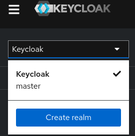

Name the realm `plt` and click "Create".

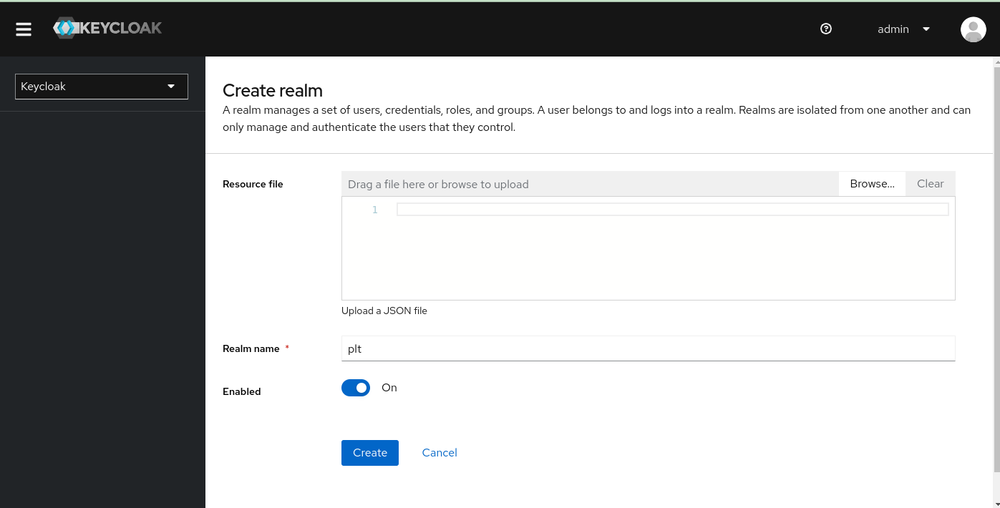

Now click on the "Clients" tab and click on "Create Client" (clients are
applications that can authenticate with Keycloak).

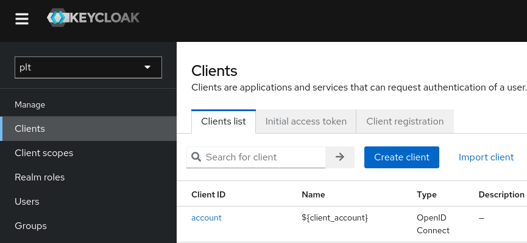

Name the client `keycloak-jwt` and click "Next".

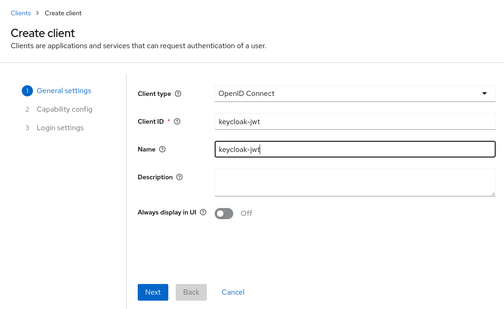

On the "Capability config" set to "ON":
- Client authentication
- Standard flow
- Direct access grants
- Service account roles

Then click on "Next"

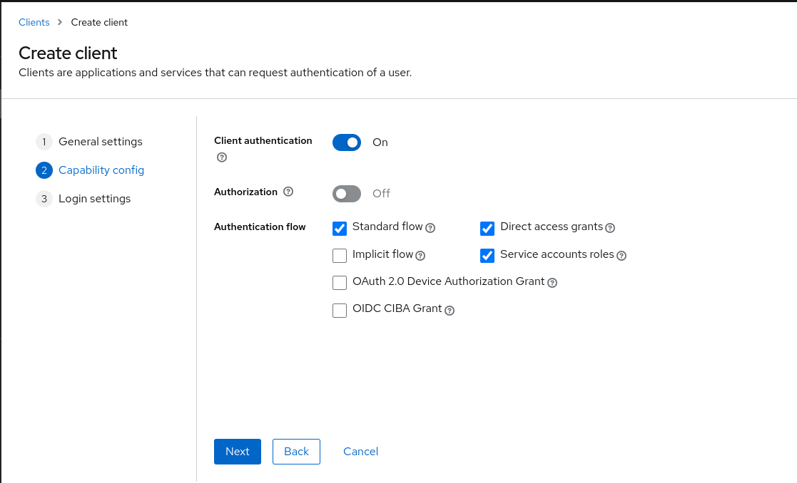

On the "Login settings" set:
- Valid redirect URIS; `/*`
- Web Origins: `/*`

Then click on "Save"

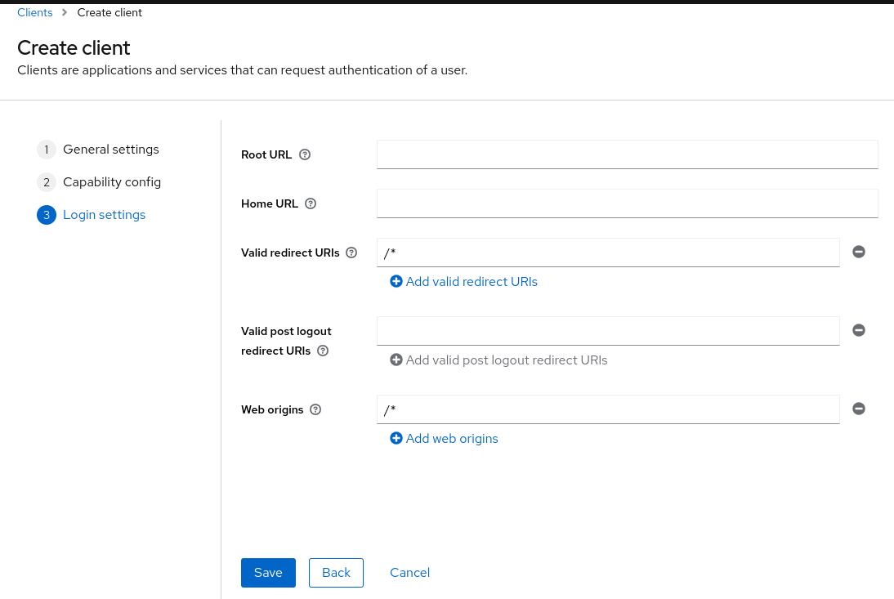

Now in "Clients" select the `keycloak-jwt` client and click on the "Credentials" tab. Here you can see the client secret, copy it and save it in a safe place.

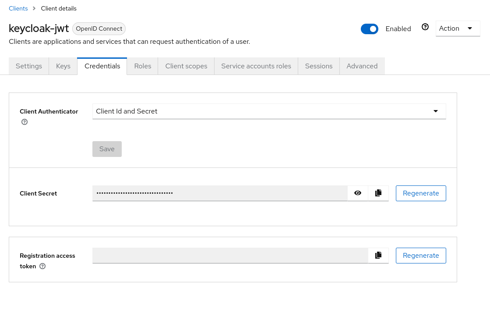

Now click on the "Roles" tab and create a new role called `movies:read` and save

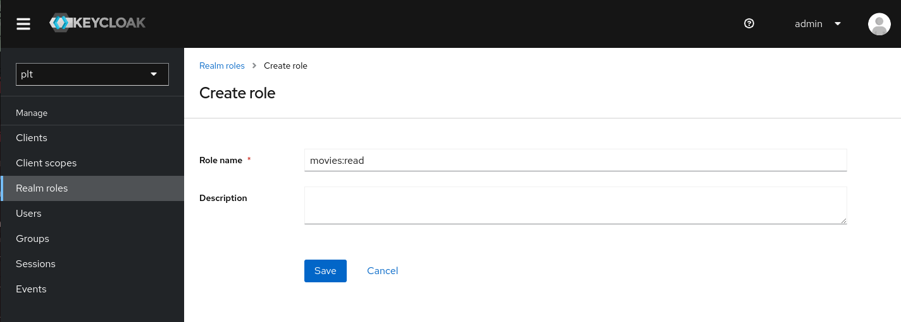

Go back to the "Clients" tab, select the `keycloak-jwt` client and click on the "Service Account Roles" tab. Here you can assign the `movies:read` role to the client.

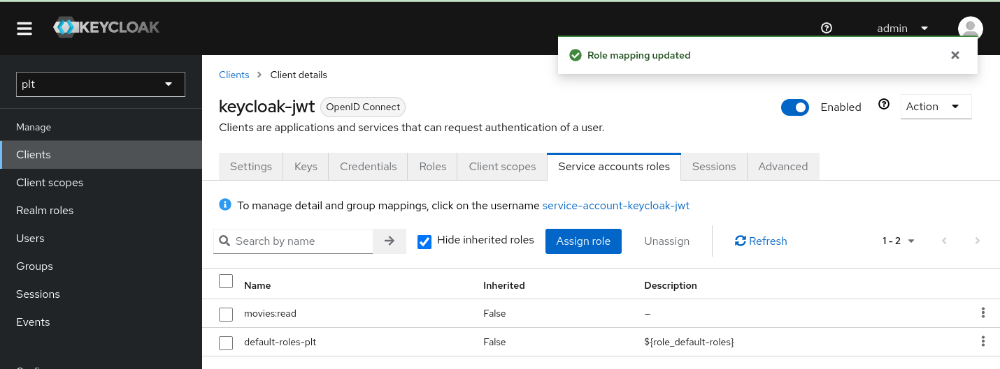

### Test the JWT creation 

We can use the `keycloak-jwt` client to create a JWT token for the user `user` with the role `movies:read`.
Change `YOUR_CLIENT_SECRET` with the client secret you saved before.

```bash
  curl -L --insecure -s -X POST 'http://127.0.0.1:8080/realms/plt/protocol/openid-connect/token' \
 -H 'Content-Type: application/x-www-form-urlencoded' \
 --data-urlencode 'client_id=keycloak-jwt' \
 --data-urlencode 'grant_type=client_credentials' \
 --data-urlencode 'client_secret=YOUR_CLIENT_SECRET'
```

You should get a response like this:

```bash 
{"access_token":"eyJhbGciOiJSUzI1NiIsInR5cCIgOiAiSldUIiwia2lkIiA6ICJLaWhpNVFqRExmWTVOWWtSWmw1QUxvVTgyOFFSMHBXbmJjRk1ya2JpVWdvIn0.eyJleHAiOjE3MTI4Mjk5MzMsImlhdCI6MTcxMjgyOTYzMywianRpIjoiYzJmOWY4NjItZTdlOC00YTcxLThlNzQtNzNiNDIzZWJiNGI2IiwiaXNzIjoiaHR0cDovLzEyNy4wLjAuMTo4MDgwL3JlYWxtcy9wbHQiLCJhdWQiOiJhY2NvdW50Iiwic3ViIjoiNWIzOWI4ZmUtNDdlOC00ZmYzLTgyOWItYzhjYmNjNWY2OWIxIiwidHlwIjoiQmVhcmVyIiwiYXpwIjoia2V5Y2xvYWstand0IiwiYWNyIjoiMSIsImFsbG93ZWQtb3JpZ2lucyI6WyIvKiJdLCJyZWFsbV9hY2Nlc3MiOnsicm9sZXMiOlsibW92aWVzOnJlYWQiLCJkZWZhdWx0LXJvbGVzLXBsdCIsIm9mZmxpbmVfYWNjZXNzIiwidW1hX2F1dGhvcml6YXRpb24iXX0sInJlc291cmNlX2FjY2VzcyI6eyJhY2NvdW50Ijp7InJvbGVzIjpbIm1hbmFnZS1hY2NvdW50IiwibWFuYWdlLWFjY291bnQtbGlua3MiLCJ2aWV3LXByb2ZpbGUiXX19LCJzY29wZSI6ImVtYWlsIHByb2ZpbGUiLCJlbWFpbF92ZXJpZmllZCI6ZmFsc2UsImNsaWVudEhvc3QiOiIxNzIuMTcuMC4xIiwicHJlZmVycmVkX3VzZXJuYW1lIjoic2VydmljZS1hY2NvdW50LWtleWNsb2FrLWp3dCIsImNsaWVudEFkZHJlc3MiOiIxNzIuMTcuMC4xIiwiY2xpZW50X2lkIjoia2V5Y2xvYWstand0In0.c4sjvdNxw5srjev2KXC4keNoG8SVUOggTCwNFLGOCOo55QNfBeaKb-bGZ4cH5dImkkpgS8940zxf14V7D41xqL6o7FYv4HQOM4E91bqAJrzLr-PUgnzI1GqafgD3ELsA00qMC7_ChaewrbFTR3ROsmn38h_kcMxT_H9YsJLte8GRj_T3EfN1XlEGCRBcZKfx4fZgTMPFcWMOWbd7Xjorp21_hOZzWbk_CNzI4b5UFlzXvU7rcyH2QAgWFqROJl4vt4WIchB8vCc2G5-E2aUzycQJmWZbk6i5Xn01X2cw-3E_qYHnM4eEu-P0TZ9inTl7BFk12zPSMmO62qEGTbB-MQ","expires_in":300,"refresh_expires_in":0,"token_type":"Bearer","not-before-policy":0,"scope":"email profile"}
```

You can copy the `access_token` and decode it at [jwt.io](https://jwt.io/). You shouldobtain a token with a payload like: 

```json
{
  "exp": 1712829933,
  "iat": 1712829633,
  "jti": "c2f9f862-e7e8-4a71-8e74-73b423ebb4b6",
  "iss": "http://127.0.0.1:8080/realms/plt",
  "aud": "account",
  "sub": "5b39b8fe-47e8-4ff3-829b-c8cbcc5f69b1",
  "typ": "Bearer",
  "azp": "keycloak-jwt",
  "acr": "1",
  "allowed-origins": [
    "/*"
  ],
  "realm_access": {
    "roles": [
      "movies:read",
      "default-roles-plt",
      "offline_access",
      "uma_authorization"
    ]
  },
  
  (...)

```

Note that the token has the role `movies:read` in the `realm_access` section.
We will use this token to authenticate with Platformatic DB and the `movies:read` realm role to authorize the user. 
Note that this is a simple example, for instance you might use roles on resources. Refer to [Keycloak documentation](https://www.keycloak.org/documentation.html) for more complex scenarios. 

Note also that the access token is valid for 5 minutes (keycloak default)

## Platformatic Setup and Test

Create a Platformatic application using `npm create wattpm`.
Call it `keycloak-test` with a `db-service`. 
Specify to use sqlite and the default migrations:

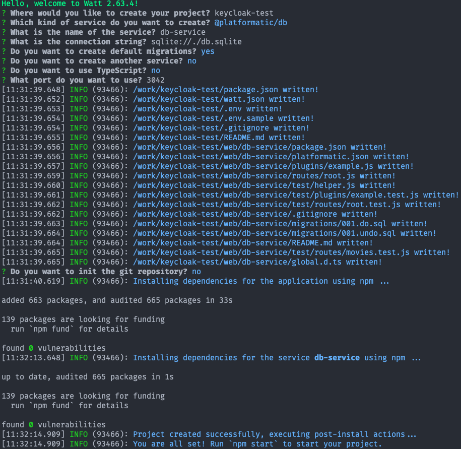

Go to `keycloak-test/services/db-service` folder and open `platformatic.json`.
Add the `authorization` section with the `jwt` configuration:

```json
  "authorization": {
    "jwt": {
      "jwks": {
        "allowedDomains": [
          "http://127.0.0.1:8080/realms/plt"
        ],
        "providerDiscovery": true
      }
    },
    "rolePath": "realm_access.roles",
    "rules": [
      {
        "role": "movies:read",
        "entity": "movie",
        "find": true
      }
    ]
  }

```

Note that the `rolePath` specify the  `realm_access.roles` path in the JWT token that is used to extract the roles from the token.
The `rules` section specify that the role `movies:read` can access the `movie` entity with the `find` operation.

Now go to the `keycloak-test` folder and start the application:

```bash
npm start
```

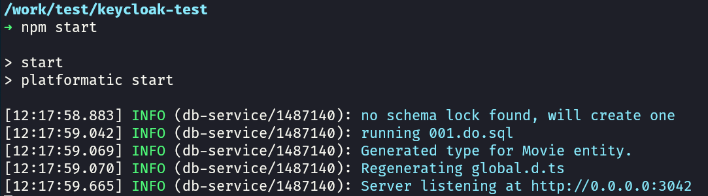

Test it to invoking the `movies` API. the request MUST be unauthorized:

```bash
curl --request GET \
  --url http://127.0.0.1:3042/movies/
```

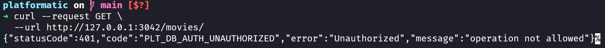

Now you can test to invoke the `movies` API with the JWT token. Keep in mind that the token expires in 5 minutes, so you might need to get a new one.


```bash

curl --location 'http://0.0.0.0:3042/movies' \
--header 'Authorization: Bearer YOUR_ACCESS_TOKEN'
```

Now you should get a response (an empty array in this case, since we have no movies in the database)


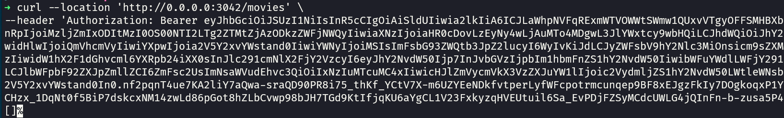


