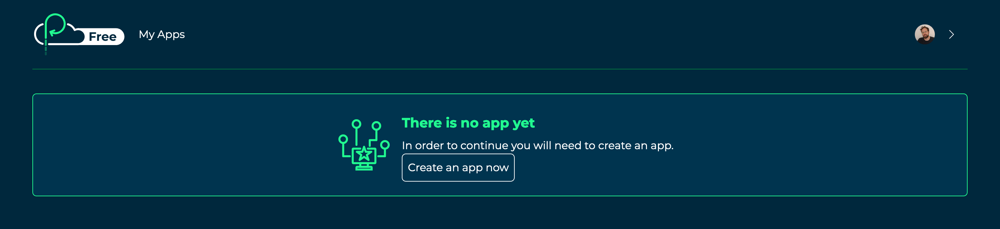
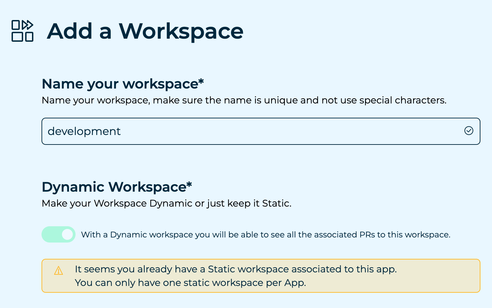
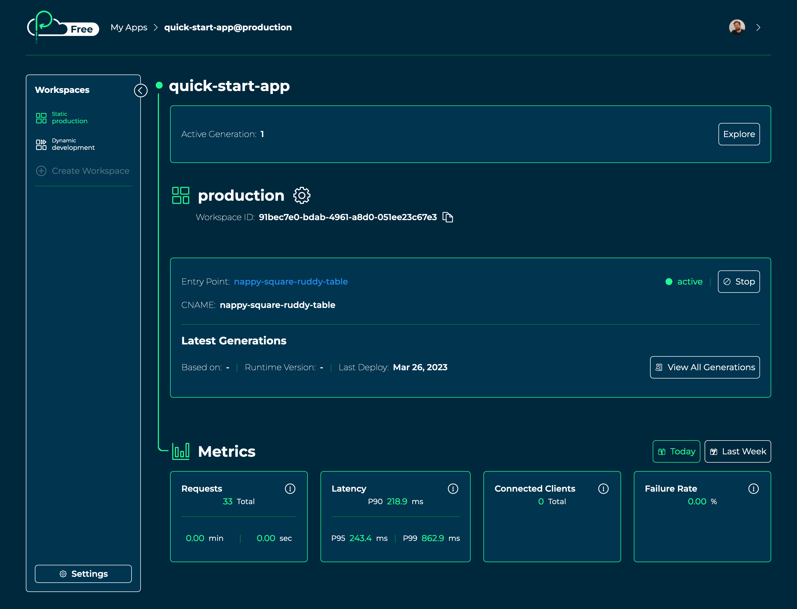
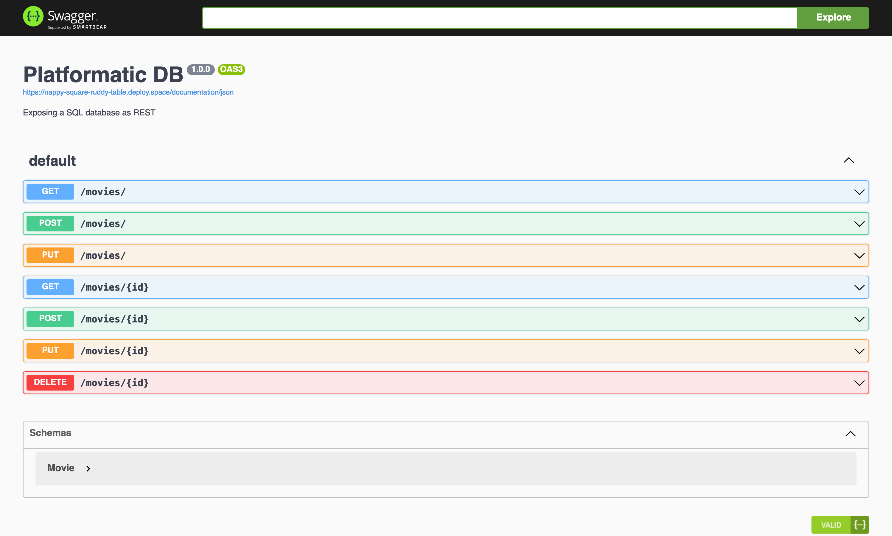
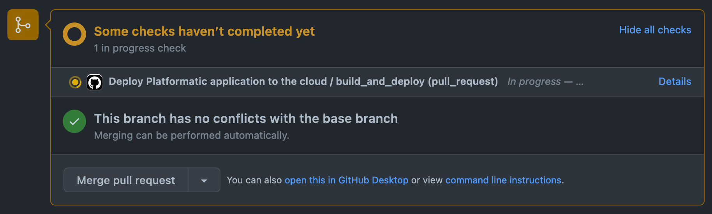
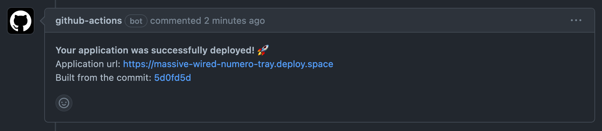
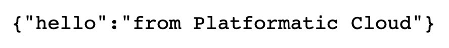
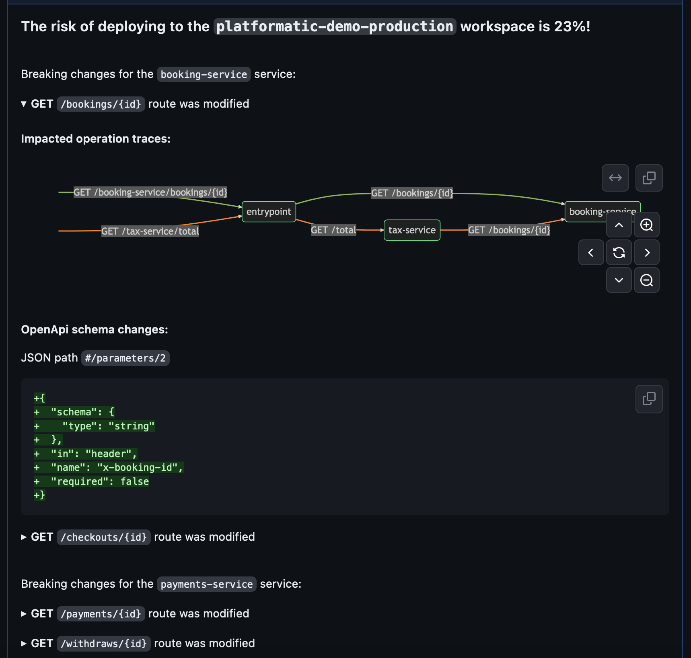

import Tabs from '@theme/Tabs';
import TabItem from '@theme/TabItem';

# Cloud Quick Start Guide

This guide shows you how to create and deploy an application to
Platformatic Cloud.

## Prerequisites

To follow along with this guide you'll need to have these things installed:

- [Node.js](https://nodejs.org/) >= v18.8.0 or >= v20.6.0
- [npm](https://docs.npmjs.com/cli/) v7 or later
- A code editor, for example [Visual Studio Code](https://code.visualstudio.com/)

You will also need to have a [GitHub](https://github.com/) account.

## Log in to Platformatic Cloud

Go to the [Platformatic Cloud](https://platformatic.cloud/) website and click on the
**Continue with GitHub** button. You'll be transferred to a GitHub page that
asks you to Authorize Platformatic Cloud. To continue, click on the
**Authorize platformatic** button.


On the Platformatic Cloud Service Agreements page, check the boxes and
click the **Continue** button. You'll then be redirected to your Cloud Dashboard page.

## Create a Cloud app



Click the **Create an app now** button on your Cloud Dashboard page.

Enter `quick-start-app` as your application name. Click the **Create Application** button.

## Create a static app workspace

Enter `production` as the name for your workspace. Then click on the **Create Workspace** button.

On the next page you'll see the **Workspace ID** and **API key** for your app workspace.
Copy them and store them somewhere secure for future reference, for example in a password manager app.
The API key will be used to deploy your app to the workspace that you've just created.

Click on the **Back to dashboard** button.

## Create a dynamic app workspace

On your Cloud Dashboard, click on your app, then click on **Create Workspace** in the **Workspaces**
sidebar.



The **Dynamic Workspace** option will be automatically enabled as you have already created a
static workspace. Dynamic workspaces can be used to deploy preview applications for GitHub
pull requests.

Enter `development` as the name for your workspace, then click on the **Create Workspace** button.
Copy the **Workspace ID** and **API key** and store them somewhere secure.

## Create a GitHub repository

Go to the [Create a new repository](https://github.com/new) page on GitHub.
Enter `quick-start-app` as the **Repository name** for your new repository.
Click on the **Add a README file** checkbox and click the **Create repository**
button.

## Add the workspace API keys as repository secrets

Go to the **Settings** tab on your app's GitHub repository. Click into the
**Secrets and variables > Actions** section and add the following secrets:

| **Name** | **Secret** |
|--- | ---|
| `PLATFORMATIC_STATIC_WORKSPACE_ID` | Your app's static workspace ID |
| `PLATFORMATIC_STATIC_WORKSPACE_API_KEY` | Your app's static workspace API key |
| `PLATFORMATIC_DYNAMIC_WORKSPACE_ID` | Your app's dynamic workspace ID |
| `PLATFORMATIC_DYNAMIC_WORKSPACE_API_KEY` | Your app's dynamic workspace API key |

Click on the **New repository secret** button to add a secret.

:::tip

You can also use the [GitHub CLI](https://cli.github.com/) to set secrets on your GitHub repository, for example:

```
gh secret set \
  --app actions \
  --env-file <FILENAME_OF_ENV_FILE_WITH_SECRETS> \
  --repos <YOUR_GITHUB_USERNAME>/<REPO_NAME>
```

:::

## Create a new Platformatic app

In your terminal, use Git to clone your repository from GitHub. For example:

```bash
git clone git@github.com:username/quick-start-app.git
```

:::tip
See the GitHub documentation for help with
[Cloning a repository](https://docs.github.com/en/repositories/creating-and-managing-repositories/cloning-a-repository).
:::

Now change in to the project directory:

```bash
cd quick-start-app
```

Now run this command to start the Platformatic creator wizard:

<Tabs groupId="package-manager-create">
<TabItem value="npm" label="npm">

```bash
npm create platformatic@latest
```

</TabItem>
<TabItem value="yarn" label="yarn">

```bash
yarn create platformatic
```

</TabItem>
<TabItem value="pnpm" label="pnpm">

```bash
pnpm create platformatic@latest
```

</TabItem>
</Tabs>

This interactive command-line tool will ask you some questions about how you'd
like to set up your new Platformatic app. For this guide, select these options:

```
- Which kind of project do you want to create?     => DB
- Where would you like to create your project?     => .
- Do you want to create default migrations?        => yes
- Do you want to create a plugin?                  => yes
- Do you want to use TypeScript?                   => no
- Do you want to overwrite the existing README.md? => yes
- Do you want to run npm install?                  => yes (this can take a while)
- Do you want to apply the migrations?             => yes
- Do you want to generate types?                   => yes
- Do you want to create the github action to deploy this application to Platformatic Cloud dynamic workspace? => yes
- Do you want to create the github action to deploy this application to Platformatic Cloud static workspace? => yes
```

Copy and paste your dynamic and static workspace IDs when prompted by the creator wizard.

Once the wizard is complete, you'll have a Platformatic app project in the
`quick-start-app` directory, with example migration files and a plugin script.

## Deploy the app

In your project directory, commit your application with Git:

```bash
git add .

git commit -m "Add Platformatic app"
```

Now push your changes up to GitHub:

```bash
git push origin main
```

On the GitHub repository page in your browser click on the **Actions** tab.
You should now see the Platformatic Cloud deployment workflow running.

## Test the deployed app



Once the GitHub Actions deployment workflow has completed, go to the `production` workspace
for your app in Platformatic Cloud. Click on the link for the **Entry Point**. You should now
see the Platformatic DB app home page.

Click on the **OpenAPI Documentation** link to try out your app's REST API using the Swagger UI.



## Preview pull request changes

When a pull request is opened on your project's GitHub repository, a preview app will automatically
be deployed to your app's dynamic workspace.

To see a preview app in action, create a new Git branch:

```bash
git checkout -b add-hello-endpoint
```

Then open up your app's `plugin.js` file in your code editor. Add the following code inside
the existing empty function:

```javascript
app.get('/hello', async function(request, reply) {
  return { hello: 'from Platformatic Cloud' }
})
```

Save the changes, then commit and push them up to GitHub:

```bash
git add plugin.js

git commit -m "Add hello endpoint"

git push -u origin add-hello-endpoint
```

Now create a pull request for your changes on GitHub. At the bottom of the
pull request page you'll see that a deployment has been triggered to your
app's dynamic workspace.



Once the deployment has completed, a comment will appear on your pull request
with a link to the preview app.



Click on the **Application URL** link. If you add `/hello` on to the URL,
you should receive a response from the endpoint that you just added to
your application.



## Calculate the risk of a pull request

You can use the Platformatic Cloud API to calculate the risk of a pull request
being merged into your production environment. The risk score is calculated
based on the potential breaking changes in the application API. For example, if a
pull request adds a new endpoint, it will not be considered a breaking change
and will not increase the risk score. However, if a pull request changes the
open API specification for an existing endpoint, it will be considered a
breaking change and will increase the risk score.

To calculate the risk score for a pull request, you can use the Platformatic Risk
Calculation GitHub Action. If you are using the latest version of the Platformatic
app creator, this action will already be set up for you. If not, here is an [example](https://github.com/platformatic/onestep#deploy-app-to-the-dynamic-workspace-and-calculate-the-risk)
of how to set it up.

When a Platformatic Deploy Action is finished, the Platformatic Risk Calculation
Action will be triggered. The risk score will be calculated for each production
workspace that exists for your app. Besides the risk score, the action will also
return a list of breaking changes that were detected in the pull request and show
the graph of services that are affected by the changes.


