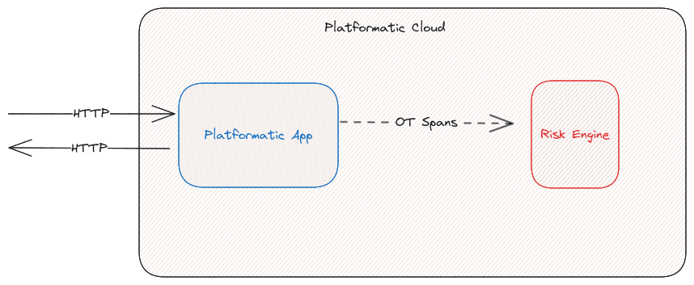
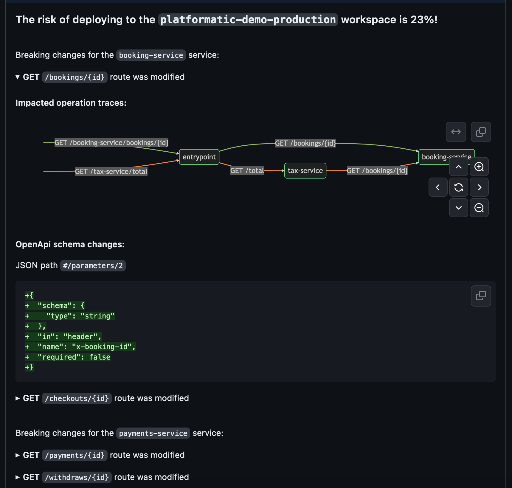
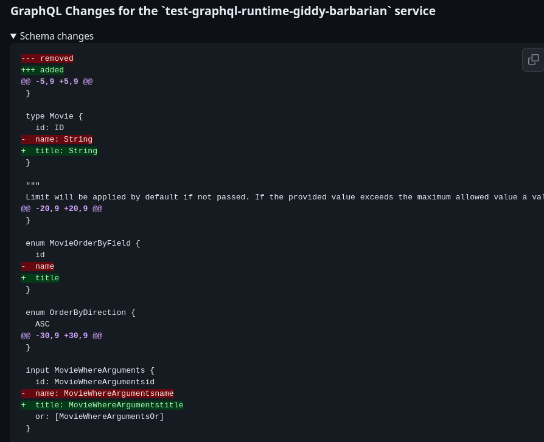
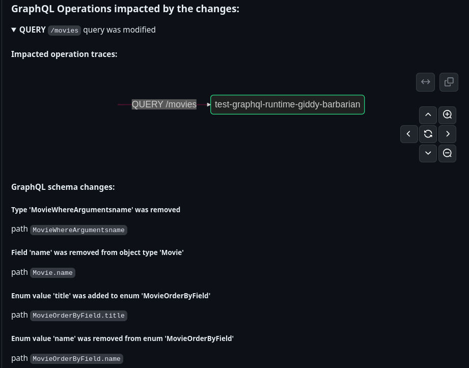

# Platformatic Risk Engine

Platformatic Cloud leverages opentelemetry for collecting and sending telemetry data to the Platformatic Risk Engine automatically. 
This allows Platformatic Cloud to calculate the risk of a pull request being merged into your production environment based on the potential breaking changes in the application API. 

For example, if a pull request adds a new endpoint, it will not be considered a breaking change and will not increase the risk score. However, if a pull request changes the open API specification for an existing endpoint, it will be considered a breaking change and will increase the risk score.

Note that Platformatic does not uses "static" structural graphs for the risk calculation. Static data does not reflect the actual (and real) flow of calls, and therefore does not reflect the actual risk in front of changes. That means that if try to calculate a risk on a system where the telemetry data hasn't been collected, the risk is `0` (the system is unused, so no actual risk in changing services). To obtain significative risk evaluations, a good amount of real-usage data of the system must have been collected. 

For more information about the theory behind the risk calculation, please read the [Evaluating the Risk of Changes in a Microservices
Architecture](https://arxiv.org/pdf/2309.06238.pdf) paper.

To fully understand what the risk engine does, we need to give some definitions:

- A **Service** is a set of Operations that are exposed by a single API. A Service is identified by a unique name.
- An **Operation** is what it's actually exposed by a service and called. 

In the OpenAPI case, an operation is a combination of the `path` and the `method` of the API.
In the GraphQL case, an operation is the type of the graphQL request (e.g. `query` or `mutation`) and the name of the query.

Examples of operations exposed by OpenAPI and GraphQL services are:
- `GET /users`
- `POST /users`
- `QUERY movies`
- `MUTATION deleteMovies`

From the Risk Engine point-of-view, a call to a microservice architecture is a sequence of operations of different services ("paths").
The Risk Engine collects dynamically all the actually travelled "paths" of operations.
When a change is created (usually in the form of a PR), it the Risk Engine can calculate the risk of the change using the data collected so far.

Consider these two peculiar cases:

#### A new operation is added
In this case, the risk engine will calculate the risk of the change as `0`, because the new operation is not actually used by any other service, so it's impossible to break the system.

#### An existing operation is changed, but this operation is not used by any other service
In this case, the risk engine will calculate the risk of the change again as `0`, because the changed operation is not actually used by any other service. 

#### An existing operation is changed, and this operation is used by other services
In this case the risk is calculated based on the actual usage of the changed operation. The more the operation is used, the higher the risk will be.

:::info
Running a risk evaluation on a system where there is no actual usage, the risk will be zero. 
Also, having **few** usage data might result in a misleadging risk evaluation. 
This tool has been designed to calculate the risk of changes of a live system where there is a good amount of usage data to obtain accurate risk forecast. 
::: 

## Risk engine in Platformatic Cloud
When an application is deployed on the cloud, it uses [opentelemetry](https://opentelemetry.io/) library to collect services' usage data. This is done automatically by Platformatic, you don't have to configure anything on your app. 

The risk engine collects automatically data about the service calls (meaning that no actual data exchanged by services are collected, just the service name, i.e. the `path` and the `method` of the calls) in the form of open telemetry `traces` of `spans`. See [Opentelemetry documentation](https://opentelemetry.io/docs/concepts/signals/traces) about the details on how the informations are sent form the services to the Risk Engine (or any other Open Telemetry backend).

As said, this happens automatically and transparently in Platformatic Cloud for both OpenAPI and GraphQL services. 

:::info
In the GraphQL we have only one HTTP endpoint (which is by default `POST/graphql`). In this case we assume that an operation is actually the type of the graphQL request (e.g. `query` or `mutation`) and the name of the query. 
:::

When a PR is created, the risk engine is triggered and it calculates the risk of the change. This is done automatically by the Platformatic Github Actions if they have been created as explained in the [Cloud Quick Start Guide](./quick-start-guide), that:
- Calculates the operations changed by the PR
- Ask to the risk engine the risk of that change

As result, the risk engine returns the risk of the change and the list of the operations that are affected by the change in a PR comment created automatically. This is an example of a PR comment created by the risk engine for a PR that changes an OpenAPI service inside a Platformatic Runtime:

A comment for GraphQL changes is similar, but it shows the schema changes (collapsed by default):

...and the list of the affected queries/mutations:

:::info
Note that a PR for an application exposing both OpenAPI and GraphQL and impacting both (for instance a Platformatic DB with a new migration) will have listed the changes in both OpenAPI and GraphQL schemas, but the actual risk will be common (being the risk of the whole change). 
:::
