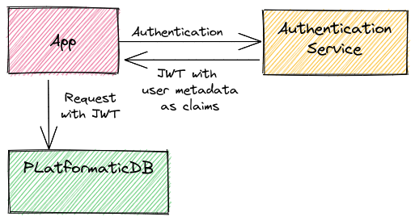
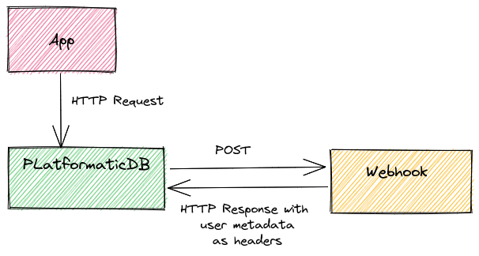
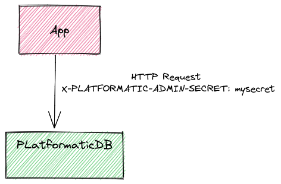

# Introduction to Authentication & Authorization

Authorization in Platformatic DB is **role-based** (see [Roles And User Information](#roles-and-user-information) for further details).
A user is supposed to have a list of roles associated.
Platformatic delegates authentication and assignment of the `roles` to an external _authentication service_.
The job of the authentication service is to authenticate users and assign their roles correctly.
Supported authentication service integrations are:
- JWT
- Webhook

We refer to the user roles and other informations (like `userId`) as [User Metadata](#user-metadata).

To make testing and developing easier, it's possible to bypass these checks if a `adminSecret` is set. See [HTTP Headers](#http-headers).

## JWT
JWT is built on top of [fastify-jwt](https://github.com/fastify/fastify-jwt).



To configure it, the quickest way is to pass a shared `secret`, e.g.:

```json
  "authorization": {
    ...

    "jwt": {
      "secret": "<shared-secret>"
    },

    ...
  }
```
For more complex configurations, please check [fastify-jwt options](https://github.com/fastify/fastify-jwt#options).

### JWKS

Platformatic DB supports [JWKS](https://www.rfc-editor.org/rfc/rfc7517). To configure it:

```json
  ...
  "authorization": {
    "jwt": {
      "jwks": {
        "allowedDomains": [
          "https://ISSUER_DOMAIN"
        ]
      }
    },
  }
  ...
```
More [get-jwks options](https://github.com/nearform/get-jwks#options) can be specified.

When a JWT token is received, Platformatic DB gets the correct public key from `https:/ISSUER_DOMAIN/.well-known/jwks.json` and uses it to verify the JWT signature. The token carries all the informations, like the `kid`, which is the key id used to sign the token itself, so no other configurations are strictly necessary.

It's also possible to enable [JWKS](https://www.rfc-editor.org/rfc/rfc7517) with no options:

```json
  ...

  "authorization": {
    "jwt": {
      "jwks": true
      }
    },
  }
  ...
```
In this case, the JWKS URL is calculated from the `iss` (issuer) field of JWT, so every JWT token from an issuer that exposes a valid JWKS token will pass the validation. For that reason, **this configuration should be used only for development**, while in every other case the `allowedDomains` should be specified.


## Webhook
Platformatic can use a webhook to authenticate the requests.



In this case, the URL is configured on authorization:

```json
  "authorization": {
    ...

    "webhook": {
      "url": "<webhook url>"
    },

    ...
  }
````

When a request is received, Platformatic sends a `POST` to the webhook, replicating the same body and headers, except for:
- `host`
- `connection`

In the Webhook case, the HTTP response contains the roles/user information as HTTP headers.

## JWT and Webhook

It's possible to configure the server to first try to validate a JWT token and if that is not found,
forward the request to the webhook.

## HTTP Headers

:::danger
***Note that using admin API key on HTTP headers is highly insecure and should be used only within protected networks.***
:::

If a request has `X-PLATFORMATIC-ADMIN-SECRET` HTTP header set with a valid `adminSecret` (see [configuration reference](/reference/db/configuration.md#authorization)]) the role is set automatically as `platformatic-admin`, unless a different role is set for user impersonation (which is disabled if JWT or Webhook are set, see [below](#user-impersonation)). 




Also, the following rule is automatically added to every entity, allowing the user that presented the `adminSecret` to perform any operation on any entity:

```json
    {
      "role": "platformatic-admin",
      "find": false,
      "delete": false,
      "save": false
    }
```

### User Impersonation

:::info
When JWT or Webhook are set, user impersonation is not enabled, and the role is always set as `platfomatic-admin` automatically.
:::

If a user presents a valid `X-PLATFORMATIC-ADMIN-SECRET`, can also **impersonate users** with different roles.
The roles to impersonate can be specified by `X-PLATFORMATIC-ROLE` containing a comma separated list of roles.

## User Metadata
In all cases, the roles/user information is passed to Platformatic from the external _authentication service_ as a string (JWT claims or HTTP headers).
We can refer to these as **user metadata**. Platformatic saves the user metadata for each request in a `user` object.
Roles can be set using `X-PLATFORMATIC-ROLE` as list of comma-separated roles (this key is [configurable](/reference/db/configuration.md#role-and-anonymous-keys)).

Note that roles are just strings. Some "special roles" are reserved:
- `platformatic-admin` : this identifies a user who has admin powers
- `anonymous`: set automatically when no roles are associated

## Events and Subscriptions

Platformatic DB supports GraphQL subscriptions and therefore db-authorization must protect them.
The check is performed based on the `find` permissions, the only permissions that are supported are:

1. `find: false`, the subscription for that role is disabled
2. `find: { checks: { [prop]: 'X-PLATFORMATIC-PROP' } }` validates that the given prop is equal
3. `find: { checks: { [prop]: { eq: 'X-PLATFORMATIC-PROP' } } }` validates that the given prop is equal

Conflicting rules across roles for different equality checks will not be supported.
