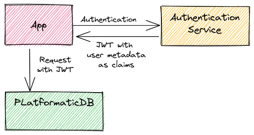
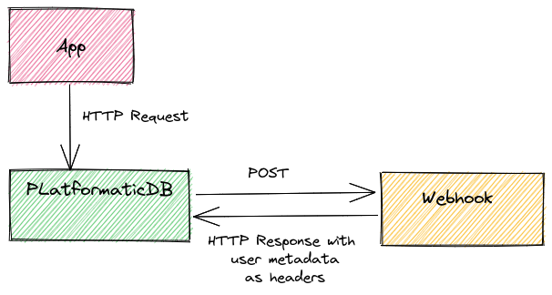

# Strategies

<!-- TODO: Update diagrams with the updated versions I created for my API adventure talk -->

## Introduction

Platformatic DB supports the following authorization strategies:

- [JSON Web Token (JWT)](#json-web-token-jwt) with support for [JSON Web Key Sets (JWKS)](#json-web-key-sets-jwks)
- [Webhook](#webhook)
- [HTTP headers (development only)](#http-headers-development-only)

<!-- TODO: Clarify/expand this section and put it somewhere else

## JWT and Webhook

It's possible to configure the server to first try to validate a JWT token and if that is not found,
forward the request to the webhook.

-->

## JSON Web Token (JWT)

The [JSON Web Token](https://jwt.io/) (JWT) authorization strategy is built on top
of the [`@fastify/jwt`](https://github.com/fastify/fastify-jwt) Fastify plugin.



To configure it, the quickest way is to pass a shared `secret` in your
Platformatic DB configuration file, for example:

```json title="platformatic.db.json"
{
  "authorization": {
    "jwt": {
      "secret": "<shared-secret>"
    }
  }
}
```

By default `@fastify/jwt` looks for a JWT in an HTTP request's `Authorization`
header. This requires HTTP requests to the Platformatic DB API to include an
`Authorization` header like this:

```
Authorization: Bearer <token>
```

See the [`@fastify/jwt` documentation](https://github.com/fastify/fastify-jwt#options)
for all of the available configuration options.

### JSON Web Key Sets (JWKS)

The JWT authorization strategy includes support for [JSON Web Key](https://www.rfc-editor.org/rfc/rfc7517) Sets.

To configure it:

```json title="platformatic.db.json"
{
  "authorization": {
    "jwt": {
      "jwks": {
        "allowedDomains": [
          "https://ISSUER_DOMAIN"
        ]
      }
    }
  }
}
```

When a JSON Web Token is included in a request to Platformatic DB, it retrieves the
correct public key from `https:/ISSUER_DOMAIN/.well-known/jwks.json` and uses it to
verify the JWT signature. The token carries all the informations, like the `kid`,
which is the key id used to sign the token itself, so no other configuration is required.

JWKS can be enabled without any options:

```json title="platformatic.db.json"
{
  "authorization": {
    "jwt": {
      "jwks": true
    }
  }
}
```

When configured like this, the JWK URL is calculated from the `iss` (issuer) field of JWT, so
every JWT token from an issuer that exposes a valid JWKS token will pass the validation.
**This configuration should only be used in development**, while
in every other case the `allowedDomains` option should be specified.

Any option supported by the [`get-jwks`](https://github.com/nearform/get-jwks#options)
library can be specified in the `authorization.jwt.jwks` object.

### JWT Custom Claim Namespace

JWT claims can be namespaced to avoid name collisions. If so, we will receive tokens
with custom claims such as: `https://platformatic.dev/X-PLATFORMATIC-ROLE`
(where `https://platformatic.dev/` is the namespace).
If we want to map these claims to user metadata removing our namespace, we can
specify the namespace in the JWT options:

```json title="platformatic.db.json"
{
  "authorization": {
    "jwt": {
      "namespace": "https://platformatic.dev/"
    }
  }
}
```

With this configuration, the `https://platformatic.dev/X-PLATFORMATIC-ROLE` claim
is mapped to `X-PLATFORMATIC-ROLE` user metadata.

## Webhook

<!-- TODO: authenticate OR authorize? -->

Platformatic DB can use a webhook to authenticate requests.



In this case, the URL is configured on authorization:

```json title="platformatic.db.json"
{
  "authorization": {
    "webhook": {
      "url": "<webhook url>"
    }
  }
}
```

When a request is received, Platformatic sends a `POST` to the webhook, replicating
the same body and headers, except for:

- `host`
- `connection`

<!--
TODO: Is this correct? Code looks like it's getting data from the response body:
https://github.com/platformatic/platformatic/blob/main/packages/db-authorization/lib/webhook.js#L45-L46
-->

In the Webhook case, the HTTP response contains the roles/user information as HTTP headers.

## HTTP headers (development only)

:::danger
Passing an admin API key via HTTP headers is highly insecure and should only be used
during development or within protected networks.
:::

If a request has `X-PLATFORMATIC-ADMIN-SECRET` HTTP header set with a valid `adminSecret`
(see [configuration reference](/reference/db/configuration.md#authorization)) the
role is set automatically as `platformatic-admin`, unless a different role is set for
user impersonation (which is disabled if JWT or Webhook are set, see [below](#user-impersonation)).


<!-- TODO: Unclear what the following paragraph means -->

Also, the following rule is automatically added to every entity, allowing the user
that presented the `adminSecret` to perform any operation on any entity:

```json
{
  "role": "platformatic-admin",
  "find": false,
  "delete": false,
  "save": false
}
```
