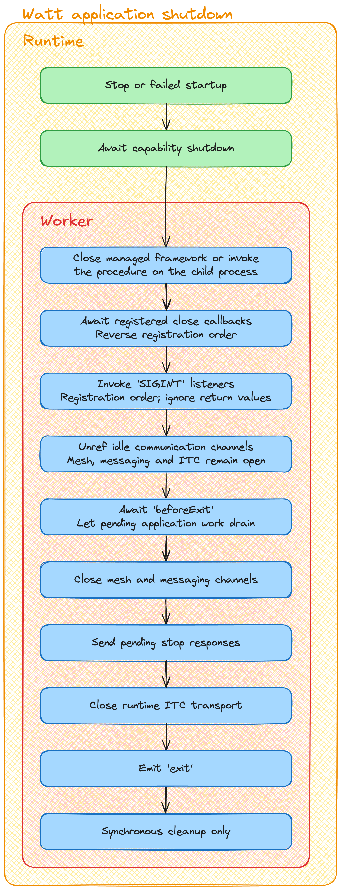

# Application shutdown

Watt coordinates application cleanup when an application stops or fails to start. Use `registerCloseCallback()` from `@platformatic/globals` for asynchronous application-owned cleanup.

```js
import { registerCloseCallback } from '@platformatic/globals'

registerCloseCallback(async () => {
  await database.close()
})
```

## Shutdown sequence

The following sequence applies once per application instance. Concurrent stop requests share the same shutdown operation, and cleanup after failed startup preserves the original startup error.

1. **Close the managed framework or server.** Watt invokes the capability's shutdown implementation. For custom commands, this phase instead waits for the child-process shutdown described below.
2. **Run registered close callbacks.** Watt awaits each callback sequentially, in reverse registration order, so resources registered later are closed first.
3. **Invoke `SIGINT` listeners.** Watt invokes the current listeners in registration order, without awaiting or consuming their return values.
4. **Drain application work.** Watt unreferences idle mesh, messaging, and runtime communication channels, then waits for `beforeExit`. Channels remain usable: requests started by signal listeners keep the worker alive until they complete. Timers, I/O, and other referenced resources must also finish before this phase completes. Watt then closes its mesh and messaging channels.
5. **Send pending stop responses.** Watt allows concurrent stop requests to receive their responses before closing the runtime communication port.
6. **Close the runtime communication port and emit `exit`.** The worker emits `exit` for final synchronous cleanup.

A failed capability shutdown or callback does not skip subsequent callbacks or signal listeners. The shutdown deadline bounds the whole operation: a callback that never settles can prevent later cleanup before forced termination.



The editable flowchart is available in [Excalidraw format](./shutdown-images/shutdown.excalidraw).

## Registering cleanup

Register callbacks during initialization or framework shutdown, before the callback phase starts. You can also pass an object implementing `Symbol.asyncDispose` directly:

```js
registerCloseCallback(server)
```

Watt awaits `server[Symbol.asyncDispose]()` with `server` as its receiver, in the same reverse registration order as callbacks. Passing neither a function nor an object with a callable `Symbol.asyncDispose` throws `PLT_GLOBALS_INVALID_CLOSE_CALLBACK`; registering after the callback phase has started throws `PLT_GLOBALS_CLOSE_CALLBACK_REGISTRATION_CLOSED`.

`consumeCloseCallbacks()` is an internal runtime operation, not an application API. It takes ownership of the callbacks and permanently closes registration.

The legacy `close` event is no longer emitted during application shutdown. See the [v4 migration guide](../../guides/migrate-v4.md#update-application-shutdown) for migrating existing handlers.

## Signal listeners

After close callbacks complete, Watt snapshots the current `SIGINT` listeners, removes them from `process` to avoid duplicate invocation, and calls them in registration order with `process` as `this` and `'SIGINT'` as the argument. Listeners added or removed by a close callback are therefore respected. No OS signal is required.

As with an ordinary signal event, listener return values are ignored. Watt does not await promises or attach rejection handlers to them. Synchronous listener errors are collected while subsequent listeners are still invoked. Use `registerCloseCallback()` for asynchronous cleanup that Watt must await.

Invoking the listeners does not complete shutdown. Watt waits for the event loop to drain before sending the stop response, up to the application shutdown deadline. This also applies after a failed startup: cleanup drains before the original startup error is reported. Mesh HTTP and messaging requests remain available during this phase, provided the target application is still running. As with natural Node.js exit, unresolved promises and unreferenced handles alone do not keep the application alive.

These rules also apply to signal handlers installed by libraries. Watt does not intercept `process.exit()`: calling it can interrupt outstanding cleanup or prevent later listeners from running.

## Custom commands

Child processes follow a similar shutdown sequence: await registered close callbacks, invoke `SIGINT` listeners, drain application work, send the stop response, and close the communication socket. The main difference is that application-owned callbacks or signal handlers must close the child's server; Watt does not perform the managed framework shutdown for it.

Applications started through custom commands run their callbacks inside the child process. Worker and child-process registrations are independent:

1. The worker requests child shutdown using the remaining shutdown budget.
2. The child awaits its close callbacks in reverse registration order, then invokes its `SIGINT` listeners without awaiting their return values.
3. The child releases telemetry resources and waits for `beforeExit`, keeping its unreferenced communication socket available while application work drains. It then replies and closes the socket. Application resources must close for the child to exit naturally.
4. Once child shutdown completes or fails, the worker runs its own callbacks and signal listeners, then closes its internal resources.

In this mode Watt does not automatically close the application's HTTP server or invoke exported factories and `close()` functions. The application owns those resources and must close them through callbacks or its signal handlers. For example, use `registerCloseCallback(() => app.close())` for a Fastify instance, or `registerCloseCallback(server)` for a Node.js HTTP server.

## Errors and deadlines

Combined cleanup failures are reported as `AggregateError` instances containing the original failures. They use `PLT_RUNTIME_APPLICATION_SHUTDOWN` in workers and `PLT_BASIC_APPLICATION_SHUTDOWN` in child processes. A single identifiable capability failure retains its original error code.

Child shutdown exceeding its deadline uses `PLT_BASIC_APPLICATION_SHUTDOWN_TIMEOUT`; the runtime also reports worker timeout events. Resources left open after callbacks and signal listeners can keep the child alive until forced termination.

The runtime retains the directly spawned child's PID as a fallback, so a blocked supervising worker cannot prevent forced child termination. If the child has already exited, `process.kill()` can report `ESRCH` (no such process); Watt logs this race at debug level. Other termination failures are logged as errors.

On Unix, a synchronously blocked worker may be unable to reap its killed child before the worker is terminated. The OS can retain a zombie entry until it is reaped or the parent process exits; the child is no longer executing. The fallback supervises the directly spawned process, not an arbitrary tree of descendants created by custom commands.
